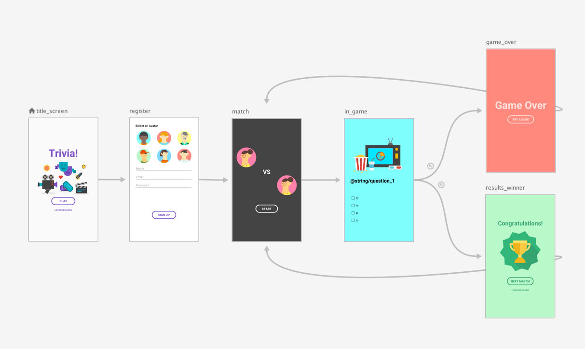
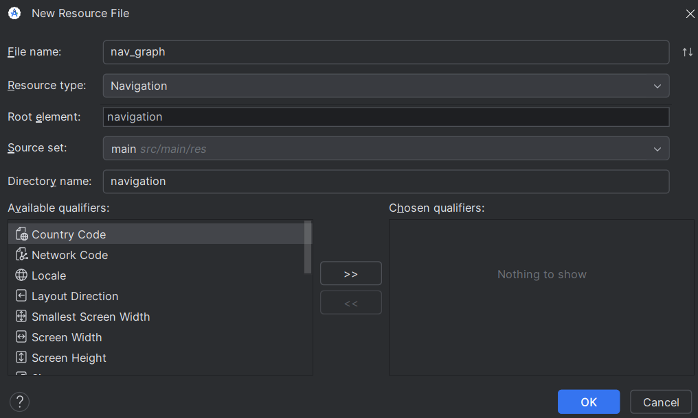
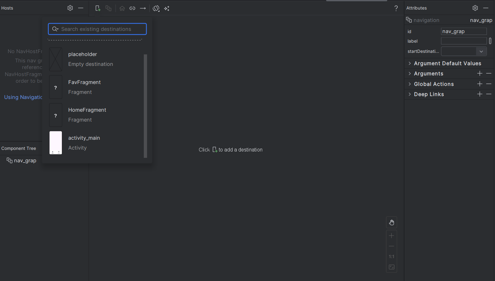
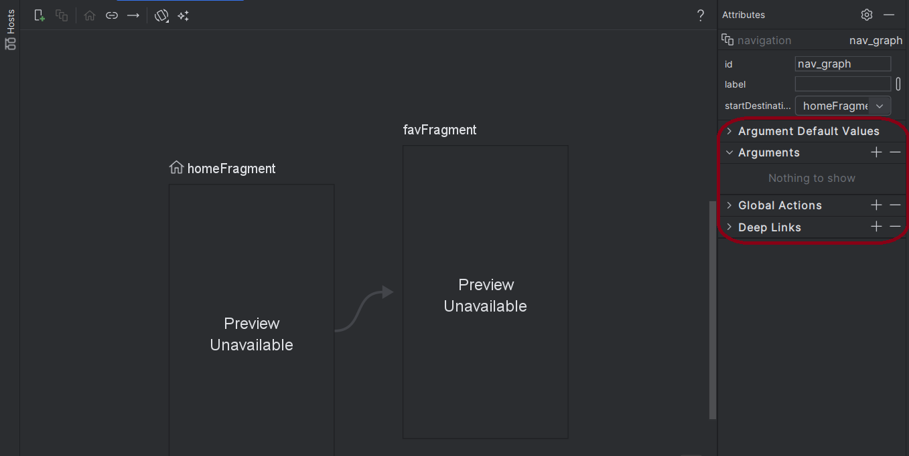
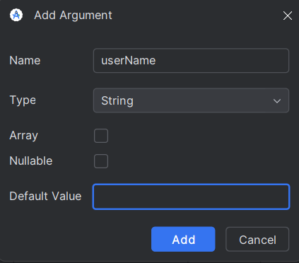
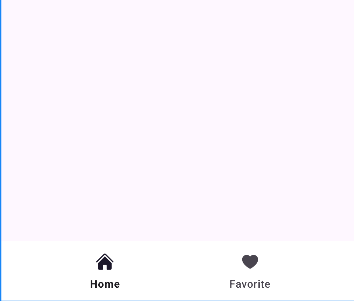

# AndroidX Navigation
## 1. Navigation Component
**Navigation Component** là một thư viện trong bộ thư viện của Android Jetpack. Hỗ trợ cho việc điều hướng giữa các điểm đến (Fragment, Activity hoặc một Component nào đó)

**Ưu điểm:**
- Quản lí các tương tác giữa các Fragment, Activity, ..., App ngoài (deeplink)
- Xử lí **Backstack** đơn giản hơn
- Cung cấp gói **tài nguyên animation** theo chuẩn Android
- Tích hợp các **UI Components** như BottomNavigationView, NavigationDrawer, Toolbar.
- Được hỗ trợ **Safe Args** giúp truyền dữ liệu qua các thành phần bên trong Navigation được an toàn hơn.
- Hỗ trợ ViewModel để chia sẻ dữ liệu giữa các 'điểm đến'

#### Nav_Graph

**Navigation Graph** là một file `XML` mô tả một nhóm các Navigation destination và các kết nối giữa chúng. Nó có thể hiển thị trực quan các destination và các action
- **Navigation Destination**: Có thể là Fragment, Activity hoặc bất kỳ View nào trong ứng dụng.
- **Navigation Action**: Là một liên kết kết nối một destination với một destination khác. Một Action biết được destination nào nó đang kết nối và loại thông tin sẽ được truyền qua giữa chúng.



#### NavHostFragment

**NavHostFragment** là một layout, một Fragment đặc biệt dùng để chứa các destination đang được hiển thị. Khi điều hướng đến destination khác thì NavHostFragment sẽ đổi màn hình hiển thị sang destination đó.


```xml
<androidx.fragment.app.FragmentContainerView
android:id="@+id/host"
android:name="androidx.navigation.fragment.NavHostFragment"
android:layout_width="match_parent"
android:layout_height="match_parent"
app:defaultNavHost="true"
app:navGraph="@navigation/nav_graph"/>
```

#### Navigation Controller
**Navigation Controller** là một object quản lí việc điều hướng giữa các destination. Nó sẽ điều phối việc hoán đổi content của các destinations trong NavHostFragment

**Khởi tạo** bằng `rememberNavController()`
```kt
//Khởi tạo từ sớm trong chương trình để đảm bảo tất cả các thành phần có thể truy cập vào
val navController = rememberNavController()
```

Cách truy cập NavController:
```kt
Fragment.findNavController()
View.findNavController()
Activity.findNavController(viewId: Int)
```

##### 1. Điều hướng giữa các destination
| Phương thức                                                    | Mô tả                                                                        |
| -------------------------------------------------------------- | ---------------------------------------------------------------------------- |
| `navigate(resId: Int)`                                         | Điều hướng bằng **ID action** hoặc **ID destination** trong `nav_graph.xml`. |
| `navigate(directions: NavDirections)`                          | Điều hướng bằng **Safe Args** (type-safe).                                   |
| `navigate(resId: Int, args: Bundle?)`                          | Điều hướng kèm **Bundle** dữ liệu.                                           |
| `navigate(resId: Int, args: Bundle?, navOptions: NavOptions?)` | Điều hướng kèm dữ liệu + tuỳ chọn backstack/animation.                       |
| `navigateUp()`                                                 | Quay về destination trước đó trong backstack (giống nút Up ở ActionBar).     |
| `popBackStack()`                                               | Xoá destination hiện tại khỏi backstack, quay về trước đó.                   |
| `popBackStack(destinationId, inclusive: Boolean)`              | Quay lại một điểm cụ thể trong graph, có thể xoá cả nó (`inclusive = true`). |

##### 2. Truy cập thông tin
| Phương thức              | Mô tả                                                |
| ------------------------ | ---------------------------------------------------- |
| `currentDestination`     | Lấy ra destination hiện tại (kiểu `NavDestination`). |
| `previousBackStackEntry` | Lấy entry liền trước trong backstack.                |
| `backQueue`              | Lấy toàn bộ backstack dưới dạng list.                |
| `graph`                  | Truy cập `NavGraph` hiện tại (sơ đồ điều hướng).     |

##### 3. Quản lý BackStackEntry
| Phương thức                        | Mô tả                                                     |
| ---------------------------------- | --------------------------------------------------------- |
| `getBackStackEntry(destinationId)` | Lấy entry cụ thể từ backstack.                            |
| `currentBackStackEntry`            | Entry hiện tại trong backstack (chứa `SavedStateHandle`). |
| `previousBackStackEntry`           | Entry liền trước (cũng chứa `SavedStateHandle`).          |

##### 4. Liên kết với UI

| Phương thức                                                   | Mô tả                                                               |
| ------------------------------------------------------------- | ------------------------------------------------------------------- |
| `addOnDestinationChangedListener(listener)`                   | Nghe sự kiện khi destination thay đổi (vd: đổi title Toolbar).      |
| `removeOnDestinationChangedListener(listener)`                | Gỡ listener trên.                                                   |
| `setGraph(navGraph: NavGraph, startDestinationArgs: Bundle?)` | Gán graph điều hướng thủ công (thường khi muốn dynamic navigation). |

## 2. Tạo Project có Navigation

### B1: Cách cài đặt môi trường
```kts
dependencies {
  val nav_version = "2.9.3"

  // Tích hợp Jetpack Compose
  implementation("androidx.navigation:navigation-compose:$nav_version")

  // Tích hợp Views/Fragments
  implementation("androidx.navigation:navigation-fragment:$nav_version")
  implementation("androidx.navigation:navigation-ui:$nav_version")
}
```

Sync project.

### B2: Tạo Nav_graph

- right-click `res` > New > Android Resource File
- Đặt tên file (ví dụ: nav_graph) rồi chọn Type là Navigation
- Ta sẽ có 1 resource mới là `navigation` và file `nav_graph.xml` trong đó



Thêm các Fragment hoặc Activity vào graph này.
- Mỗi màn hình = 1 destination.
- Nối chúng bằng Action để định nghĩa hướng đi.

### B3. Thêm NavHostFragment

Trong `activity_main.xml`

```xml
<androidx.fragment.app.FragmentContainerView
    android:id="@+id/nav_host_fragment"
    android:layout_width="match_parent"
    android:layout_height="match_parent"
    app:defaultNavHost="true"
    app:navGraph="@navigation/nav_graph"
    android:name="androidx.navigation.fragment.NavHostFragment" />
```

`defaultNavHost="true"` bắt nút Back của hệ thống chuyển qua NavController. 
`navGraph="@navigation/nav_graph"` kết nối với nav_graph

### B4. Thêm Destination Vào NavGraph

- Ta có 2 cách tạo destination:
    - Tạo new destination hoặc placeholder
    - Tạo destination từ một activity/fragment đã tồn tại.
- Start destination: là screen đầu tiên mà user nhìn thấy khi mở app và cũng là last screen mà user nhìn thấy khi thoát app



### B4. Sử dụng NavController
**Lấy NavController:**
- Trong Activity chứa NavHostFragment:
```kt
val navController = findNavController(R.id.nav_host_fragment)
```
- Trong Fragment:
```kt
val navController = findNavController()
```
- Trong View:
```kt
val navController = view.findNavController()
```

Sau khi có `navController` ta có thể dùng để di chuyển sang màn hình khác:
```kt
navController.navigate(R.id.AnotherFragment)
```

**Sử dụng Action**

Khai báo trong `nav_graph.xml`

```xml
<fragment
    android:id="@+id/homeFragment"
    android:name="com.example.HomeFragment"
    android:label="Home">

    <!-- Khai báo action -->
    <action
        android:id="@+id/action_home_to_detail"
        app:destination="@id/detailFragment" />
</fragment>

<fragment
    android:id="@+id/detailFragment"
    android:name="com.example.DetailFragment"
    android:label="Detail" />
```

Ví dụ chuyển màn sau khi nhấn nút:

```kt
button.setOnClickListener {
    findNavController().navigate(R.id.action_home_to_detail)
}
```

### Truyền dữ liệu qua các Destination
##### Cách 1: Dùng Bundle (truyền thống)
Ví dụ truyền dữ liệu bằng Bundle:

- Ở Fragment A (gửi dữ liệu):
```kotlin
val bundle = Bundle().apply {
    putString("username", "John")
    putInt("userId", 123)
}
findNavController().navigate(R.id.action_fragmentA_to_fragmentB, bundle)
```

- Ở Fragment B (nhận dữ liệu):
```kotlin
val username = arguments?.getString("username")
val userId = arguments?.getInt("userId")
```

**Nhược điểm:**
- Không kiểm tra kiểu dữ liệu, sai key hoặc kiểu sẽ crash hoặc nhận giá trị null.
- Không phù hợp với dữ liệu phức tạp


#### Cách 2: Dùng Safe Args (chuẩn Jetpack Navigation)

**Safe Args** là một plugin của Android giúp truyền dữ liệu giữa các Fragment an toàn và type-safe (kiểm tra kiểu dữ liệu ngay khi code, tránh lỗi runtime).

**Thiết lập Safe Args**:

1. Thêm classpath vào build.gradle (project):
    ```groovy
    buildscript {
        repositories {
            google()
        }
        dependencies {
            val nav_version = "2.7.7"
            classpath("androidx.navigation:navigation-safe-args-gradle-plugin:$nav_version")
        }
    }
    ```
2. Thêm plugin vào build.gradle (app):
    ```groovy
    id("androidx.navigation.safeargs.kotlin")
    ```
3. Khai báo tham số truyền trong navigation graph XML:
    ```xml
    <fragment
        android:id="@+id/fragmentB"
        ...>
        <action
            android:id="@+id/action_fragmentA_to_fragmentB"
            app:destination="@id/fragmentB" />
        <argument
            android:name="username"
            app:argType="string" />
        <argument
            android:name="userId"
            app:argType="integer" />
    </fragment>
    ```
Ta có thể dùng "kéo thả" trong `nav_graph.xml` để thêm `action` và `argument`
- Nhấp vào destination mà data được truyền đến, sẽ hiển thị màn hình tùy chọn bên phải:
    
- Sau khi nhấn nút add: `+` sẽ hiển thị màn hình tùy chỉnh:
    
- Đặt tên, chọn data type, ... Sau đó nhấn `Add` để thêm argument

**Truyền dữ liệu với Safe Args:**

- Ở Fragment A (gửi dữ liệu):
    ```kotlin
    val action = FragmentADirections.actionFragmentAToFragmentB(
        username = "John",
        userId = 123
    )
    findNavController().navigate(action)
    ```

- Ở Fragment B (nhận dữ liệu):
    ```kotlin
    val args = FragmentBArgs.fromBundle(requireArguments())
    val username = args.username
    val userId = args.userId
    ```

## 3. Các navigation component
### 3.1.  Bottom Navigation (Thanh điều hướng )
Là một thành phần UI có chức năng tạo thanh điều hướng ở phía dưới màn hình, thường dùng cho các ứng dụng có từ 3 đến 5 mục chính.

Ví dụ:
```xml
<com.google.android.material.bottomnavigation.BottomNavigationView
    android:id="@+id/bottom_nav"
    android:layout_width="match_parent"
    android:layout_height="70dp"
    android:background="@color/white"
    app:menu="@menu/menu"/>
```

NavigationView trên sẽ lấy số lượng và các thành phần từ resource `menu` để hiển thị

- Ví dụ menu có 2 thành phần (item):
```xml
<menu xmlns:android="http://schemas.android.com/apk/res/android">
    <item
        android:id="@+id/home"
        android:icon="@drawable/ic_home"
        android:enabled="true"
        android:title="Home" />

    <item
        android:id="@+id/favorite"
        android:icon="@drawable/ic_heart"
        android:enabled="true"
        android:title="Favorite" />
</menu>
```
- kết quả:


### 3.2. TabLayout + View

Là một thành phần UI giúp tạo ra các tab theo chiều ngang

TabLayout có thể hiển thị theo 2 cách:
- `app:tabMode="fixed"`: Số lượng tab ít (thường <4), tất cả tab đều hiển thị trên màn hình, chia đều kích thước.
- `app:tabMode="scrollable"`: Số lượng tab nhiều, tab có thể cuộn ngang khi không đủ chỗ hiển thị.

**Ta thường thêm các tab vào bằng code:**
```kt
TabLayout tabLayout = ...;
tabLayout.addTab(tabLayout.newTab().setText("Tab 1"));
tabLayout.addTab(tabLayout.newTab().setText("Tab 2"));
tabLayout.addTab(tabLayout.newTab().setText("Tab 3"));
```
Khi dùng xml:
```xml
<com.google.android.material.tabs.TabLayout
        android:layout_height="wrap_content"
        android:layout_width="match_parent">

    <com.google.android.material.tabs.TabItem
            android:text="@string/tab_text"/>

    <com.google.android.material.tabs.TabItem
            android:icon="@drawable/ic_android"/>

</com.google.android.material.tabs.TabLayout>
```