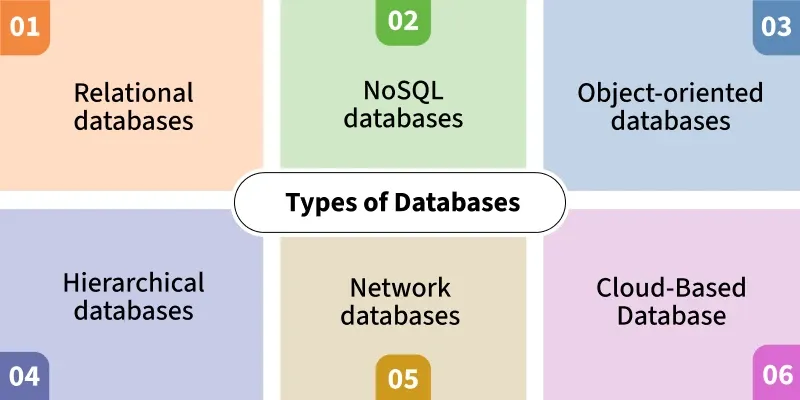
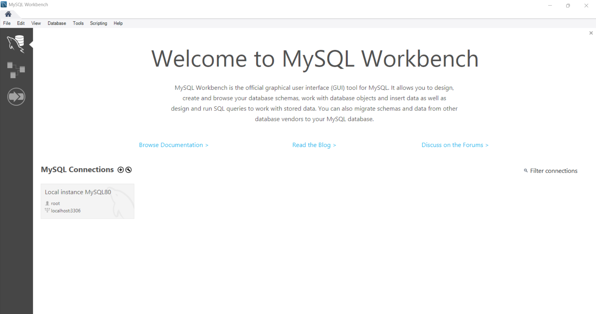
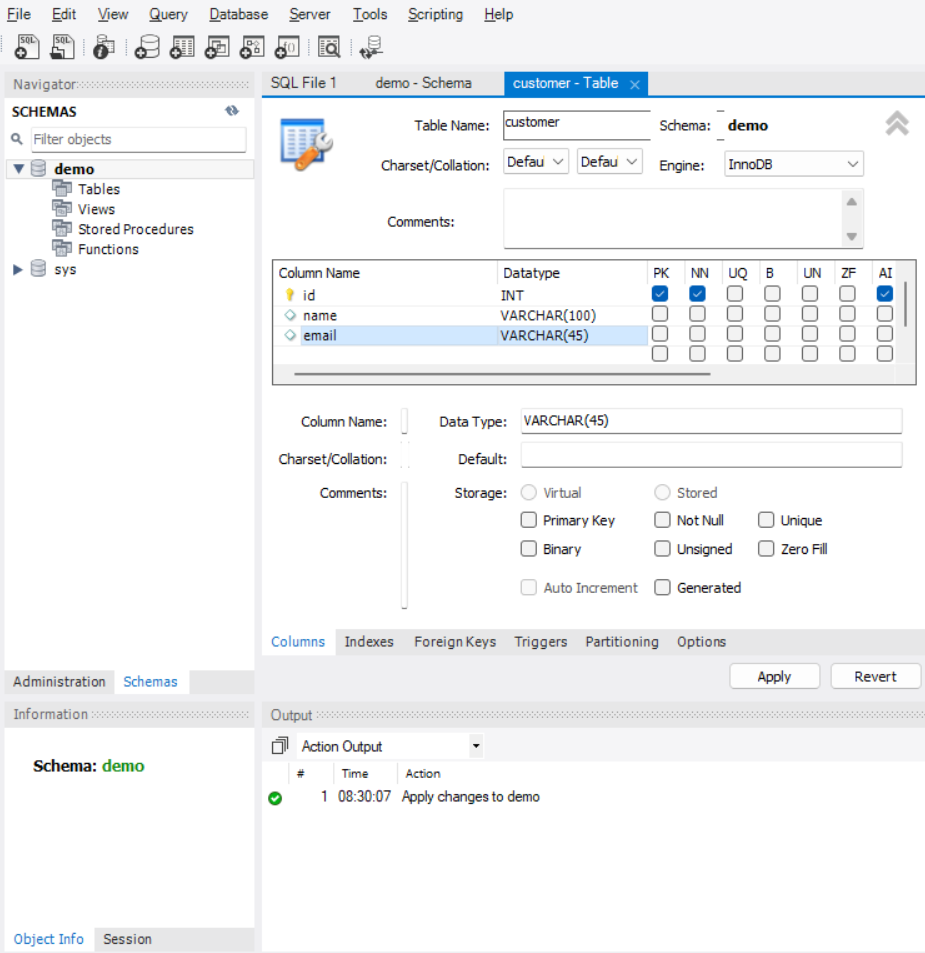

# Database

## 1. CSDL là gì, CSDL quan hệ là gì?

### Cơ sở dữ liệu: 
**Cơ sở dữ liệu (Database)** là một tập hợp các dữ liệu có tổ chức liên quan đến nhau, thường được lưu trữ và truy cập từ hệ thống máy tính (máy chủ) sao cho có thể dễ dàng truy xuất, cập nhật, tìm kiếm và quản lý.

**Đặc điểm:**
- **Tính tổ chức và cấu trúc**: Dữ liệu trong CSDL được sắp xếp theo một mô hình có hệ thống, thường là dưới dạng bảng (trong CSDL quan hệ) hoặc đối tượng/mô hình khác
- **Khả năng truy xuất và tìm kiếm**: Người dùng có thể nhanh chóng lấy ra hoặc tìm kiếm dữ liệu thông qua các câu lệnh truy vấn
- **Tính nhất quán và toàn vẹn**: CSDL có cơ chế đảm bảo dữ liệu luôn chính xác và không bị mâu thuẫn
- **Khả năng mở rộng**: Khi dữ liệu và nhu cầu xử lý ngày càng nhiều, CSDL có thể mở rộng bằng cách nâng cấp phần cứng hoặc sử dụng các kỹ thuật để đáp ứng khối lượng công việc lớn hơn.
- **Bảo mật và quyền truy cập**: Dữ liệu được bảo vệ khỏi truy cập trái phép thông qua việc phân quyền người dùng
- **Sao lưu và phục hồi**: CSDL có cơ chế sao lưu dữ liệu định kỳ và khôi phục khi xảy ra sự cố như hỏng hóc hoặc mất dữ liệu
- **Quản lý giao dịch**: Mỗi thao tác trên dữ liệu được quản lý theo nguyên tắc ACID (Nguyên tử, Nhất quán, Tách biệt, Bền vững)
- **Hỗ trợ đồng thời**: CSDL cho phép nhiều người dùng cùng thao tác cùng lúc mà không làm chậm hệ thống hay gây xung đột dữ liệu
- **Tính tương thích**: CSDL có thể tích hợp và làm việc chung với các hệ thống, ứng dụng khác thông qua chuẩn giao tiếp và giao thức chung

-> Những đặc điểm này đảm bảo rằng dữ liệu được lưu trữ, truy xuất và bảo mật một cách tối ưu, đồng thời hỗ trợ các ứng dụng và hệ thống trong việc quản lý thông tin

[**Phân loại:**](https://www.geeksforgeeks.org/dbms/types-of-databases/)



### Cơ sở dữ liệu quan hệ
**Cơ sở dữ liệu quan hệ** là loại cơ sở dữ liệu được sử dụng rộng rãi nhất hiện nay. Chúng lưu trữ dữ liệu trong các bảng, với các hàng đại diện cho các bản ghi và các cột đại diện cho các thuộc tính của bản ghi. Trong các cơ sở dữ liệu này, mỗi phần thông tin đều có mối quan hệ với mọi phần thông tin khác (Ví dụ: MySQL, PostgreSQL và Oracle Database là một số cơ sở dữ liệu quan hệ phổ biến.)

**Các thành phần chính:**
1. **Bảng (Table)**: Bảng là thành phần cốt lõi trong một cơ sở dữ liệu quan hệ. Mỗi bảng lưu trữ dữ liệu dưới dạng các hàng (rows) và cột (columns), trong đó:

   - Hàng (Row): Mỗi hàng đại diện cho một bản ghi dữ liệu cụ thể, ví dụ một khách hàng, một sản phẩm hoặc một đơn hàng.

   - Cột (Column): Mỗi cột đại diện cho một thuộc tính của dữ liệu, ví dụ như tên khách hàng, giá sản phẩm hay ngày đặt hàng. Các cột này xác định loại thông tin mà bảng lưu trữ và thường có kiểu dữ liệu xác định (số nguyên, văn bản, ngày tháng,...).
2. **Khóa chính (Primary Key)**: Là mã định danh duy nhất của một hàng, đảm bảo rằng không có hai bản ghi nào trong bảng có thể có cùng một giá trị khóa chính, giúp xác định và truy xuất dữ liệu một cách nhanh chóng và chính xác
3. **Khóa ngoại (Foreign Key)**: Khóa ngoại là tập hợp các cột trong một bảng liên kết với khóa chính của bảng khác
4. **Quan hệ (Relationship)**: Quan hệ là mối liên kết giữa hai hoặc nhiều bảng trong cơ sở dữ liệu thông qua các khóa ngoại và khóa chính
   - Quan hệ 1-1: Một bản ghi trong bảng này chỉ liên kết với một bản ghi trong bảng khác.

   - Quan hệ 1-n: Một bản ghi trong bảng này có thể liên kết với nhiều bản ghi trong bảng khác.

   - Quan hệ n-n: Một bản ghi trong bảng này có thể liên kết với nhiều bản ghi trong bảng khác và ngược lại.
5. **Chỉ mục (Index)**: Chỉ mục là một cấu trúc dữ liệu được sử dụng để tăng tốc độ truy vấn các bản ghi từ bảng. Nó hoạt động giống như mục lục trong một cuốn sách, cho phép người dùng tìm kiếm thông tin một cách nhanh chóng mà không cần phải duyệt qua toàn bộ bảng.
6. **SQL (Structured Query Language)**: SQL là ngôn ngữ chuẩn được sử dụng để tương tác với cơ sở dữ liệu quan hệ. Người dùng có thể sử dụng SQL để thực hiện các thao tác như truy vấn, thêm, sửa, xóa dữ liệu
## 2. SQL là gì?
**SQL** (Structured Query LanguageLanguage) là Ngôn ngữ truy vấn mang tính cấu trúc, là một loại ngôn ngữ máy tính phổ biến để tạo, sửa, và lấy dữ liệu từ một hệ quản trị cơ sở dữ liệu quan hệ

**Cách cài đặt:**
1. Tải MySQL Installer từ [trang chủ MySQL](https://dev.mysql.com/downloads/installer/).
2. Chạy file cài đặt và chọn kiểu cài đặt (Developer Default hoặc Custom).
3. Làm theo hướng dẫn để cài đặt các thành phần như MySQL Server, Workbench, Shell.
4. Thiết lập mật khẩu root và các tài khoản cần thiết.
5. Kiểm tra cài đặt bằng cách mở MySQL Workbench hoặc command line:  
   ```bash
   mysql -u root -p
   ```
**Cài đặt thêm các công cụ quản lý**: Để dễ dàng thao tác: Chỉ cần bấm chuột, kéo thả, nhập truy vấn thay vì nhớ cú pháp dòng lệnh và có thể quan sát dữ liệu trực quan
[MySQL Workbench](https://dev.mysql.com/downloads/workbench/)

Sau khi tải về và cài đặt mật khẩu cho sever:


## 3. Table trong MySQL
**Table** là thành phần cơ bản trong cơ sở dữ liệu MySQL, dùng để lưu trữ dữ liệu theo dạng bảng
- Mỗi bảng thường lưu trữ một loại thông tin (ví dụ: thông tin khách hàng, sản phẩm, đơn hàng...).
- Một bảng gồm:
  - **Tên bảng** (table name)
  - **Cột** (column): Định nghĩa kiểu dữ liệu và tên thuộc tính
  - **Hàng** (row): Mỗi hàng là một bản ghi dữ liệu.

**Tạo bảng trong MySQL**

Ví dụ tạo bảng
```sql
CREATE TABLE customers (
    id INT AUTO_INCREMENT PRIMARY KEY,
    name VARCHAR(100),
    email VARCHAR(100),
    created_at DATETIME
);
```
- **id**: số nguyên, tự động tăng, là khóa chính (primary key)
- **name**: chuỗi ký tự tối đa 100 ký tự
- **email**: chuỗi ký tự tối đa 100 ký tự
- **created_at**: kiểu ngày giờ

Hoặc sử dụng giao diện:


**Các câu lệnh thường dùng với bảng:**
| **Cú pháp / Ví dụ**                                                                         | **Ý nghĩa**                                      |
| ------------------------------------------------------------------------------------------- | ------------------------------------------------ |
| `CREATE TABLE SinhVien (MaSV CHAR(5) PRIMARY KEY, HoTen VARCHAR(50), Tuoi INT);`            | Tạo bảng mới                                     |
| `DESCRIBE SinhVien;`                                                                        | Hiển thị cột, kiểu dữ liệu, khóa                 |
| `ALTER TABLE SinhVien ADD Email VARCHAR(100);`                                              | Thêm cột mới                                     |
| `ALTER TABLE SinhVien DROP COLUMN Email;`                                                   | Xóa một cột                                      |
| `DROP TABLE SinhVien;`                                                                      | Xóa bảng và dữ liệu trong đó                     |
| `INSERT INTO SinhVien (MaSV, HoTen, Tuoi) VALUES ('SV01','Nguyễn Văn A',20);`               | Thêm bản ghi                                     |
| `UPDATE SinhVien SET Tuoi = 21 WHERE MaSV='SV01';`                                          | Cập nhật bản ghi                                 |
| `DELETE FROM SinhVien WHERE MaSV='SV01';`                                                   | Xóa bản ghi                                      |
| `SELECT * FROM SinhVien;`                                                                   | Lấy tất cả dữ liệu                               |
| `SELECT HoTen, Tuoi FROM SinhVien;`                                                         | Lấy dữ liệu theo cột                             |
| `SELECT * FROM SinhVien WHERE Tuoi > 20;`                                                   | Lọc dữ liệu theo điều kiện                       |
| `SELECT * FROM SinhVien ORDER BY Tuoi DESC;`                                                | Sắp xếp kết quả                                  |
| `SELECT * FROM SinhVien LIMIT 5;`                                                           | Lấy 5 bản ghi đầu                                |
| `SELECT DISTINCT Lop FROM SinhVien;`                                                        | Chỉ lấy giá trị khác nhau                        |
| `SELECT COUNT(*) FROM SinhVien;`                                                            | Đếm số bản ghi                                   |
| `SELECT MAX(Tuoi), MIN(Tuoi) FROM SinhVien;`                                                | Lấy giá trị max/min                              |
| `SELECT AVG(Tuoi) FROM SinhVien;`                                                           | Tính trung bình                                  |
| `SELECT Lop, COUNT(*) FROM SinhVien GROUP BY Lop;`                                          | Gom nhóm và tính toán                            |
| `SELECT HoTen, TenNganh FROM SinhVien JOIN NganhHoc ON SinhVien.Lop=NganhHoc.MaNganh;`      | Lấy dữ liệu khi khớp ở cả 2 bảng                 |
| `SELECT HoTen, TenNganh FROM SinhVien LEFT JOIN NganhHoc ON SinhVien.Lop=NganhHoc.MaNganh;` | Lấy tất cả từ bảng trái + dữ liệu khớp bảng phải |

## 4. Thao tác với dữ liệu

#### 1. Câu lệnh **INSERT**
- Dùng để thêm một hoặc nhiều bản ghi (row) mới vào bảng.
- Cú pháp cơ bản:
    ```sql
    INSERT INTO table_name (column1, column2, ...)
    VALUES (value1, value2, ...);
    ```
- **Ví dụ:**
    ```sql
    INSERT INTO customers (name, email, created_at)
    VALUES ('Nguyen Van A', 'a@gmail.com', NOW());
    ```
- **Chèn nhiều bản ghi cùng lúc:**
    ```sql
    INSERT INTO products (name, price)
    VALUES ('Product 1', 10000), ('Product 2', 20000);
    ```
- **Lưu ý:**
  - Phải nhập đúng số lượng và kiểu dữ liệu tương ứng với các cột.
  - Có thể bỏ qua các cột có giá trị mặc định hoặc tự động tăng (AUTO_INCREMENT).


#### 2. Câu lệnh **UPDATE**
- Dùng để sửa đổi dữ liệu của một hoặc nhiều bản ghi trong bảng.
- Cú pháp cơ bản:
    ```sql
    UPDATE table_name
    SET column1 = value1, column2 = value2, ...
    WHERE condition;
    ```
- **Ví dụ:**
    ```sql
    UPDATE customers
    SET email = 'abc@gmail.com'
    WHERE id = 1;
    ```
- **Sửa nhiều cột một lúc:**
    ```sql
    UPDATE products
    SET price = 15000, name = 'New Name'
    WHERE id = 2;
    ```
- **Lưu ý:**
  - **Phải có điều kiện WHERE** nếu không sẽ cập nhật toàn bộ bảng!
  - Nên backup hoặc kiểm tra kỹ trước khi update hàng loạt.


#### 3. Câu lệnh **DELETE**
- Dùng để xóa một hoặc nhiều bản ghi trong bảng.
- Cú pháp cơ bản:
    ```sql
    DELETE FROM table_name
    WHERE condition;
    ```
- **Ví dụ:**
    ```sql
    DELETE FROM customers
    WHERE id = 1;
    ```
- **Xóa toàn bộ dữ liệu trong bảng:**
    ```sql
    DELETE FROM table_name; -- KHÔNG khuyến khích, sẽ xóa hết dữ liệu!
    ```
- **Lưu ý:**
  - **Phải có điều kiện WHERE** để tránh xóa toàn bộ dữ liệu.
  - Không xóa cấu trúc bảng, chỉ xóa dữ liệu bên trong.
  - Có thể dùng `TRUNCATE TABLE table_name;` để xóa toàn bộ dữ liệu nhanh hơn, nhưng không thể khôi phục.


## 5. Đọc dữ liệu
**SELECT** là câu lệnh dùng để truy vấn (đọc) dữ liệu từ một hoặc nhiều bảng trong MySQL.
- Có thể kết hợp SELECT với nhiều điều kiện để lọc, sắp xếp, nhóm hoặc giới hạn dữ liệu trả về.

### Cú pháp cơ bản
```sql
SELECT column1, column2, ...
FROM table_name;
```
- Ví dụ:
    ```sql
    SELECT name, email FROM customers;
    ```

- Nếu muốn lấy tất cả các cột:
    ```sql
    SELECT * FROM customers;
    ```

### Các điều kiện thường dùng đi kèm SELECT

#### a. **WHERE** – Lọc dữ liệu theo điều kiện
```sql
SELECT * FROM customers
WHERE city = 'Hanoi';
```
- Có thể dùng các toán tử như: =, >, <, >=, <=, <>, BETWEEN, IN, LIKE...
    ```sql
    SELECT * FROM products
    WHERE price BETWEEN 10000 AND 50000;
    SELECT * FROM customers
    WHERE name LIKE 'Nguyen%';
    ```

#### b. **ORDER BY** – Sắp xếp kết quả
```sql
SELECT * FROM products
ORDER BY price DESC;
```
- Mặc định là tăng dần (`ASC`), có thể chọn giảm dần (`DESC`).
- Sắp xếp theo nhiều cột:
    ```sql
    SELECT * FROM products
    ORDER BY category ASC, price DESC;
    ```

#### c. **LIMIT** – Giới hạn số dòng kết quả
```sql
SELECT * FROM customers
LIMIT 5;
```
- Lấy 5 khách hàng đầu tiên.
- Kết hợp OFFSET để bỏ qua một số dòng đầu:
    ```sql
    SELECT * FROM customers
    LIMIT 10 OFFSET 5;
    ```
    - Lấy 10 bản ghi, bắt đầu từ bản ghi thứ 6.

#### d. **GROUP BY** – Gom nhóm dữ liệu
```sql
SELECT city, COUNT(*) AS num_customers
FROM customers
GROUP BY city;
```
- Thường dùng với các hàm tổng hợp: COUNT, SUM, AVG, MAX, MIN...

#### e. **HAVING** – Lọc dữ liệu sau khi nhóm
```sql
SELECT city, COUNT(*) AS num_customers
FROM customers
GROUP BY city
HAVING num_customers > 5;
```
- HAVING dùng để lọc kết quả sau khi GROUP BY (khác với WHERE là lọc trước khi nhóm).

## 6. Các loại JOIN
**JOIN** là phép kết nối dữ liệu từ nhiều bảng lại với nhau. Khi bạn cần truy vấn các cột dữ liệu từ nhiều bảng khác nhau để trả về trong cùng một tập kết quả , bạn cần dùng JOIN. 2 bảng kết nối được với nhau khi có 1 trường chung giữa 2 bảng này.

**Cú pháp:**
```sql
SELECT column_name(s)
FROM table1
JOIN table2
ON table1.column_name = table2.column_name;
```

**INNER JOIN nhiều table**
```sql
SELECT column_list
FROM table1
INNER JOIN table2 ON join_condition1
INNER JOIN table3 ON join_condition2
```