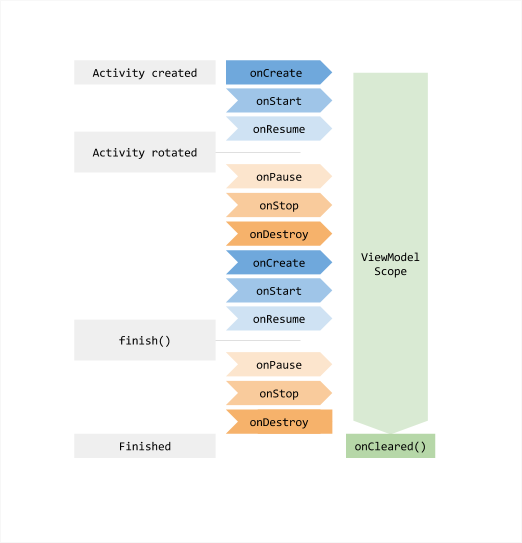
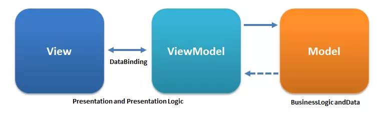

- ViewModel
- LiveData
- MVVM architecture
- Đọc thêm
+ Unidirectional Data Flow

# Mô hình MVVM

## 1. ViewModel 
### 1.1 Giới thiệu
**ViewModel** là một thành phần quan trọng trong kiến trúc Android, giúp lưu trữ và quản lý dữ liệu UI theo vòng đời của Activity hoặc Fragment. ViewModel giúp tách rời logic xử lý dữ liệu khỏi UI, đảm bảo dữ liệu không bị mất khi cấu hình thay đổi (ví dụ: xoay màn hình).

ViewModel thuộc thư viện **Android Architecture Components**, thường được sử dụng cùng với **LiveData**, **Room**, **Repository** có tác dụng:

- **Quản lý dữ liệu UI:** ViewModel giữ dữ liệu UI trong bộ nhớ, không bị mất khi Activity/Fragment bị hủy do thay đổi cấu hình.
- **Tách logic khỏi UI:** Giúp code rõ ràng, dễ kiểm thử (testable), dễ bảo trì.
- **Tối ưu hiệu năng:** Tránh việc tải lại dữ liệu không cần thiết.
- **Hỗ trợ Lifecycle:** ViewModel được thiết kế để phối hợp với Lifecycle của Activity/Fragment.

Vòng đời của **ViewModel** gắn liền với scope của nó (có thể là Activity/Fragment).
- ViewModel tồn tại cho tới khi Activity hoặc Fragment bị hủy hoàn toàn (do back hoặc finish).
- Khi cấu hình thay đổi (xoay màn hình), Activity/Fragment bị hủy/tạo lại, ViewModel vẫn giữ nguyên dữ liệu.



### 1.2 Cách dùng

#### Thêm dependencies

```gradle
implementation "androidx.lifecycle:lifecycle-viewmodel-ktx:2.7.0"
implementation "androidx.lifecycle:lifecycle-livedata-ktx:2.7.0"
```

#### Tạo Class ViewModel

```kotlin
class UserViewModel : ViewModel() {
    val users = MutableLiveData<List<User>>()

    fun loadUsers() {
        // Logic tải dữ liệu từ Repository
    }
}
```

#### Khởi tạo ViewModel trong Activity/Fragment

```kotlin
val viewModel: UserViewModel by viewModels()
```

Hoặc với Fragment:

```kotlin
val viewModel: UserViewModel by activityViewModels()
```

| `by viewModels()`                                                                    | `by activityViewModels()`                                                       |
| ------------------------------------------------------------------------------------ | ------------------------------------------------------------------------------- |
| Tạo **ViewModel mới** cho chính scope (Activity hoặc Fragment) đang gọi              | Lấy **ViewModel có sẵn** được gắn với Activity cha                              |
| Dữ liệu trong ViewModel **không chia sẻ** ra ngoài scope của nó                      | Dữ liệu được **chia sẻ** giữa Activity và tất cả các Fragment trong Activity đó |
| Mất dữ liệu khi scope bị destroy                                                     | Giữ dữ liệu chừng nào Activity chưa bị destroy                                  |
| Có thể truyền ViewModelStoreOwner khác để thay đổi scope (`requireParentFragment()`) | Mặc định scope là Activity cha                                                  |

#### LiveData

##### 1. LiveData là gì?

**LiveData** là một observable data holder (container lưu trữ dữ liệu có thể quan sát) nhận biết vòng đời (`lifecycle-aware`). Nó giúp UI tự động cập nhật khi dữ liệu thay đổi **và** tránh crash khi UI đã bị hủy.

Đặc điểm:
- Nhận biết trạng thái `LifecycleOwner` (Activity / Fragment / View Lifecycle Owner).
- Chỉ thông báo (dispatch) giá trị tới các Observer ở trạng thái `STARTED` hoặc `RESUMED` (gọi chung là "active").
- Tự động gỡ Observer khi vòng đời bị `DESTROYED`.
- Tồn tại trong **ViewModel** để “sống sót” sau thay đổi cấu hình (xoay màn hình, thay đổi ngôn ngữ…).

---

##### 2. Các loại LiveData thường dùng

| Loại                                     | Mô tả                               | Khi dùng                                      |
| ---------------------------------------- | ----------------------------------- | --------------------------------------------- |
| `LiveData<T>`                            | Chỉ đọc ngoài UI                    | Expose ra từ ViewModel                        |
| `MutableLiveData<T>`                     | Đọc + ghi                           | Chỉ dùng nội bộ trong ViewModel               |
| `MediatorLiveData<T>`                    | Kết hợp nhiều nguồn LiveData        | Tổng hợp nhiều nguồn dữ liệu (Remote + Local) |
| `Transformations.map()`                  | Biến đổi đồng bộ                    | Trong chuỗi UI formatting                     |
| `Transformations.switchMap()`            | Chuyển nguồn phụ thuộc giá trị      | Truy vấn theo key động (id, query)            |
| (Custom) Event Wrapper / SingleLiveEvent | Sự kiện một lần (navigation, toast) | Tránh lặp lại sau rotate                      |

> Lưu ý: Android không cung cấp chính thức `SingleLiveEvent`; đây là pattern tự tạo (xem thêm mục “Xử lý sự kiện một lần”).

---

##### 3. Cách hoạt động với vòng đời

LiveData chỉ gọi Observer khi:
- Có ít nhất một Observer active.
- Giá trị thay đổi qua `setValue()` hoặc `postValue()`.

Trạng thái Observer được tính theo `Lifecycle.State`:
- Active: `STARTED`, `RESUMED`
- Inactive: `INITIALIZED`, `CREATED`
- Gỡ bỏ: `DESTROYED`

##### 4. `setValue()` vs `postValue()`

| Hàm           | Thread dùng được | Thời điểm dispatch      | Gộp giá trị (coalesce)                            |
| ------------- | ---------------- | ----------------------- | ------------------------------------------------- |
| `setValue()`  | Main thread      | Ngay lập tức            | Không                                             |
| `postValue()` | Bất kỳ thread    | Đẩy vào main loop (trễ) | Có: nếu gọi nhiều lần nhanh, chỉ gửi giá trị cuối |

**Tại sao lại dùng LiveData:**
- Kết hợp chặt với ViewModel: Không bị reset khi xoay màn hình.

- Tự động update UI: Khi `.value` thay đổi, tất cả observer đang active sẽ được gọi lại.

- An toàn vòng đời: Không update UI khi Activity/Fragment đang ở trạng thái DESTROYED. tránh crash.

**Ví dụ về ViewModel:**
```kt
class SharedViewModel : ViewModel() {
    private val message = MutableLiveData<String>() //Sử dụng LiveData để lưu dữ liệu
    val message: LiveData<String> get() = message
}
```
**Fragment:**

```kt
class MyFragment : Fragment(R.layout.fragment_my) {
    private val viewModel: SharedViewModel by activityViewModels()

    override fun onViewCreated(view: View, savedInstanceState: Bundle?) {
        super.onViewCreated(view, savedInstanceState)

        val button = view.findViewById<Button>(R.id.myButton)
        button.setOnClickListener {
            viewModel.message.value = "Hello từ Fragment" //gửi dữ liệu lên ViewModel
        }
    }
}
```
**Activity:**

```kt
class MainActivity : AppCompatActivity() {
    private val viewModel: SharedViewModel by viewModels()

    override fun onCreate(savedInstanceState: Bundle?) {
        super.onCreate(savedInstanceState)
        setContentView(R.layout.activity_main)
        //Nhận dữ liệu bằng observe
        viewModel.message.observe(this) { msg ->
            Toast.makeText(this, "Nhận từ Fragment: $msg", Toast.LENGTH_SHORT).show()
        }
    }
}
```
LiveData chỉ gửi dữ liệu khi Observer trong trạng thái active. Khi LifecycleOwner bị hủy, LiveData tự động loại bỏ Observer.

## 2. Mô hình MVVM

**Mô hình MVVM** là mô hình kiến trúc phần mềm bao gồm các thành phần:
- **View**: phần giao diện của ứng dụng để hiển thị dữ liệu và nhận tương tác của người dùng. Có khả năng thực hiện các hành vi và phản hồi lại người dùng thông qua tính năng binding, command.
- **ViewModel**: lớp trung gian giữa View và Model (thay thế cho **Controller**). Chứa các mã lệnh cần thiết để thực hiện data binding, command.
- **Model**: các đối tượng giúp truy xuất và thao tác trên dữ liệu thực sự.
  


Ưu điểm của MVVM:

- Tách biệt rõ ràng giữa giao diện (View) và logic xử lý (Model, ViewModel).
- Dễ dàng kiểm thử logic (Unit Test) mà không phụ thuộc vào UI.
- Hỗ trợ tốt cho việc binding dữ liệu (Data Binding), giúp cập nhật UI tự động khi dữ liệu thay đổi.

MVVM rất phổ biến trong phát triển ứng dụng Android

