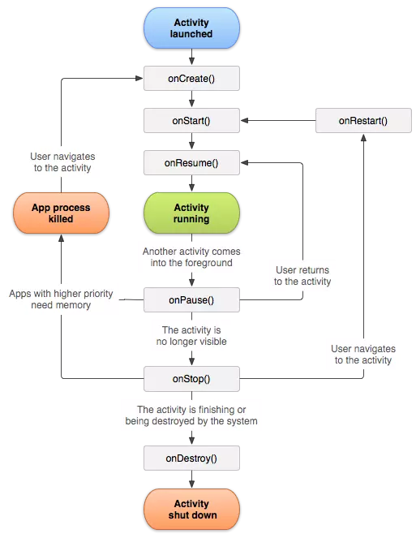
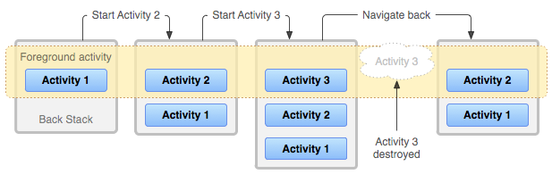
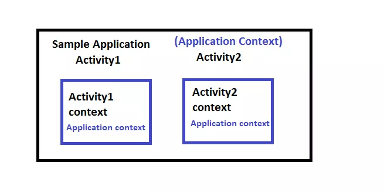

## 1. Foreground, background application trong android
#### 1.1. Foreground application
Nếu như trên máy tính, màn hình to, rộng nên có thể hiển thị cùng lúc nhiều cửa sổ / màn hình của nhiều ứng dụng. Trên mobile thì ứng dụng cũng được chạy song song nhưng vì màn hình nhỏ nên nó chỉ hiển thị 1 app vào 1 thời điểm. Ứng đang chạy, đang hiển thị thì nó được gọi là `foreground application`.

Đặc điểm:
- Có quyền truy cập nhiều tài nguyên hơn (CPU, RAM)
- Hiển thị trên màn hình
- Được phép thực hiện các thực thi trực tiếp từ người dùng

#### 1.2. Background application
`Background application` là ứng dụng đang được chạy ngầm (chạy nền) bên trong hệ thống, người dùng không thấy nó. Tình huống thường xảy ra là, khi người dùng bấm nút Home thì ứng dụng đó "đóng lại". Mình không thấy nó nhưng nó vẫn đang được chạy ngầm bên dưới.

Đặc điểm:
- Có ưu tiên thấp về tài nguyên (khi thiếu RAM có thể bị kill)
- Không hiển thị trên màn hình
- Có thể tương tác với người dùng qua thông báo

## 2. Activity
### 2.1. Định nghĩa
Mỗi **Activity** giống như một “cửa sổ” hoặc “màn hình” mà người dùng có thể tương tác.

Mỗi ứng dụng `Android` có thể có nhiều **Activity** khác nhau trong đó mỗi **Activity** chịu trách nhiệm hiển thị giao diện (thông qua layout `XML` hoặc code) và xử lý logic liên quan đến màn hình đó.

Các **Activity** được quản lý trong `back stack` (nhấn Back để quay lại *Activity* trước).

Đặc điểm:
- Activity cần “gắn” giao diện (UI) vào màn hình: dùng setContentView(...) (cho file XML) hoặc setContent { } (Jetpack Compose).
- Các **Activity** trong ứng dụng được điều hướng nhờ **Intent** để mở Activity khác bằng cách trả kết quả bằng Activity Result API
- Activity có một vòng đời gồm các giai đoạn: `onCreate() → onStart() → onResume() → onPause() → onStop() → onDestroy()`.

### 2.2 Activity Lifecycle
 Khi người dùng tương tác với ứng dụng, có thể có nhiều trường hợp xảy ra như: *chuyển*, *đóng*, *ẩn*, *thay thế Activity*. Điều này sẽ tạo ra nhiều thay đổi về mặt trạng thái đối với Activity. Do đó ta được cung cấp một số `callback` nhằm phục vụ việc quản lí Activity dễ dàng hơn hay còn được gọi là **Activity Lifecycle**.

Android quản lý vòng đời này thông qua các `callback method` mà ta có thể `override` để xử lý logic phù hợp ở từng giai đoạn.

 

| Phương thức       | Khi nào được gọi?                                                                                          | Chức năng chính                                                                                                                 | Ví dụ thực tế                                                                    |
| ----------------- | ---------------------------------------------------------------------------------------------------------- | ------------------------------------------------------------------------------------------------------------------------------- | -------------------------------------------------------------------------------- |
| **`onCreate()`**  | Gọi **một lần duy nhất** khi Activity được tạo. | - Khởi tạo biến, cấu hình logic ban đầu.<br>- Gắn layout bằng `setContentView()`.<br>- Kết nối dữ liệu ban đầu (database, API). | Khi mở ứng dụng lần đầu, màn hình chính được khởi tạo.                           |
| **`onStart()`**   | Sau `onCreate()` hoặc sau khi quay lại từ trạng thái `onStop()`.                                  | - Activity **chuẩn bị hiển thị** cho người dùng.<br>-  Preview, xem trước Camera | Khi chuyển từ màn hình A sang màn hình B, B chạy `onStart()` trước khi hiển thị. |
| **`onResume()`**  | Sau `onStart()` hoặc khi quay lại từ `onPause()`.                                                          | - Activity đang được hiển thị và người dùng có thể tương tác.<br>- Tiếp tục các tác vụ tạm dừng ở `onPause()`.               | Sau khi đóng một dialog nhỏ, màn hình chính trở lại và có thể bấm nút được.      |
| **`onPause()`**   | Khi một Activity khác **đang chuẩn bị** xuất hiện (hoặc app bị đưa ra background nhưng vẫn thấy một phần). | - Tạm dừng các tác vụ tốn tài nguyên như video, animation,...<br>- Lưu dữ liệu tạm thời.                                      | Khi ta mở cửa sổ các ứng dụng đang chạy.                        |
| **`onStop()`**    | Khi Activity **không còn hiển thị** trên màn hình (bị che hoàn toàn).                                      | - Giải phóng tài nguyên nặng (camera, cảm biến).<br>- Lưu dữ liệu vào bộ nhớ lâu dài nếu cần.                                   | Chuyển từ app A sang app B - màn hình A biến mất.                                |
| **`onDestroy()`** | Gọi khi Activity bị hủy hoàn toàn (do người dùng back hoặc hệ thống thu hồi tài nguyên).                   | - Dọn dẹp bộ nhớ, hủy thread, đóng kết nối database.<br>- Có thể không được gọi nếu hệ thống “kill” do thiếu RAM.                    | Bấm nút Back để thoát màn hình, hoặc app bị kill trong quản lý đa nhiệm.         |
| **`onRestart()`** | Gọi sau `onStop()` nếu Activity được mở lại.                                                               | - Chuẩn bị chạy lại vòng đời (`onStart()` → `onResume()`).                                                                      | Chuyển sang app khác rồi quay lại app cũ.          |

##### Lưu ý:
- `onCreate()` là hàm bắt buộc phải thực hiện để khởi tạo Activity
```kotlin
override fun onCreate(savedInstanceState: Bundle?) {
        super.onCreate(savedInstanceState)
        // Some thing
}
```
- `onCreate()` có param là một bundle onCreate(savedInstanceState: Bundle?) chứa giá trị liên quan đến trạng thái đã được lưu lần trước của activity
- `onResume()` có thể được gọi nhiều lần trong suốt chương trình:
    - onCreate > onStart > onResume
    - onPause > onResume
    - onStop > onRestart > onStart > onResume

### 2.3. Back Stack
#### a) Task
**Task là gì?**
Một **Task** là một tập hợp các Activity mà người dùng tương tác theo thứ tự thời gian.
Ta có thể hiểu Task hoạt động như một "ngăn xếp" các màn hình mà Android quản lý

**Cách hoạt động:**
Khi người dùng mở ứng dụng từ **Home screen**, Android sẽ tạo một Task mới. Activity đầu tiên trong Task đó được gọi là **root activity**.
Các Activity mới mở từ Activity hiện tại sẽ được push vào back stack của Task đó.
Khi người dùng bấm Back thì Activity hiện tại sẽ bị pop khỏi stack và Activity trước đó trong stack sẽ được hiển thị trở lại màn hình.

**Đặc điểm:**
- Android có thể giữ nhiều Task chạy song song (giống như nhiều cửa sổ).

- Người dùng có thể chuyển đổi giữa các Task qua **Recent Apps**.

- Mỗi Task được quản lý độc lập, nên khi quay lại Task cũ, trạng thái các Activity có thể được giữ nguyên hoặc bị hủy tùy bộ nhớ.

- Một Task có thể chứa Activity của nhiều ứng dụng khác nhau nếu **Intent** mở sang Activity của ứng dụng khác.
- Android cho phép bạn điều khiển cách Activity và Task hoạt động bằng **flags**

#### b) Back Stack
`Back Stack` là ngăn xếp (stack) chứa các Activity trong một Task hoạt động theo nguyên tắc LIFO.

Khi người dùng nhấn hoặc cử chỉ `Back`, mỗi hoạt động trong `back stack` được pop ra để hiển thị màn hình trước đó. Khi tất cả các Activity bị xoá khỏi ngăn xếp, Task cũng không còn tồn tại.



- Khi đang ở **Activity1** và bắt đầu **Activity2** thì **Activity1** sẽ bị dừng, nhưng hệ thống sẽ giữ lại trạng thái của nó (VD: vị trí scroll, EditText đang được nhập...), Nếu user ấn `Back` khi ở **Activity2**, **Activity1** sẽ tiếp tục với trạng thái được khôi phục.

- Khi user rời khỏi Task bằng cách ấn `Home button` (hoặc mở task mới), task hiên tại sẽ được đưa xuống `background`. Hệ thống sẽ giữ nguyên trạng thái của các activity trong task, nếu sau đó user tiếp tục ứng dụng, task sẽ được đưa lên `foreground` và tiếp tục activity trên cùng của nó.
#### c) Launch Mode
**Launch mode** là cách mà Android quản lý việc khởi tạo instance của một Actitvity trong một task của ứng dụng.

Có 4 loại Launch mode:
| Launch mode | Đặc điểm | Khi nào dùng |
| - | - | - |
| **`standard`** (mặc định) | - Mỗi lần start **luôn** tạo một instance mới.<br>- Instance được push vào back stack của Task hiện tại.<br>- Không quan tâm Activity đã tồn tại hay chưa.                       | Màn hình bình thường, không cần giới hạn số instance.              |
| **`singleTop`**           | - Nếu Activity đang ở **top** thì tái sử dụng instance hiện tại, gọi `onNewIntent()`.<br>- Nếu không ở đỉnh thì tạo instance mới.                        | Tối ưu việc không tạo lại các instant ở top     |
| **`singleTask`**          | - Chỉ có **1 instance** tồn tại.<br>- Nếu đã tồn tại thì xóa các Activity phía trên nó trong stack, đưa nó lên đỉnh, gọi `onNewIntent()`. | Màn hình chính, dashboarddashboard. Khi muốn tránh nhiều Activity.                 |
| **`singleInstance`**      | - Task chỉ chứa **duy nhất Activity**.<br>- Không chứa bất kỳ Activity nào khác.<br>- Nếu Activity khác mở nó → chạy trong Task riêng biệt.                         | Các màn hình chạy độc lập hoàn toàn (màn hình khóa, cuộc gọi đến, chat bubble,...). |


Để khai báo launch mode ta vào trong AndroidManifest.xml
```xml
<activity
    android:name=".MainActivity"
    android:launchMode="singleTask" />
```

## 3. Context
**Context** là một abstract class cung cấp quyền truy cập đến: Tài nguyên của ứng dụng, Hệ thống dịch vụ (system services), Thông tin môi trường của một ứng dụng.

Nó cho phép ta tương tác với các dịch vụ hệ thống, tài nguyên và các thành phần ứng dụng khác.

Ta có thể hiểu **Context** là "bối cảnh" hiện tại của ứng dụng.

Các thành phần như `Activity, Service, Application, BroadcastReceiver` đều kế thừa từ Context

Trong đó có 2 loại Context quan trọng là:
- **Application Context**: Nó là singleton tồn tại trong toàn bộ vòng đời của ứng dụng và có thể được truy cập trong activity thông qua `getApplicationContext()`
- **Activity Context**: Mỗi activity sẽ có context của riêng nó. Context này được gắn với vòng đời của activity. Activity context nên được sử dụng khi đang ở trong phạm vi của activity. Có thể lấy nó qua phương thức `getContext()`.

**Hệ thống phân cấp Context:**


## 4. Intent
### 4.1 Định nghĩa
**Intent** là một *đối tượng thông báo* (messaging object) mà Android dùng để:
- Yêu cầu một hành động từ một thành phần khác
- Hoặc truyền dữ liệu giữa các thành phần trong cùng ứng dụng hoặc giữa các ứng dụng với nhau.

Ta có thể hiểu **Intent** là một mô tả trừu tượng của 1 hoạt động sẽ được thực hiện. Nó có thể sử dụng để khởi chạy 1 `Activity`, `Service`, hoặc đăng ký `Broadcast Receiver`

### 4.2 Phân loại
Có 2 loại Intent: Explicit intents (tường minh) và Implicit intents ( không tường minh)

#### a) Explicit intents
Intent tường mình là chỉ định rõ và truyền trực tiếp tên thành phần đích vào khi tạo một đối tượng Intent

```kotlin
val intent = Intent(this, SomeActivity::class.java)
    startActivity(intent)
```

#### b) Implicit intents
Thay vì trong Intent Android được chỉ định sẵn một Activity nào đó thực hiện, thì sẽ chỉ truyền vào action và gửi cho Android. Android sẽ dựa vào action đó mà lọc những thành phần nào đã đăng kí action đó gọi ra.

```kotlin
val intent = Intent(Intent.ACTION_VIEW)
intent.data = Uri.parse("https://www.google.com")
startActivity(intent)
```

**Một số Implicit intents:**
- `ACTION_VIEW:` Mở một dữ liệu URI (Uniform Resource Identifier) bằng cách sử dụng ứng dụng mặc định cho loại dữ liệu đó. Ví dụ: mở trang web, xem hình ảnh, v.v.
- `ACTION_EDIT:` Yêu cầu chỉnh sửa dữ liệu đã cho. Ví dụ: chỉnh sửa thông tin liên hệ trong ứng dụng liên hệ.
- `ACTION_DIAL:` Mở màn hình điện thoại với số điện thoại đã cho trong dấu hiệu chuỗi. Điều này cho phép người dùng gọi số điện thoại đó.
- `ACTION_SEND:` Gửi dữ liệu đến một ứng dụng mục tiêu. Dữ liệu có thể là văn bản, hình ảnh, âm thanh, v.v.
- `ACTION_PICK:` Yêu cầu người dùng chọn một mục từ danh sách. Ví dụ: chọn một liên hệ từ danh bạ.
- `ACTION_SEARCH:` Thực hiện một tìm kiếm dựa trên một truy vấn được cung cấp.
- `ACTION_CALL:` Gọi số điện thoại đã cho mà không cần xác nhận từ người dùng.
- `ACTION_CAMERA:` Mở ứng dụng máy ảnh để chụp ảnh.
- `ACTION_GET_CONTENT:` Lấy nội dung từ nguồn đã cho, ví dụ như lấy hình ảnh từ thư viện hình ảnh.
- `ACTION_BATTERY_LOW:` Gửi thông báo khi pin của thiết bị yếu đi.
- `ACTION_POWER_CONNECTED`: Gửi thông báo khi thiết bị được kết nối với nguồn điện.
- `ACTION_BOOT_COMPLETED:` Gửi thông báo khi hệ thống đã khởi động xong.

### 4.3 Công dụng phổ biến
#### a) Chuyển đổi giữa 2 activity
Ở MainActivity, ta sẽ chuyển sang SecondActivity khi Button "Go" được nhấn:
```kotlin
//Trong MainActivity.kt
val btn = findViewById<Button>(R.id.btnGo)
btn.setOnClickListener {
    // Tạo Intent để chuyển sang SecondActivity:
    val intent = Intent(this, SecondActivity::class.java)
    //Chuyển sang SecondActivity:
    startActivity(intent)
}
```

#### b) Khởi động Service
Ví dụ 1 service bất kì: `MusicService`
```kotlin
val intent = Intent(this, MusicService::class.java)
startService(intent)
```
Để dừng service:
```kotlin
stopService(Intent(this, MusicService::class.java))
```

#### c) Đăng kí 1 BroadCast
Đăng kí 1 BroadCast để gửi thông báo pin yếu:
```kotlin
class MainActivity : AppCompatActivity() {
    private val batteryReceiver = BatteryReceiver()

    override fun onStart() {
        super.onStart()
        val filter = IntentFilter("com.example.ACTION_BATTERY_LOW")
        registerReceiver(batteryReceiver, filter)
    }

    override fun onStop() {
        super.onStop()
        unregisterReceiver(batteryReceiver) //Hủy đăng ký để tránh rò rỉ bộ nhớ
    }
}
```
Nhận broadcast
```kotlin
class BatteryReceiver : BroadcastReceiver() {
    override fun onReceive(context: Context, intent: Intent) {
        Toast.makeText(context, "Battery Low!", Toast.LENGTH_SHORT).show()
    }
}
```

#### d) Mở trình duyệt web:
```kotlin
val intent = Intent(Intent.ACTION_VIEW)
intent.data = Uri.parse("https://www.google.com")
startActivity(intent)
```

### 4.4 Một số Flag của intent
**Flag** là các hằng số (`constant`) mà bạn có thể gắn vào **Intent** để điều chỉnh cách Activity được khởi chạy hoặc cách Intent hoạt động.

Để gắn 1 "cờ" vào intent ta có thể dùng:
```kotlin
intent.addFlags(Intent.FLAG_XXX)
//hoặc
intent.flags = Intent.FLAG_XXX // Lưu ý các flag đã thêm trước đó đều được thay thế bằng flag mới
```
| Flag | Ý nghĩa ngắn |
| - | - |
| `FLAG_ACTIVITY_NEW_TASK`| Mở Activity trong **task mới** (cần khi start từ Service/Broadcast).|
| `FLAG_ACTIVITY_CLEAR_TASK`| Xóa toàn bộ Activity trong task hiện tại trước khi mở Activity mới. |
| `FLAG_ACTIVITY_CLEAR_TOP`| Xóa các Activity phía trên Activity đích trong back stack.|
| `FLAG_ACTIVITY_SINGLE_TOP`| Nếu Activity trên cùng là Activity đích → không tạo mới, gọi `onNewIntent()`. |
| `FLAG_ACTIVITY_NEW_DOCUMENT`| Tạo một instance mới của Activity trong **task riêng biệt**. |
| `FLAG_ACTIVITY_MULTIPLE_TASK`| Cho phép tạo **nhiều task mới** cho cùng một Activity. |
| `FLAG_ACTIVITY_NO_HISTORY`| Không lưu Activity vào back stack, thoát là sẽ mất.
| `FLAG_ACTIVITY_REORDER_TO_FRONT`| Đưa Activity đã tồn tại trong back stack lên trên cùng thay vì tạo mới.|
| `FLAG_ACTIVITY_EXCLUDE_FROM_RECENTS`| Không cho Activity xuất hiện trong danh sách recent apps.|

## 5. Truyền dữ liệu giữa các Activity
#### 5.1 Extra
Là một cặp key‑value đơn lẻ được thêm vào Intent bằng phương thức `putExtra(key, value)`

Activity nhận dữ liệu sẽ lấy bằng `getXxxExtra(key)`

```kotlin
val intent = Intent(this, SecondActivity::class.java)
intent.putExtra("username", "An")
```

```kotlin
val username = intent.getStringExtra("username") // username = "An"
```

#### 5.2 Extras
Là toàn bộ các dữ liệu (nhiều cặp key‑value) đã được gắn vào Intent và được lưu dưới dạng một đối tượng Bundle.

Khác biệt với Extra ở bên nhận dữ liệu sẽ lấy bằng `intent.extras`.

```kotlin
// Truyền nhiều dữ liệu
val intent = Intent(this, SecondActivity::class.java)
intent.putExtra("username", "Pandoruu")
intent.putExtra("age", 20)

// Nhận toàn bộ extras
val bundle = intent.extras
val username = bundle?.getString("username")
val age = bundle?.getInt("age")
```

#### 5.3 Activity Result API
Là cơ chế để mở một Activity khác và nhận kết quả trả về từ Activity đó (Ví dụ: Mở màn hình chọn ảnh => khi người dùng chọn xong, Activity sẽ trả URI ảnh về cho Activity trước đó)

**Cách hoạt động:**
- Đăng ký một Activity Result Launcher thông qua `registerForActivityResult()`

- Chỉ định contract (định nghĩa cách khởi chạy và nhận dữ liệu).

- Gọi `launch(input)` để chạy.

- Nhận kết quả qua lambda callback.

Ở file MainActivity.kt
```kotlin
class MainActivity : AppCompatActivity() {

    // 1. Tạo launcher để mở Activity và nhận kết quả
    private val openSecondActivity = registerForActivityResult(
        ActivityResultContracts.StartActivityForResult()
    ) { result ->
        if (result.resultCode == Activity.RESULT_OK) {
            val value = result.data?.getStringExtra("result_key")
            Toast.makeText(this, "Nhận: $value", Toast.LENGTH_SHORT).show()
        }
    }

    override fun onCreate(savedInstanceState: Bundle?) {
        super.onCreate(savedInstanceState)
        setContentView(R.layout.activity_main)

        // 2. Gọi Activity khác
        findViewById<Button>(R.id.btnOpen).setOnClickListener {
            val intent = Intent(this, SecondActivity::class.java)
            openSecondActivity.launch(intent)
        }
    }
}
```
SecondActivity.kt
```kotlin
class SecondActivity : AppCompatActivity() {
    override fun onCreate(savedInstanceState: Bundle?) {
        super.onCreate(savedInstanceState)
        setContentView(R.layout.activity_second)

        findViewById<Button>(R.id.btnReturn).setOnClickListener {
            val data = Intent().apply {
                putExtra("result_key", "Xin chào từ SecondActivity")
            }
            setResult(Activity.RESULT_OK, data)
            finish()
        }
    }
}
```
**Các ActivityResultContracts thường dùng:**
| Contract| Công dụng| Input| Output |
| - | - | - | - |
| `StartActivityForResult`     | Mở Activity và nhận kết quả | `Intent`                    | `ActivityResult`       |
| `RequestPermission`          | Xin một quyền runtime       | `String` (quyền)            | `Boolean`              |
| `RequestMultiplePermissions` | Xin nhiều quyền             | `Array<String>`             | `Map<String, Boolean>` |
| `TakePicture`                | Chụp ảnh và lưu vào URI     | `Uri`                       | `Boolean`              |
| `TakePicturePreview`         | Chụp ảnh và trả về `Bitmap` | none                        | `Bitmap`               |
| `TakeVideo`                  | Quay video và lưu vào URI   | `Uri`                       | `Boolean`              |
| `GetContent`                 | Chọn file/ảnh/video         | `String` (MIME type)        | `Uri`                  |
| `OpenDocument`               | Chọn tài liệu từ storage    | `Array<String>` (MIME type) | `Uri`                  |
| `PickContact`                | Chọn liên hệ                | none                        | `Uri`                  |
