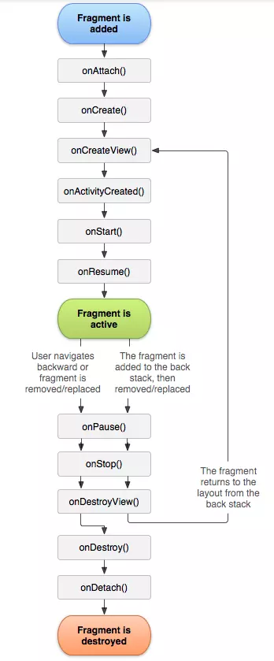
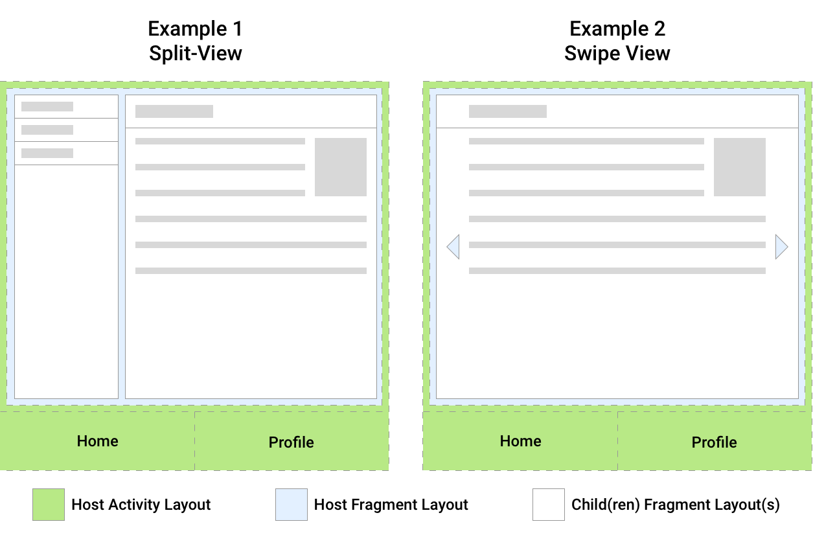
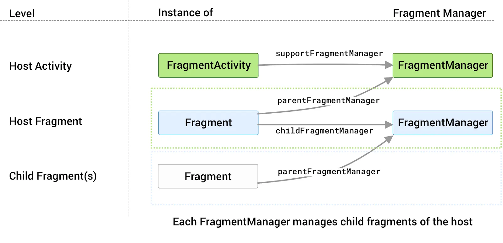

# Fragment trong Android
## 1. Fragment là gì?
Ta có thể coi **Fragment** là một "mảnh giao diện nhỏ" có thể tái sử dụng nhiều lần ở nhiều nơi khác nhau trên một ứng dụng Android.

Mỗi **Fragment** thường có một file UI riêng (`.xml`), có các logic xử lí riêng và cũng có vòng đời (life cycle) riêng của chúng.

**Fragment** phải được hiển trị trong một Activity hoặc trong 1 Fragment khác. Trên một màn hình có thể linh hoạt thêm, sửa, xóa. thay đổi fragment

**Fragment** nhẹ hơn Activity, nên ưu tiên thiết kế các fragment có thể thay thế cho activity để tối ưu.

#### Khởi tạo một Fragment
- Tạo layout cho fragment

```xml
<?xml version="1.0" encoding="utf-8"?>
<androidx.constraintlayout.widget.ConstraintLayout xmlns:android="http://schemas.android.com/apk/res/android"
    android:layout_width="match_parent"
    android:layout_height="match_parent"
    xmlns:app="http://schemas.android.com/apk/res-auto">
    <TextView
        android:layout_width="wrap_content"
        android:layout_height="wrap_content"
        android:text="This is a simple Fragment!"
        android:background="@color/black"
        android:textColor="@color/white"
        android:textSize="30sp"
        app:layout_constraintTop_toTopOf="parent"
        app:layout_constraintBottom_toBottomOf="parent"
        app:layout_constraintEnd_toEndOf="parent"
        app:layout_constraintStart_toStartOf="parent"
        />
</androidx.constraintlayout.widget.ConstraintLayout>
```

- Tạo 1 class `Fragment` nhận View là layout đã tạo trên

```kt
class SimpleFragment: Fragment {
    constructor()

    override fun onCreateView(
        inflater: LayoutInflater,
        container: ViewGroup?,
        savedInstanceState: Bundle?
    ): View? {
        val view: View = inflater.inflate(R.layout.fragment_simple, container, false)
        return view
    }
}
```

- Trong layout của Activity cha, tạo 1 view để chứa `fragment` muốn tải lên

```xml
<androidx.fragment.app.FragmentContainerView
    android:id="@+id/fragment_container"
    android:layout_width="match_parent"
    android:layout_height="wrap_content"
    app:layout_constraintTop_toBottomOf="@+id/text"
    app:layout_constraintStart_toStartOf="parent"
    app:layout_constraintEnd_toEndOf="parent"/>
```

- Trong class activity cha, dùng phương thức `add()` hoặc `replace()` để load `fragment` vào vị trí của `fragmentContainer`

```kt
class MainActivity : AppCompatActivity() {
    private lateinit var binding: ActivityMainBinding
    override fun onCreate(savedInstanceState: Bundle?) {
        super.onCreate(savedInstanceState)

        binding = ActivityMainBinding.inflate(layoutInflater)
        setContentView(binding.root)

        supportFragmentManager.commit {
            setReorderingAllowed(true)
            replace(binding.fragmentContainer.id, SimpleFragment(), "load")
        }
    }
}
```

## 2. Life cycle
Giống như Activity, Mỗi **Fragment** cũng có vòng đời của nó dựa vào các trang thái của fragment đó.

Các trạng thái của một **Fragment** được liệt kê trong enum `Lifecycle.State`. Gồm:
- `INITIALIZED`
- `CREATED`
- `STARTED`
- `RESUMED`
- `DESTROYED`



Trong đó ta cần nắm được các callback:
- `onAttach()`: instance của Fragment sẽ được gắn vớimootj activity. Fragment và Activity không hoàn toàn được khởi tạo

- `onCreate()`: Bước khởi tạo ban đầu, các thông số mặc định của một Fragment được khởi tạo

- `onCreateView()`: Được gọi khi cần Fragment vẽ UI lần đầu tiên. Phương thức này trả về một View mà Fragment đó vẽ. Nếu Fragment không có giao diện sẽ trả về null

- `onActivityCreated()`: Được gọi sau khi activity cha được tạo. Khi này View có thể được truy cập với phương thức findViewById().

- `onStart()`: Được gọi khi Fragment hiển thị View cho người dùng

- `onResume()`: Được gọi khi Fragment đã được hiển thị và đang chạy. Người dùng có thể tương tác với Fragment   

- `onPause()`: Khi Fragment bị che mất 1 phần hoặc khi có thành phần khác đè lên nó. Người dùng không tương tác được với Fragment

- `onStop()`: Fragment bị che mất hoàn toàn. Người dùng khôn thể tương tác với Fragment đó

- `onDestroyView()`: Hủy View của Fragment. Nên hủy binding (binding = null) trong bước này để tránh memory leak

- `onDestroy()`: Được gọi khi xóa Fragment

- `onDetach()`: Tách Fragment ra khỏi Activity hoặc Fragment cha

Vòng đời của View Fragment đối chiếu với vòng đời của Fragment:


## 3. Fragment Manager & Fragment Transaction
### 3.1. Fragment Manager
Tùy theo mục đích sử dụng mà trong một Activity của ứng dụng có thể chứa nhiều vùng Fragment khác nhau. Mỗi Fragment lại có thể chứa nhiều Fragment con. Điều này tạo ra tính module và linh hoạt trong thiết kế UI. 



Để quản lí cấu trúc trên thì ta cần có `FragmentManager`. Đây là lớp xử lí các hành động được thực hiện trên các Fragment của ứng dụng như `add(), remove(), replace(), find()` fragment, cũng như quản lí back stack cho fragment `addToBackStack()`.

Ta có thể truy cập FragmentManager từ một Activity hoặc từ 1 Fragment:
```kt
//Khi xử lí ở trong Activity:
val fragmentManager = supportFragmentManager
//Khi xử lí ở trong 1 Fragment cha:
val childManager = childFragmentManager
```

Nếu một Fragment con muốn quản lý Fragment anh em hoặc tương tác với Fragment cha/Activity cha thì dùng:

```kt
val parentManager = parentFragmentManager
```

**Sơ đồ truy cập FragmentManager:**



### 3.2. Fragment Transaction
Fragment Transaction là cơ chế mà FragmentManager dùng để thực hiện các thay đổi với Fragment trong Activity hoặc Fragment khác.

Đặc điểm:
- Được tạo ra từ FragmentManager bằng phương thức beginTransaction().

- Có thể thực hiện nhiều thao tác với Fragment trong một transaction.

- Thay đổi sẽ chưa áp dụng ngay cho đến khi gọi `commit()` hoặc `commitNow()`.

| Phương thức                          | Mô tả                                               |
| ------------------------------------ | --------------------------------------------------- |
| `add(containerViewId, fragment)`     | Thêm một Fragment mới vào layout.                   |
| `replace(containerViewId, fragment)` | Thay thế Fragment hiện tại bằng Fragment khác.      |
| `remove(fragment)`                   | Gỡ Fragment ra khỏi layout.                         |
| `hide(fragment)`                     | Ẩn Fragment nhưng không hủy.                        |
| `show(fragment)`                     | Hiện Fragment đã bị ẩn.                             |
| `attach(fragment)`                   | Gắn lại Fragment đã bị tách (detached).             |
| `detach(fragment)`                   | Tách Fragment khỏi UI nhưng không hủy instance.     |
| `addToBackStack(name)`               | Thêm transaction vào Back Stack để có thể quay lại. |

Các thay đổi này sẽ được đặt trong một phương thức `beginTransaction()` và được commit trong 1 lần

```kt
class MainActivity : AppCompatActivity() {
    private lateinit var binding: ActivityMainBinding
    override fun onCreate(savedInstanceState: Bundle?) {
        super.onCreate(savedInstanceState)
        binding = ActivityMainBinding.inflate(layoutInflater)

        setContentView(binding.root)

        supportFragmentManager.beginTransaction()
            .setReorderingAllowed(true)
            .replace(binding.fragmentContainer.id, SimpleFragment(), "1st_replace")
            .commit()
    }
}
```

Cách dùng thư viện mở rộng **AndroidX Fragment KTX**:
- Thêm vào dependencies: `implementation "androidx.fragment:fragment-ktx:1.8.2"`

```kt
class MainActivity : AppCompatActivity() {
    private lateinit var binding: ActivityMainBinding
    override fun onCreate(savedInstanceState: Bundle?) {
        super.onCreate(savedInstanceState)
        binding = ActivityMainBinding.inflate(layoutInflater)
        setContentView(binding.root)

        supportFragmentManager.commit {
            setReorderingAllowed(true)
            replace(binding.fragmentContainer.id, SimpleFragment(), "1st_replace")
        }
    }
}
```

**Lưu ý:** `setReorderingAllowed(true)` là một cờ cho phép FragmentManager được quyền tái sắp xếp (reorder) các thao tác thêm/xóa/thay thế Fragment để tối ưu hiệu năng và tránh lỗi vòng đời Fragment.

## 4. Giao tiếp Activity - Fragment
Ta có thể tạo giao tiếp giữa Activity - Fragment bằng `ViewModel` hoặc là sử dụng `Fragment Result API`

### 4.1. ViewModel + LiveData
**ViewModel**: là một lớp trong thư viện `androidx.lifecycle.` dùng để tạo 1 kênh liên lạc giữa Activity và các Fragment.

**MutableLiveData**: LiveData là một container dữ liệu có thể quan sát được (observable data holder), thuộc `androidx.lifecycle.` MutableLiveData là phiên bản có thể thay đổi giá trị của LiveData.

Tại sao lại dùng MutableLiveData:
- Kết hợp chặt với ViewModel: Không bị reset khi xoay màn hình.

- Tự động update UI: Khi `.value` thay đổi, tất cả observer đang active sẽ được gọi lại.

- An toàn vòng đời: Không update UI khi Activity/Fragment đang ở trạng thái DESTROYED. tránh crash.

**Ví dụ về ViewModel:**
```kt
class SharedViewModel : ViewModel() {
    private val message = MutableLiveData<String>() //Sử dụng LiveData để lưu dữ liệu
    val message: LiveData<String> get() = message
}
```
**Fragment:**

```kt
class MyFragment : Fragment(R.layout.fragment_my) {
    private val viewModel: SharedViewModel by activityViewModels()

    override fun onViewCreated(view: View, savedInstanceState: Bundle?) {
        super.onViewCreated(view, savedInstanceState)

        val button = view.findViewById<Button>(R.id.myButton)
        button.setOnClickListener {
            viewModel.message.value = "Hello từ Fragment" //gửi dữ liệu lên ViewModel
        }
    }
}
```
**Activity:**

```kt
class MainActivity : AppCompatActivity() {
    private val viewModel: SharedViewModel by viewModels()

    override fun onCreate(savedInstanceState: Bundle?) {
        super.onCreate(savedInstanceState)
        setContentView(R.layout.activity_main)
        //Nhận dữ liệu bằng observe
        viewModel.message.observe(this) { msg ->
            Toast.makeText(this, "Nhận từ Fragment: $msg", Toast.LENGTH_SHORT).show()
        }
    }
}
```

Trong đó ta cần chú ý:
|`by viewModels()`| `by activityViewModels()`|
| - | - |
| Tạo **ViewModel mới** cho chính scope (Activity hoặc Fragment) đang gọi | Lấy **ViewModel có sẵn** được gắn với Activity cha |
| Dữ liệu trong ViewModel **không chia sẻ** ra ngoài scope của nó  | Dữ liệu được **chia sẻ** giữa Activity và tất cả các Fragment trong Activity đó|
| Mất dữ liệu khi scope bị destroy| Giữ dữ liệu chừng nào Activity chưa bị destroy |
| Có thể truyền ViewModelStoreOwner khác để thay đổi scope (`requireParentFragment()`) | Mặc định scope là Activity cha |

Ta có thể khởi tạo nhiều instance cùng class `SharedViewModel` nhưng ở scope khác nhau, để tách biệt các luồng giao tiếp giữa:
- Activity - Fragment cha
- Fragment cha - Fragment con

### 4.2. Fragment Result API
Cách này không cần ViewModel và phù hợp cho việc gửi dữ liệu một lần khi một Fragment đóng hoặc thực hiện xong nhiệm vụ.

**Fragment Result API** cho phép một Fragment gửi dữ liệu dạng Bundle đến Fragment hoặc Activity khác thông qua **FragmentManager**

Có hai hàm chính:

- `setFragmentResult(requestKey, bundle)` - Gửi dữ liệu bằng 1 gói bundle kèm 1 key định danh.

- `setFragmentResultListener(requestKey, lifecycleOwner, listener)` - Đăng kí lắng nghe dữ liệu qua 1 Key.

**Fragment:**
```kt
class ChildFragment : Fragment(R.layout.fragmentfragment_A) {
    override fun onViewCreated(view: View, savedInstanceState: Bundle?) {
        super.onViewCreated(view, savedInstanceState)

        val btn = view.findViewById<Button>(R.id.btnSendResult)
        btn.setOnClickListener {
            val result = Bundle().apply {
                putString("data_key", "Hello từ ChildFragment")
            }
            parentFragmentManager.setFragmentResult("request_key", result)
        }
    }
}
```

**Activity:**
```
class MainActivity : AppCompatActivity() {
    override fun onCreate(savedInstanceState: Bundle?) {
        super.onCreate(savedInstanceState)
        setContentView(R.layout.activity_main)

        supportFragmentManager.setFragmentResultListener(
            "request_key",
            this
        ) { key, bundle ->
            val data = bundle.getString("data_key")
            Toast.makeText(this, "Nhận từ Fragment: $data", Toast.LENGTH_SHORT).show()
        }
    }
}
```