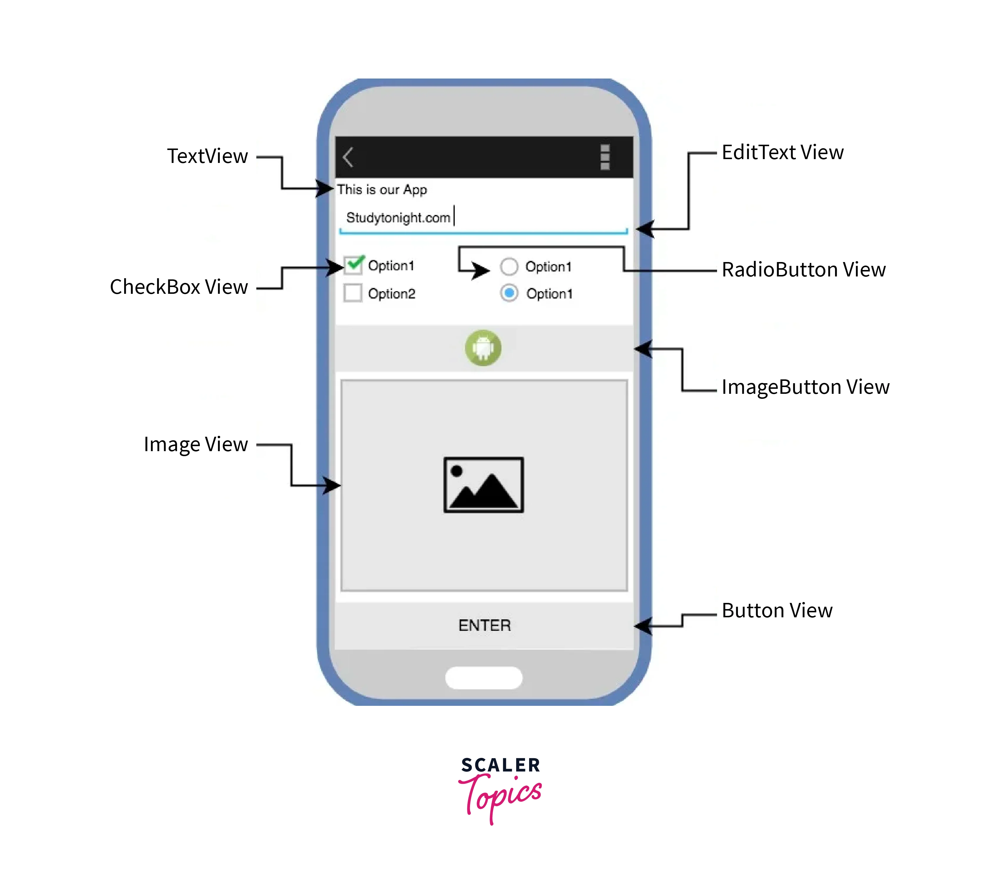
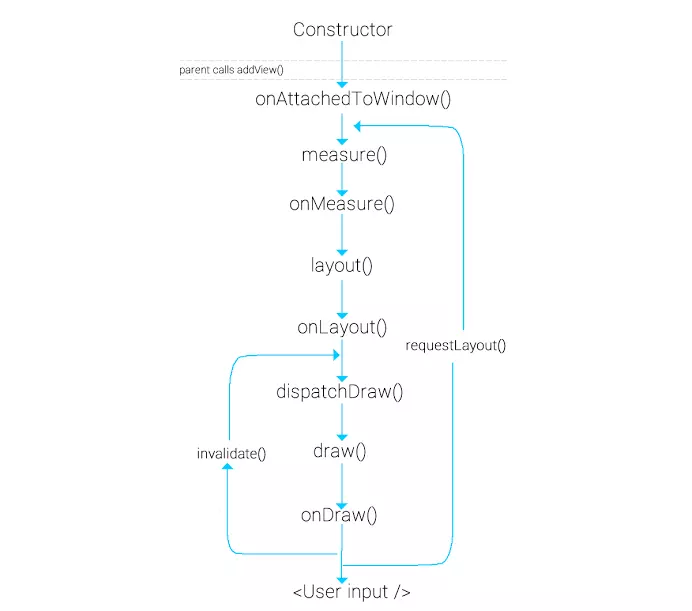
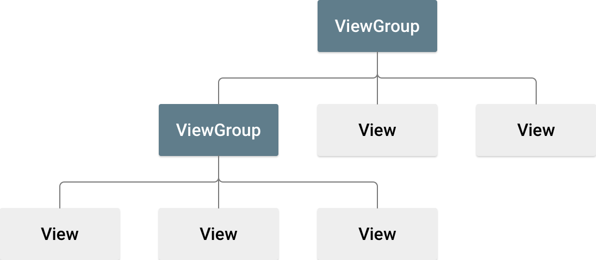
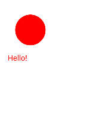

Cơ chế vẽ View trong Android (measure pass & layout pass)
View, ViewGroup, MeasureSpec
Tạo Custom View và Custom Attribute
Vẽ UI bằng Canvas & Paint
Override onMeasure(), onSizeChanged(), onDraw()

# Buổi 1: Cơ chế vẽ View trong Android


## 1. View, ViewGroup, MeasureSpec

#### 1.1 View

- `View` là một class thể hiện cho 1 thành phần giao diện được hiển thị trên màn hình. Mỗi View sẽ chiếm 1 vùng hình chữ nhật trên màn hình, chịu trách nghiệm vẽ và xử lí các sự kiện của thành phần đó.
- Tất cả các View trên màn hình đều được sắp xếp trong một View Tree, các View con nằm trong các View cha và cùng nằm trong View Root. Có thể thêm View bằng cách viết code hoặc chỉ định 1 hoặc nhiều file `.xml`.
- View có nhiều lớp con được thiết kế chuyên biệt để hiển thị các dang nội dung khác nhau.
- Ví dụ: TextView, ImageView, ButtonView, ...


| Subclass     | Description                                                                      |
| ------------ | -------------------------------------------------------------------------------- |
| TextView     | Used to display text on the screen.                                              |
| ImageView    | Used to display images or drawables.                                             |
| Button       | Used to trigger actions when clicked.                                            |
| EditText     | Used to accept user input as text.                                               |
| CheckBox     | Used to represent a binary choice (checked or unchecked).                        |
| RadioButton  | Used to represent a single choice from a group of options.                       |
| ProgressBar  | Used to show the progress of an operation.                                       |
| SeekBar      | Used to select a value from a range by sliding a thumb.                          |
| ListView     | Used to display a scrollable list of items.                                      |
| RecyclerView | A more flexible and efficient version of ListView for displaying large datasets. |

**Vòng đời của 1 view**:


#### 1.2 ViewGroup
- ViewGroup là một subclass của View, nó có thể chứa các View con ở trong nó.

```kotlin
abstract class ViewGroup : View {
    
    // Danh sách children
    private var mChildren: Array<View?>
    private var mChildrenCount: Int
    
    fun addView(child: View)
    
    fun removeView(child: View)
    
    fun getChildAt(index: Int): View
    
    fun getChildCount(): Int
    
    protected abstract fun onLayout(...)
}
```

- ViewGroup quản lí measure và layout cho các View con
- Ví dụ: LinearLayout, RelativeLayout, RecyclerView, ...
- Ví dụ XML
```xml
<LinearLayout
    android:layout_width="match_parent"
    android:layout_height="match_parent"
    android:orientation="vertical">
    
    <TextView
        android:layout_width="wrap_content"
        android:layout_height="wrap_content"
        android:text="Hello" />
    
    <LinearLayout
        android:layout_width="match_parent"
        android:layout_height="wrap_content"
        android:orientation="horizontal">
        
        <Button
            android:layout_width="wrap_content"
            android:layout_height="wrap_content"
            android:text="Button 1" />
        
        <Button
            android:layout_width="wrap_content"
            android:layout_height="wrap_content"
            android:text="Button 2" />
    </LinearLayout>
</LinearLayout>
```
- Ta sẽ có View tree như sau:
```code
LinearLayout (ViewGroup)
├── TextView (View)
└── LinearLayout (ViewGroup)
    ├── Button (View)
    └── Button (View)
```

#### 1.3 MeasureSpec
Là viết tắt của **Measurement Specification**. MeasureSpec là một **Int** 32-bit mà View cha gửi cho View con để xác định kích thước được phép và chế độ sử dụng kích thước đó.

**MeasureSpec**(32 bits)  = size + mode:
- Mode (2 bit cao): Xác định View con có quyền quyết định kích thước hay không
- Size (30 bit thấp): Xác định View con có thể cao/rộng bao nhiêu

```kotlin
class MeasureSpec {
    companion object {
        private const val MODE_SHIFT = 30
        private const val MODE_MASK = 0x3 shl MODE_SHIFT  // 11000000...
        
        // Modes
        const val UNSPECIFIED = 0 shl MODE_SHIFT  // 00...
        const val EXACTLY = 1 shl MODE_SHIFT      // 01...
        const val AT_MOST = 2 shl MODE_SHIFT      // 10...
    }
}
```

Cách tính MeasureSpec được tạo ra:
```kotlin
fun makeMeasureSpec(size: Int, mode: Int): Int {
    return (size and 0x3FFFFFFF.toInt()) or mode
}

// Ví dụ:
val spec = MeasureSpec.makeMeasureSpec(1080, MeasureSpec.AT_MOST)

// Bit representation:
// 1080 = 0000 0000 0000 0000 0000 0100 0011 1000
// AT_MOST = 10 00 0000 0000 0000 0000 0000 0000 0000
// Result  = 10 00 0000 0000 0000 0000 0100 0011 1000
//           ↑↑ ↑──────────────────────────────────↑
//           │└─ Mode (2 bits)
//           └── Size (30 bits)
```

**Modes:**
- *EXACTLY*: Kích thước cố định, View con **phải** sử dụng **đúng** kích cỡ đã đưa ra.
  - `android:layout_width="100dp"` - Giá trị cụ thể
  - `android:layout_width="match_parent"` - Lấp đầy parent
- *AT_MOST*: Giới hạn kích thước tối đa của View con - View con được tùy chọn kích thước nhưng không được vượt quá size.
  - `android:layout_width="wrap_content"` - Vừa với nội dung
- *UNSPECIFIED*: Không ràng buộc về kích thước.
  - `ScrollView`, `RecyclerView`, ... sử dụng mode này
## 2. Measure pass & Layout pass

Khi Android thực hiện hiển thị **View** lên màn hình thì các View này sẽ được gọi lên theo phương pháp đệ quy trong View tree bắt đầu từ View root. Các View "cha" sẽ định vị kích thước (`measure pass`) và vị trí hiển thị (`layout pass`) của View con.

Từ một file `.xml` thể hiện 1 View cụ thể hệ thống đã thực hiện các bước chính sau để có thể hiển thị View đó lên màn hình:

#### 2.1. Measure Pass

Tiến hành di chuyển từ trên xuống dưới của **View tree** và gọi phương thức `measure(int, int)` cho các View con của nó để đo lường các kích thước. Các thông số kích thước này sẽ được lưu lại tại mỗi View để sử dụng cho **Layout Pass**

- View con sẽ nhận tham số `MeasureSpec` từ View cha để xác định các kích thước (width, height).

```kotlin
override fun onMeasure(widthMeasureSpec: Int, heightMeasureSpec: Int) {
      super.onMeasure(widthMeasureSpec, heightMeasureSpec) // xử lí các logic đo lường mặc định
      lastWidthMeasureSpec = widthMeasureSpec
      lastHeightMeasureSpec = heightMeasureSpec
      // lưu lại lastWidthMeasureSpec và lastHeightMeasureSpec để dùng sau này
   }
```
- Mỗi View cha sẽ gọi `measure()` cho tất cả các View con chứa trong nó
- View cha có thể gọi `measure()` nhiều lần cho 1 View con nếu tổng kích thước của các View con quá lớn hoặc quá nhỏ.
  - Ví dụ: LinearLayout có `height` = 600px
```kotlin
// đặt rằng buộc là UNSPECIFIED để đo thử xem các View con có kích thước thế nào
child.measure(
    MeasureSpec.makeMeasureSpec(0, MeasureSpec.UNSPECIFIED),
    MeasureSpec.makeMeasureSpec(0, MeasureSpec.UNSPECIFIED)
)
val childPreferredHeight = child.measuredHeight

// nếu View con có kích thước quá lớn thì sẽ gọi lại `measure()` với ràng buộc
if (childPreferredHeight > 300) {
    child.measure(
        MeasureSpec.makeMeasureSpec(300, MeasureSpec.EXACTLY),
        MeasureSpec.makeMeasureSpec(0, MeasureSpec.UNSPECIFIED)
    )
}
```
**Các trường hợp đo lại phổ biến:**
| Tình huống                    | Lý do đo lại                                               |
| ----------------------------- | ---------------------------------------------------------- |
| RelativeLayout                | Đo con trước để tính vị trí, sau đó đo lại với constraints |
| ConstraintLayout              | Giải hệ ràng buộc → có thể đo nhiều lần để hội tụ          |
| LinearLayout + weight         | Đo 1 lần tìm total, đo lại để chia weight                  |
| Wrap content trong ScrollView | Đo không giới hạn, sau đó áp dụng minHeight                |

=> Hàm `onMeasure()` chỉ nên tính toán kích thước, không xử lí logic nặng vì có thể bị gọi lại nhiều lần.

#### 2.2. Layout Pass

Sau khi **Measure Pass** hoàn tất, hệ thống đã có đầy đủ thông tin về kích thước của tất cả các View trong View tree. **Layout Pass** sẽ tiến hành xác định **vị trí** cụ thể của từng View trên màn hình.

**Layout Pass** cũng di chuyển từ trên xuống dưới của **View tree** và gọi phương thức `layout(int, int, int, int)` cho các View con để xác định vị trí hiển thị.

```kotlin
// Được gọi bởi View cha
view.layout(left, top, right, bottom)

// left, top: Tọa độ góc trên-trái so với View cha
// right, bottom: Tọa độ góc dưới-phải so với View cha
```

**Cơ chế hoạt động:**

- View cha gọi `layout()` cho từng View con với 4 tham số xác định **vùng hình chữ nhật** mà View con được phép chiếm.
- View con nhận tọa độ và lưu vị trí của mình.
- Nếu View con là ViewGroup, nó tiếp tục gọi `layout()` cho các View con của nó.

Ví dụ: LinearLayout đặt các View con theo chiều dọc
```kotlin
class LinearLayout : ViewGroup {
    override fun onLayout(changed: Boolean, l: Int, t: Int, r: Int, b: Int) {
        var currentTop = paddingTop // Bắt đầu từ padding trên
        
        for (i in 0 until childCount) {
            val child = getChildAt(i)
            if (child.visibility != GONE) {
                val childWidth = child.measuredWidth
                val childHeight = child.measuredHeight
                
                // Đặt View con tại vị trí hiện tại
                child.layout(
                    paddingLeft,                    // left
                    currentTop,                     // top
                    paddingLeft + childWidth,       // right
                    currentTop + childHeight        // bottom
                )
                
                // Di chuyển xuống dưới cho View con tiếp theo
                currentTop += childHeight
            }
        }
    }
}
```
### 2.3. Draw Pass
Sau khi đã có kích cỡ và vị trí của các View trong cây thì hệ thống sẽ có thể thực hiện quá trình vẽ nội dung của các View này lên màn hình.

Các công cụ sử dụng để vẽ là:
- [Canvas](https://developer.android.com/reference/android/graphics/Canvas): Lớp hệ thống đại diện cho bề mặt vẽ. Cung cấp các hàm để vẽ
```kotlin
class Canvas {
    // Vẽ màu nền
    fun drawColor(color: Int)
    
    // Vẽ đường thẳng
    fun drawLine(startX: Float, startY: Float, stopX: Float, stopY: Float, paint: Paint)
    
    // Vẽ hình chữ nhật
    fun drawRect(left: Float, top: Float, right: Float, bottom: Float, paint: Paint)
    
    // Vẽ hình tròn
    fun drawCircle(cx: Float, cy: Float, radius: Float, paint: Paint)
    
    // Vẽ text
    fun drawText(text: String, x: Float, y: Float, paint: Paint)
    
    // Vẽ bitmap
    fun drawBitmap(bitmap: Bitmap, left: Float, top: Float, paint: Paint?)
    
    // Vẽ path (đường cong phức tạp)
    fun drawPath(path: Path, paint: Paint)
    
    // Transform
    fun translate(dx: Float, dy: Float)
    fun rotate(degrees: Float)
    fun scale(sx: Float, sy: Float)
    
    // Save/Restore state
    fun save(): Int
    fun restore()
}
```

- [Paint](https://developer.android.com/reference/kotlin/androidx/compose/ui/graphics/Paint): "Bút vẽ" - định nghĩa cách mà hệ thống vẽ ra một thành phần

```kotlin
class Paint {
    var color: Int           // Màu sắc
    var strokeWidth: Float   // Độ dày nét vẽ
    var style: Style         // FILL (tô đầy) hoặc STROKE (viền)
    var textSize: Float      // Kích thước chữ
    var isAntiAlias: Boolean // Làm mịn cạnh
    var alpha: Int           // Độ trong suốt (0-255)
    
    // Measure text
    fun measureText(text: String): Float
    fun getFontMetrics(): FontMetrics
}
```

Ví dụ:
```kotlin
class SimpleView : View{
    val paint = Paint() // Tạo đối tượng bút vẽ

    constructor(context: Context) : super(context) {
        paint.color = Color.RED
        paint.textSize = 50f
    }

    override fun onDraw(canvas: Canvas) {
        super.onDraw(canvas)

        // Vẽ nền trắng
        canvas.drawColor(Color.WHITE)

        // Vẽ hình tròn màu đỏ
        canvas.drawCircle(200f, 200f, 100f, paint)

        // Vẽ chữ Hello màu đỏ
        canvas.drawText("Hello!", 50f, 400f, paint)
    }
}
```
Kết quả hiển thị:


- Một số hàm vẽ nền:

| Hàm                                        | Tham số                                                     | Ý nghĩa                            | Ví dụ                             |
| ------------------------------------------ | ----------------------------------------------------------- | ---------------------------------- | --------------------------------- |
| `drawColor(color: Int)`                    | `color`: Màu sắc                                            | Tô toàn bộ canvas một màu          | `canvas.drawColor(Color.WHITE)`   |
| `drawRGB(r: Int, g: Int, b: Int)`          | `r`: Red (0-255)<br>`g`: Green (0-255)<br>`b`: Blue (0-255) | Tô canvas bằng màu RGB             | `canvas.drawRGB(255, 0, 0)`       |
| `drawARGB(a: Int, r: Int, g: Int, b: Int)` | `a`: Alpha (0-255)<br>`r, g, b`: RGB                        | Tô canvas với màu có độ trong suốt | `canvas.drawARGB(128, 255, 0, 0)` |

**Vẽ hình các hình**:
```kotlin
canvas.drawText(
    text: String,
    x: Float,
    y: Float,
    paint: Paint
)

canvas.drawCircle(cx: Float, cy: Float, radius: Float, paint: Paint)

canvas.drawRect(left: Float, top: Float, right: Float, bottom: Float, paint: Paint)

canvas.drawRoundRect(
    left: Float, 
    top: Float, 
    right: Float, 
    bottom: Float,
    rx: Float, // bán kích bo góc ngang
    ry: Float, // bán kích bo góc dọc
    paint: Paint
)

canvas.drawLine(
    startX: Float,
    startY: Float,
    stopX: Float,
    stopY: Float,
    paint: Paint
)

canvas.drawLines(pts: FloatArray, paint: Paint) // pts: Mảng tọa độ: [x1,y1, x1`,y1`, x2,y2, x2`,y2`, ...]
```

## 3. Tạo Custom View và Custom Attribute
### 3.1 Custom View
Ta sẽ có nhu cầu sử dụng các Custom View khi các View hệ thống không đáp ứng được nhu cầu của ứng dụng:
- Cần giao diện đặc biệt (chart, gauge, signature pad...)
- Cần animation phức tạp
- Cần tối ưu performance cho vẽ phức tạp

**Các loại Custom View**:
- Kế thừa từ View: phải overdrive hàm `onDraw()` để vẽ bằng Canvas
- Kế thừa từ subclass của View
- Custom view hỗn hợp: được ghép từ nhiều view bằng `xml`

Ví dụ:
```kotlin
class PieChart(context: Context, attrs: AttributeSet) : View(context, attrs)
```

### 3.2 Custom Attribute
Custom Attribute là thuộc tính XML do người dùng định nghĩa, để cấu hình Custom View ngay trong layout.

Để tạo Custom Attribute ta tạo 1 file `attrs.xml` trong folder `values`
```xml
<resources>
   <declare-styleable name="PieChart">
       <attr name="showText" format="boolean" />
       <attr name="labelPosition" format="enum">
           <enum name="left" value="0"/>
           <enum name="right" value="1"/>
       </attr>
   </declare-styleable> <!-- khai báo bộ thuộc tính riêng cho custom view -->
</resources>
```
### Constructor
Constructor là nơi khai báo và cung cấp nhưng thứ cần thiết cho việc vẽ. Android Studio cần constructor này để:
- Tạo instance của view
- Edit trong Layout Editor
```kotlin
class PieChart @JvmOverloads constructor(
    context: Context,              // Context của app
    attrs: AttributeSet? = null,   // Attributes từ XML
    defStyleAttr: Int = 0          // Default style attribute
) : View(context, attrs, defStyleAttr)
```