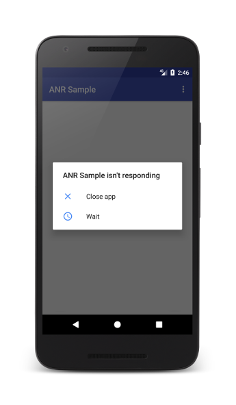
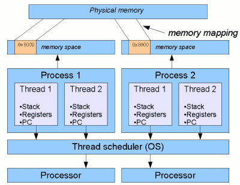
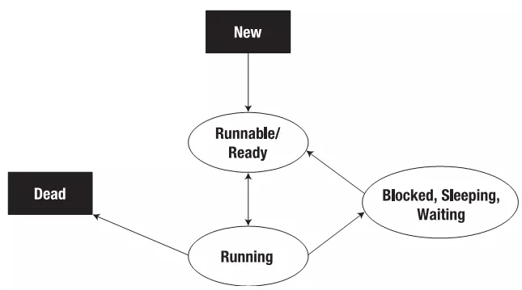

Lập trình bất đồng bộ là gì?
Thread? Kotlin coroutine? So sánh sự khác biệt của chúng?
Blocking - non-blocking, normal function - suspend function
Coroutine scope, Job, Dispatcher
Phân biệt và cách sử dụng launch, async, await

# Buổi 2: Lập trình bất đồng bộ trong Android với Kotlin Coroutines

## 1. Lập trình bất đồng bộ là gì?

### 1.1. Khái niệm

**Lập trình đồng bộ (Synchronous Programming)** là phương pháp lập trình mà các tác vụ được thực hiện tuần tự, tác vụ sau phải đợi tác vụ trước hoàn thành mới được thực thi.

**Lập trình bất đồng bộ (Asynchronous Programming)** là phương pháp lập trình cho phép các tác vụ chạy độc lập với nhau, không cần đợi tác vụ trước hoàn thành. Khi một tác vụ đang chờ (ví dụ: tải dữ liệu từ mạng), chương trình có thể tiếp tục thực hiện các công việc khác.

### 1.2. Tại sao cần lập trình bất đồng bộ trong Android?

#### 1.2.1. Main Thread và ANR (Application Not Responding)

Trong Android, tất cả các tương tác với UI đều diễn ra trên **Main Thread** (còn gọi là UI Thread). Main Thread có trách nhiệm:
- Xử lý sự kiện người dùng (click, scroll, touch...)
- Vẽ và cập nhật giao diện
- Chạy các lifecycle callbacks (onCreate, onResume...)

**Quy tắc:** Main Thread phải luôn mượt mà, không được block.

Nếu Main Thread bị block quá 5 giây → Android hiển thị dialog **ANR (Application Not Responding)**



#### 1.2.2. Các tác vụ cần chạy bất đồng bộ

| Loại tác vụ                   | Ví dụ                              | Thời gian ước tính |
| ----------------------------- | ---------------------------------- | ------------------ |
| Network request               | Gọi API, tải ảnh từ server         | 500ms - 5s         |
| Database operations           | Query SQLite, Room                 | 10ms - 500ms       |
| File I/O                      | Đọc/ghi file lớn                   | 50ms - 2s          |
| Image processing              | Resize, crop, apply filter         | 100ms - 1s         |
| Heavy computation             | Mã hóa, giải mã, xử lý dữ liệu lớn | 100ms - 10s        |
| Video/Audio encoding/decoding | Compress video, convert audio      | 1s - phút          |

**Ví dụ code đồng bộ gây ANR:**

```kotlin
class MainActivity : AppCompatActivity() {
    override fun onCreate(savedInstanceState: Bundle?) {
        super.onCreate(savedInstanceState)
        setContentView(R.layout.activity_main)
        
        // Gọi API trên Main Thread
        val button = findViewById<Button>(R.id.btnLoadData)
        button.setOnClickListener {
            val data = fetchDataFromServer() // Block Main Thread 2-3 giây
            textView.text = data // UI bị đóng băng trong 2-3 giây
        }
    }
    
    // Hàm này mất 2-3 giây để hoàn thành
    fun fetchDataFromServer(): String {
        val url = URL("https://api.example.com/data")
        val connection = url.openConnection() as HttpURLConnection
        return connection.inputStream.bufferedReader().readText()
    }
}
```

**Hậu quả:**
- Người dùng click button → UI đóng băng 2-3 giây không thể tương tác
- Nếu hơn 5 giây → ANR dialog xuất hiện

### 1.3. Giải pháp: Chạy tác vụ nặng trên Background Thread
- Chạy tác vụ nặng trên **Background Thread**
- Khi hoàn thành, chuyển kết quả về **Main Thread** để cập nhật UI

```kotlin
// Sử dụng Coroutine
class MainActivity : AppCompatActivity() {
    override fun onCreate(savedInstanceState: Bundle?) {
        super.onCreate(savedInstanceState)
        setContentView(R.layout.activity_main)
        
        val button = findViewById<Button>(R.id.btnLoadData)
        button.setOnClickListener {
            // Tạo Coroutine chạy trên background
            lifecycleScope.launch {
                val data = withContext(Dispatchers.IO) {
                    fetchDataFromServer() // Chạy trên background thread
                }
                textView.text = data // Tự động chuyển về Main Thread
            }
        }
    }
}
```

## 2. Thread & Kotlin Coroutine
### 2.1. Thread là gì?

**Thread** (luồng) là đơn vị thực thi nhỏ nhất trong một process. Một ứng dụng Android có thể chạy nhiều thread đồng thời.

Mỗi thread có:
- **Call stack** riêng: Lưu trữ các function calls và local variables
- **Program counter** riêng: Theo dõi instruction đang thực thi
- **Registers** riêng: Lưu trữ trạng thái CPU



#### 2.1.1 Phân loại Thread trong Android
##### 1). Main Thread (UI Thread)
**Main Thread** là thread chính của ứng dụng Android, được tạo tự động khi app khởi động.

**Main Thread phải xử lý:**
1. **Lifecycle callbacks**: onCreate(), onStart(), onResume()...
2. **UI rendering**: Vẽ và cập nhật giao diện (60 FPS)
3. **Event handling**: Click, touch, scroll events
4. **Animation**: Tính toán và vẽ animations
5. **Broadcast receivers**: Nhận system broadcasts

**Quy tắc vàng của Main Thread:**

- **KHÔNG ĐƯỢC làm trên Main Thread:**
  - Network requests (HTTP, Socket...)
  - Database operations (lâu)
  - File I/O (đọc/ghi file lớn)
  - Heavy computations (>5ms)
  - Bitmap decoding (ảnh lớn)
- **CHỈ làm trên Main Thread:**
  - Cập nhật UI (setText, setImageBitmap...)
  - Gọi View methods (findViewById, invalidate...)
  - Start/stop animations

##### 2) Background Thread (Worker Thread)
**Background Thread** là các thread phụ được tạo ra để xử lý các tác vụ nặng.
```kotlin
override fun onCreate(savedInstanceState: Bundle?) {
    super.onCreate(savedInstanceState)
    setContentView(R.layout.activity_main)
    
    button.setOnClickListener {
        // Tạo background thread
        Thread {
            println("Thread: ${Thread.currentThread().name}")
            // Output: Thread: Thread-2
            
            val data = downloadData()

            // Phải dùng runOnUiThread để thực hiện thay đổi UI
            runOnUiThread {
                textView.text = data
            }
        }.start()
    }
}
fun downloadData(): String {
    Thread.sleep(2000)
    return "Downloaded data"
}
```

**Bảng phân loại Thread:**
| Thread Type     | Được tạo bởi   | Số lượng       | Mục đích chính        | Update UI |
| --------------- | -------------- | -------------- | --------------------- | --------- |
| **Main Thread** | Android        | 1              | UI, Events, Lifecycle | Có        |
| **Background**  | Lập trình viên | Không giới hạn | Heavy tasks, I/O      | Không     |

#### 2.1.2 Trạng thái của Thread


- **Trạng thái New** : Khi tạo một Thread với toán tử new, thì Thread vẫn chưa được chạy các code bên trong vẫn chưa được thực thi, nó ở trong trạng thái New.
- **Trạng thái Runnable**: Khi gọi phương thức `start()`, thì Thread rơi vào trạng thái Runnable.
- **Trạng thái Blocked** : Thread rơi vào trạng thái **Blocked** nếu một trong các action sau đây xảy ra:
  - Gọi phương thức `sleep()`.
  - Thread gọi một operation mà nó đang bị blocking trên Input/Output.
  - Thread cố gắng giành lấy khóa(lock) trong khi khóa này đang được nắm giữ bởi một Thread khác.
  - Thread đang đợi một điều kiện nào đó để thực thi.
- **Trạng thái Dead** : Một Thread rơi vào trạng thái Dead với một trong 2 lý do sau:
  - Thực thi xong phương thức `run()`.
  - Một ngoại lệ chưa được bắt(uncaught) được phát sinh và kết thúc phương thức `run()`. Ngoài ra, có một cách khác có thể kill một Thread bằng cách gọi phương thức `stop()`. Tuy nhiên, phương thức này đã bị ngăn cấm và không nên sử dụng phương thức này trong code.
### 2.2. Kotlin Coroutine là gì?

**Kotlin Coroutine** là một framework cho phép viết **async code** (code bất đồng bộ) theo cách **sequential** (tuần tự), giống như viết synchronous code. Các functions có thể tạm dừng và tiếp tục mà không chặn thread.

**Đặc điểm chính:**
- **Lightweight:** Có thể tạo hàng nghìn coroutines mà không lo hết tài nguyên
- **Structured Concurrency:** Tự động quản lý vòng đời
- **Sequential Code Style:** Viết async code như sync code

**"Coroutines = Co (cooperative) + Routine (function)"**

**Ưu điểm:**
- Code đọc từ trên xuống, dễ hiểu
- Không có callback hell
- Tự động hủy khi Activity bị destroy (nhờ `lifecycleScope`)
#### 2.2.1. Coroutine cơ bản

```kotlin
class MainActivity : AppCompatActivity() {
    override fun onCreate(savedInstanceState: Bundle?) {
        super.onCreate(savedInstanceState)
        
        // Tạo coroutine scope gắn với lifecycle của Activity
        lifecycleScope.launch {
            // Code này chạy bất đồng bộ nhưng được viết như code đồng bộ thuông thường
            val user = fetchUser("user123")        // Chờ kết quả
            val posts = fetchUserPosts(user.id)    // Chờ kết quả
            val comments = fetchComments(posts[0].id) // Chờ kết quả
            
            // Tự động chạy trên Main Thread phải quan sát bằng ViewModel và cập nhật trên View
            displayData(user, posts, comments)
        }
    }
    
    suspend fun fetchUser(id: String): User {
        return withContext(Dispatchers.IO) {
            // Network call
            api.getUser(id)
        }
    }
    
    suspend fun fetchUserPosts(userId: String): List<Post> {
        return withContext(Dispatchers.IO) {
            api.getUserPosts(userId)
        }
    }
}
```
#### 2.2.2 Cài đặt

```kotlin
dependencies {
    // Coroutines
    implementation("org.jetbrains.kotlinx:kotlinx-coroutines-core:1.7.3")
    implementation("org.jetbrains.kotlinx:kotlinx-coroutines-android:1.7.3")
    
    // Lifecycle scopes
    implementation("androidx.lifecycle:lifecycle-runtime-ktx:2.6.2")
    implementation("androidx.lifecycle:lifecycle-viewmodel-ktx:2.6.2")
}
````

### 2.3. So sánh Thread vs Coroutine

| Tiêu chí               | Thread                                  | Kotlin Coroutine                  |
| ---------------------- | --------------------------------------- | --------------------------------- |
| **Tài nguyên**         | Nặng (~1-2 MB/thread)                   | Nhẹ (~KB/coroutine)               |
| **Số lượng tối đa**    | Hàng trăm                               | Hàng triệu                        |
| **Context switching**  | Tốn kém (OS level)                      | Rất rẻ (chỉ trong Kotlin runtime) |
| **Code style**         | Callback hell                           | Sequential                        |
| **Quản lý vòng đời**   | Thủ công                                | Tự động (Structured Concurrency)  |
| **Exception handling** | Phức tạp                                | Đơn giản (try-catch bình thường)  |
| **Hủy tác vụ**         | Khó (phải implement interrupt manually) | Chỉ cần cancel()                  |
| **Chuyển thread**      | runOnUiThread, Handler.post             | withContext(Dispatcher)           |


### 2.4. Cơ chế hoạt động của Coroutine

**Coroutine Kotlin** hoạt động dựa trên cơ chế tạm dừng (`suspend`) và tiếp tục (`resume`) các tác vụ mà không chặn luồng (thread) hệ điều hành, giúp xử lý đồng thời (concurrency) hiệu quả cao. Chúng sử dụng các hàm tạm dừng (`suspend functions`) và trình điều phối (**Dispatchers**) để chuyển đổi giữa các luồng, cho phép hàng nghìn coroutine chạy trên ít luồng. 

**Thread sử dụng OS-level scheduling:**

Thread 1: [Task A──────────] (blocked)
Thread 2: [Task B──────────] (blocked)
Thread 3: [Task C──────────] (blocked)

=> Cần 3 threads => 3-6 MB RAM

**Coroutine sử dụng cooperative multitasking:**

Thread Pool (4 threads):

Thread 1: [Coroutine A]──[Coroutine D]──[Coroutine G]
Thread 2: [Coroutine B]──[Coroutine E]──[Coroutine H]
Thread 3: [Coroutine C]──[Coroutine F]──[Coroutine I]
Thread 4: [idle]

=> 4 threads có thể chạy nhiều coroutines

## 3. Blocking - Non-blocking, Normal Function - Suspend Function

### 3.1. Blocking vs Non-blocking

#### 3.1.1. Blocking (Chặn)

Blocking = Chặn thread cho đến khi tác vụ hoàn thành. Thread không thể làm gì khác.

```kotlin
fun blockingExample() {
    println("Start")
    Thread.sleep(2000) // Block thread 2 giây
    println("End")
}

blockingExample()
println("After")

// Output:
// Start
// (đợi 2 giây - thread bị đóng băng)
// End
// After
```

Ví dụ thực tế:

```kotlin
// SAI - Block Main Thread → UI đóng băng
button.setOnClickListener {
    val data = URL("https://api.com/data").readText() // Block 1-2 giây
    textView.text = data
}
```

#### 3.1.2. Non-blocking (Không chặn)

Non-blocking = Thread không bị chặn, có thể làm việc khác trong khi chờ.

```kotlin
suspend fun nonBlockingExample() {
    println("Start")
    delay(2000) // KHÔNG block thread
    println("End")
}

lifecycleScope.launch {
    nonBlockingExample()
}
println("Main continues") // In ngay lập tức

// Output:
// Start
// Main continues    ← Main thread KHÔNG bị block
// (2 giây sau) End
```
```

Ví dụ thực tế:

```kotlin
button.setOnClickListener {
    lifecycleScope.launch {
        val data = withContext(Dispatchers.IO) {
            URL("https://api.com/data").readText()
        }
        textView.text = data
    }
}
```

So sánh:

|          | Blocking         | Non-blocking     |
| -------- | ---------------- | ---------------- |
| Thread   | Bị chặn          | Được giải phóng  |
| UI       | Đóng băng        | Chạy bình thường |
| Function | `Thread.sleep()` | `delay()`        |

### 3.2. Normal Function vs Suspend Function

#### 3.2.1. Normal Function

**Normal Function** là các func bình thường, phải chạy xong từ đầu đến cuối, không thể tạm dừng.

#### 3.2.2. Suspend Function

Có thể tạm dừng (suspend) và tiếp tục (resume) mà không chặn thread.

```kotlin
suspend fun suspendFunction(): String {
    delay(1000) // Tạm dừng 1 giây
    return fetchData()
}

// Có thể tạm dừng/tiếp tục
// Có thể gọi suspend functions khác
// Chỉ gọi từ coroutine hoặc suspend function
```

Khai báo:

```kotlin
suspend fun loadUser(id: String): User {
    delay(100)
    return withContext(Dispatchers.IO) {
        database.getUser(id)
    }
}
```

#### 3.2.3. Quy tắc sử dụng

1. Không thể gọi suspend function từ normal function

```kotlin
// LỖI
fun normalFunction() {
    delay(1000) // ERROR!
}

// ĐÚNG - Gọi từ coroutine
fun example() {
    lifecycleScope.launch {
        delay(1000) // OK
    }
}

// ĐÚNG - Gọi từ suspend function
suspend fun example() {
    delay(1000) // OK
}
```

2. Chỉ đánh dấu suspend khi cần

```kotlin
// Không cần suspend
suspend fun add(a: Int, b: Int) = a + b

// ĐÚNG
fun add(a: Int, b: Int) = a + b
```

3. Phải suspend khi gọi suspend function khác

```kotlin
// LỖI
fun fetchData() = api.getData() // api.getData() là suspend

// ĐÚNG
suspend fun fetchData() = api.getData()
```

4. Dùng withContext để chuyển thread

```kotlin
suspend fun loadFromDb(): List<User> {
    return withContext(Dispatchers.IO) {
        database.getAllUsers()
    }
}
```

#### 3.2.4. So sánh

|               | Normal Function  | Suspend Function  |
| ------------- | ---------------- | ----------------- |
| Keyword       | `fun`            | `suspend fun`     |
| Block thread? | Có thể           | Không             |
| Gọi từ đâu?   | Bất kỳ           | Coroutine/Suspend |
| Delay         | `Thread.sleep()` | `delay()`         |

#### 3.2.5. Ví dụ thực tế

Repository:

```kotlin
class UserRepository(private val api: ApiService, private val db: UserDao) {
    
    suspend fun getUser(id: String): User {
        return withContext(Dispatchers.IO) {
            // Thử cache
            db.getUser(id) ?: run {
                // Không có → fetch từ API
                val user = api.getUser(id)
                db.insert(user)
                user
            }
        }
    }
}
```

ViewModel:

```kotlin
class UserViewModel : ViewModel() {
    fun loadUser(id: String) {
        viewModelScope.launch {
            try {
                val user = repository.getUser(id)
                _userData.value = user
            } catch (e: Exception) {
                _error.value = e.message
            }
        }
    }
}
```

## 4. Coroutine Scope, Job, Dispatcher

### 4.1. Coroutine Scope

Scope = Phạm vi sống của coroutine. Khi scope bị hủy → coroutines bị hủy.

Tại sao cần?

```kotlin
// SAI - GlobalScope → Memory leak
GlobalScope.launch {
    delay(60000)
    textView.text = "Done" // CRASH nếu Activity destroyed
}

// ĐÚNG - lifecycleScope → Tự động cancel
lifecycleScope.launch {
    delay(60000)
    textView.text = "Done" // An toàn
}
```

Các loại Scope:

| Scope          | Lifecycle         | Use Case       |
| -------------- | ----------------- | -------------- |
| GlobalScope    | App lifetime      | Không dùng     |
| lifecycleScope | Activity/Fragment | UI operations  |
| viewModelScope | ViewModel         | Business logic |
| Custom         | Manual            | Repository     |

Ví dụ:

```kotlin
// Activity
class MainActivity : AppCompatActivity() {
    override fun onCreate(savedInstanceState: Bundle?) {
        super.onCreate(savedInstanceState)
        
        lifecycleScope.launch {
            loadData()
        }
    }
}

// ViewModel
class UserViewModel : ViewModel() {
    fun loadUser() {
        viewModelScope.launch {
            val user = repository.getUser()
            _userData.value = user
        }
    }
}

// Custom
class MyRepository {
    private val scope = CoroutineScope(Dispatchers.IO + SupervisorJob())
    
    fun loadData() {
        scope.launch { }
    }
    
    fun cleanup() {
        scope.cancel()
    }
}
```

Structured Concurrency:

```kotlin
lifecycleScope.launch {  // Parent
    launch { delay(1000); println("Child 1") }
    launch { delay(2000); println("Child 2") }
}

// Cancel parent → children cũng cancel
```

### 4.2. Job - Vòng đời Coroutine

Job = Handle để kiểm soát coroutine.

```kotlin
val job = lifecycleScope.launch {
    delay(5000)
}

job.cancel()     // Hủy
job.join()       // Đợi hoàn thành
job.isActive     // Kiểm tra đang chạy
job.isCompleted  // Kiểm tra đã xong
job.isCancelled  // Kiểm tra bị hủy
```

Cancel:

```kotlin
val job = lifecycleScope.launch {
    repeat(10) { i ->
        delay(1000)
        println("Count: $i")
    }
}

delay(3000)
job.cancel()

// Output: Count: 0, 1, 2 (cancelled)
```

Check cancellation:

```kotlin
lifecycleScope.launch {
    repeat(1000) { i ->
        ensureActive()  // Throw nếu cancelled
        performWork(i)
    }
}

// Hoặc
lifecycleScope.launch {
    while (isActive) {
        performWork()
    }
}
```

Job vs SupervisorJob:

```kotlin
// Job: 1 child fail → tất cả fail
lifecycleScope.launch {
    launch { throw Exception("Failed") }
    launch { println("Child 2") } // KHÔNG chạy
}

// SupervisorJob: Children độc lập
val scope = CoroutineScope(SupervisorJob())
scope.launch {
    launch { throw Exception("Failed") }
    launch { println("Child 2") } // VẪN chạy
}
```

### 4.3. Dispatcher - Chọn thread

Dispatcher = Quyết định coroutine chạy trên thread nào.

Các loại:

| Dispatcher | Thread    | Use Case        | Example                |
| ---------- | --------- | --------------- | ---------------------- |
| Main       | 1         | UI              | `textView.text = "Hi"` |
| IO         | 64        | Network/DB/File | `api.getData()`        |
| Default    | CPU cores | CPU-intensive   | `list.sorted()`        |

Ví dụ:

```kotlin
// Main
lifecycleScope.launch(Dispatchers.Main) {
    textView.text = "Hello"
}

// IO
lifecycleScope.launch(Dispatchers.IO) {
    val data = api.getData()
    database.insert(data)
}

// Default
lifecycleScope.launch(Dispatchers.Default) {
    val sorted = largeList.sorted()
}
```

withContext - Chuyển dispatcher:

```kotlin
lifecycleScope.launch {  // Main
    val data = withContext(Dispatchers.IO) {
        api.getData()  // IO
    }
    textView.text = data  // Main (tự động)
}
```

Ví dụ thực tế:

```kotlin
fun loadImage(url: String) = lifecycleScope.launch {
    progressBar.visibility = View.VISIBLE
    
    try {
        // Download (IO)
        val bitmap = withContext(Dispatchers.IO) {
            URL(url).openStream().use {
                BitmapFactory.decodeStream(it)
            }
        }
        
        // Process (Default)
        val processed = withContext(Dispatchers.Default) {
            applyFilter(bitmap)
        }
        
        // Display (Main - tự động)
        imageView.setImageBitmap(processed)
    } finally {
        progressBar.visibility = View.GONE
    }
}
```

## 5. Launch vs Async vs Await

### 5.1. launch - Fire and forget

Không trả về kết quả, chỉ trả về `Job`.

```kotlin
lifecycleScope.launch {
    delay(1000)
    println("Done")
}
```

Khi nào dùng:
- Không cần kết quả
- Side effects (update UI, log...)

Ví dụ:

```kotlin
// Log analytics
fun logEvent(event: String) {
    viewModelScope.launch(Dispatchers.IO) {
        analytics.log(event)
    }
}

// Update UI
fun updateStatus(online: Boolean) {
    lifecycleScope.launch {
        statusText.text = if (online) "Online" else "Offline"
    }
}
```

### 5.2. async - Trả về kết quả

Trả về `Deferred<T>`, lấy kết quả bằng `await()`.

```kotlin
lifecycleScope.launch {
    val deferred = async {
        delay(1000)
        "Result"
    }
    
    val result = deferred.await()
    println(result)
}
```

Khi nào dùng:
- Cần kết quả
- Chạy song song nhiều tasks

### 5.3. Parallel execution

Sequential (chậm):

```kotlin
lifecycleScope.launch {
    val user = getUser()      // 500ms
    val posts = getPosts()    // 800ms
    val friends = getFriends() // 600ms
    
    display(user, posts, friends)
}
// Tổng: 1900ms
```

Parallel (nhanh):

```kotlin
lifecycleScope.launch {
    val user = async { getUser() }
    val posts = async { getPosts() }
    val friends = async { getFriends() }
    
    display(user.await(), posts.await(), friends.await())
}
// Tổng: 800ms (nhanh gấp 2.4 lần)
```

### 5.4. So sánh

|          | launch       | async       |
| -------- | ------------ | ----------- |
| Return   | Job          | Deferred<T> |
| Kết quả  | Không        | Có (await)  |
| Use case | Side effects | Cần kết quả |

### 5.5. Ví dụ tổng hợp

```kotlin
class UserViewModel : ViewModel() {
    
    fun loadUserProfile(userId: String) {
        viewModelScope.launch {
            _uiState.value = Loading
            
            try {
                // Parallel loading
                val profile = async(Dispatchers.IO) { api.getProfile(userId) }
                val stats = async(Dispatchers.IO) { api.getStats(userId) }
                
                _uiState.value = Success(
                    profile.await(),
                    stats.await()
                )
            } catch (e: Exception) {
                _uiState.value = Error(e.message)
            }
        }
    }
    
    // Fire-and-forget
    fun trackView(userId: String) {
        viewModelScope.launch(Dispatchers.IO) {
            analytics.log("profile_view")
        }
    }
}
```

## Tổng kết

### Quick Reference

| Tình huống        | Sử dụng               |
| ----------------- | --------------------- |
| Không cần kết quả | `launch`              |
| Cần kết quả       | `async + await`       |
| Chạy song song    | `async` nhiều lần     |
| Chuyển thread     | `withContext`         |
| Activity/Fragment | `lifecycleScope`      |
| ViewModel         | `viewModelScope`      |
| Network/DB/File   | `Dispatchers.IO`      |
| CPU-intensive     | `Dispatchers.Default` |
| Update UI         | `Dispatchers.Main`    |

### Code Templates

Load data:

```kotlin
fun loadData() {
    lifecycleScope.launch {
        try {
            _uiState.value = Loading
            val data = withContext(Dispatchers.IO) { repository.getData() }
            _uiState.value = Success(data)
        } catch (e: Exception) {
            _uiState.value = Error(e.message)
        }
    }
}
```

Parallel loading:

```kotlin
suspend fun loadMultiple() = coroutineScope {
    val data1 = async(Dispatchers.IO) { api.getData1() }
    val data2 = async(Dispatchers.IO) { api.getData2() }
    Pair(data1.await(), data2.await())
}
```

Repository:

```kotlin
suspend fun getUser(id: String): User = withContext(Dispatchers.IO) {
    db.getUser(id) ?: api.getUser(id).also { db.insert(it) }
}
```