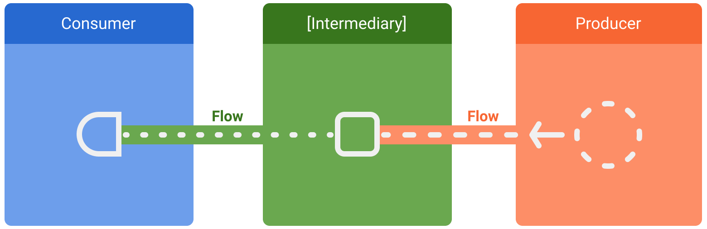

Flow là gì? Cách tạo ra flow?

Các toán tử của flow: take(), map(), transform(), onEach(), reduce(), fold(), debounce(), sample(), flatmapMerge(), flatmapConcat(), combine(), zip(),... Lấy ví dụ.

Cold flow vs Hot flow. Flow vs StateFlow vs SharedFlow.

So sánh với LiveData.

Sequence

Channel

RxJava.

# Buổi 3: Flow trong Android

## 1. Flow là gì?

### 1.1. Định nghĩa
Trong coroutine, **flow** là một loại dữ liệu có thể phát ra (emit) nhiều giá trị tuần tự.

**Flow** được xây dựng dựa trên coroutine và có thể cung cấp nhiều giá trị. Về cơ bản, flow là một dòng dữ liệu có thể được tính toán không đồng bộ. Các giá trị trả về phải thuộc cùng một loại dữ liệu.
```kotlin
val flow = flow {
    emit(1)
    delay(1000)
    emit(2)
    delay(1000)
    emit(3)
}

lifecycleScope.launch {
    flow.collect { value ->
        println("Received: $value")
    }
}

// Output:
// Received: 1
// (1 giây sau) Received: 2
// (1 giây sau) Received: 3
```

Flow có 3 phần chính:

```kotlin
// PRODUCER - tạo ra dữ liệu
val myFlow = flow {
    emit("Data 1")
    emit("Data 2")
    emit("Data 3")
}

// INTERMEDIARY (optional) - xử lý dữ liệu
val processedFlow = myFlow
    .map { data -> data.uppercase() }
    .filter { data -> data.contains("1") }

// CONSUMER - nhận dữ liệu
lifecycleScope.launch {
    processedFlow.collect { data ->
        println(data) 
    }
}
```



### 1.2. Đặc điểm
Flow là Cold Stream tức là Flow chỉ bắt đầu chạy khi có người `collect`. Và mỗi collector khi collect sẽ nhận toàn bộ dữ liệu từ đầu.

```kotlin
val randomFlow = flow {
    val randomNumber = Random.nextInt(100) 
    emit(randomNumber)
}

lifecycleScope.launch {
    // Lần collect thứ 1
    randomFlow.collect { number ->
        println("Collector 1 nhận: $number")
    }
    
    // Lần collect thứ 2
    randomFlow.collect { number ->
        println("Collector 2 nhận: $number")
    }
}

// Output:
// Collector 1 nhận: số a
// Collector 2 nhận: số b ← Số khác vì flow chạy lại từ đầu
```

### 1.3. Khi nào dùng flow

**Cần nhiều giá trị theo thời gian:**
```kotlin
// Theo dõi vị trí người dùng mỗi 5 giây
fun observeLocation(): Flow<Location> = flow {
    while (true) {
        val location = getCurrentLocation()
        emit(location)
        delay(5000) // Đợi 5 giây
    }
}
```

**Theo dõi thay đổi từ Database:**
```kotlin
// Room tự động tạo Flow
@Dao
interface UserDao {
    @Query("SELECT * FROM users")
    fun getAllUsers(): Flow<List<User>> // Tự động emit khi DB thay đổi
}
```

**Stream data từ API:**
```kotlin
fun getNewsUpdates(): Flow<List<News>> = flow {
    while (true) {
        val news = api.getLatestNews()
        emit(news)
        delay(60000) // Poll mỗi phút
    }
}
```

- Không nên dùng Flow khi chỉ cần 1 giá trị duy nhất. Khi đó hãy dùng suspend function.

## 2. Cách tạo ra Flow

Có nhiều cách để tạo Flow, mỗi cách phù hợp với tình huống khác nhau.

### 2.1. flow { } - Cách cơ bản nhất

Đây là cách phổ biến nhất, ta sẽ tự viết logic bên trong `flow {}`:

```kotlin
val countdownFlow = flow {
    // Đếm ngược từ 5 về 1
    for (i in 5 downTo 1) {
        println("Phát ra: $i")
        emit(i)           
        delay(1000)       // Đợi 1 giây
    }
    println("Hết giờ!")
}

lifecycleScope.launch {
    countdownFlow.collect { number ->
        println("Nhận được: $number")
    }
}

// Output:
// Phát ra: 5
// Nhận được: 5
// .....
// Phát ra: 1
// Nhận được: 1
// Hết giờ!
```

### 2.2. flowOf()

Khi ta có sẵn các giá trị và muốn chuyển thành Flow

Tạo Flow từ `flowOf()` thì các giá trị sẽ emit cùng lúc, không có delay.

```kotlin
val namesFlow = flowOf("An", "Bình", "Cường", "Dũng")

lifecycleScope.launch {
    namesFlow.collect { name ->
        println("Xin chào $name!")
    }
}

// Output:
// Xin chào An!
// Xin chào Bình!
// Xin chào Cường!
// Xin chào Dũng!
```

### 2.3. asFlow() - Chuyển Collection thành Flow

Khi ta có một **Collection** (List, Array, hoặc Range) và muốn chuyển thành **Flow**:

```kotlin
// Từ List
val fruitsList = listOf("Táo", "Chuối", "Cam")
val fruitsFlow = fruitsList.asFlow()

lifecycleScope.launch {
    fruitsFlow.collect { fruit ->
        println("Trái cây: $fruit")
    }
}

// Output:
// Trái cây: Táo
// Trái cây: Chuối
// Trái cây: Cam
```

### 2.4. callbackFlow {} - Chuyển Callback thành Flow

**callbackFlow** là một builder đặc biệt để chuyển đổi các APIs dùng callback thành **Flow**.

Trong Android, nhiều APIs cũ sử dụng callback thay vì suspend functions. Ta có thể chuyển đổi chúng thành Flow để dễ sử dụng.

Ví dụ:
- LocationManager (callback vị trí)
- Firebase Realtime Database (callback data changes)
- Button click listeners
- TextWatcher (theo dõi text input)

```kotlin
fun listenToButton(button: Button): Flow<Unit> = callbackFlow {
    // Đăng ký listener
    val listener = View.OnClickListener {
        trySend(Unit) // Phát hiện sự kiện click
    }
    button.setOnClickListener(listener)
    
    // Cleanup khi Flow bị hủy
    awaitClose {
        button.setOnClickListener(null)
    }
}

// Sử dụng
lifecycleScope.launch {
    listenToButton(myButton).collect {
        println("Button được click!")
    }
}
```

**Điểm khác biệt:**
- `trySend()` thay vì `emit()` - không cần suspend
- Block khoong kết thúc ngay - chờ đến khi cancel
- `awaitClose { }` đảm bảo cleanup

**Ví dụ với TextWatcher** (theo dõi text input):

```kotlin
fun EditText.textChanges(): Flow<String> = callbackFlow {
    // Tạo TextWatcher
    val watcher = object : TextWatcher {
        override fun beforeTextChanged(s: CharSequence?, start: Int, count: Int, after: Int) {}
        
        override fun onTextChanged(s: CharSequence?, start: Int, before: Int, count: Int) {
            // Phát ra text mới
            trySend(s.toString())
        }
        
        override fun afterTextChanged(s: Editable?) {}
    }
    
    // Đăng ký watcher
    addTextChangedListener(watcher)
    
    // Cleanup
    awaitClose {
        removeTextChangedListener(watcher)
    }
}

// Sử dụng
lifecycleScope.launch {
    searchEditText.textChanges().collect { text ->
        println("User gõ: $text")
    }
}
```

### 2.7. Room Database - Tự động tạo Flow

Room có thể tự động tạo Flow

Mỗi khi ta `insert`, `update`, hoặc `delete` -> Flow tự động emit giá trị mới

```kotlin
@Dao
interface UserDao {
    // Room tự động tạo Flow
    // Flow này sẽ emit giá trị mới MỖI KHI database thay đổi
    @Query("SELECT * FROM users")
    fun getAllUsers(): Flow<List<User>>
    
    @Query("SELECT * FROM users WHERE id = :userId")
    fun getUser(userId: String): Flow<User?>
}

// Sử dụng
class UserRepository(private val userDao: UserDao) {
    // Không cần làm gì, chỉ cần return Flow từ DAO
    fun observeUsers(): Flow<List<User>> = userDao.getAllUsers()
}

// Trong ViewModel
class UserViewModel(private val repository: UserRepository) : ViewModel() {
    // Tự động cập nhật khi database thay đổi
    val users: StateFlow<List<User>> = repository.observeUsers()
        .stateIn(
            viewModelScope,
            SharingStarted.WhileSubscribed(5000),
            emptyList() // Giá trị ban đầu
        )
}
```

## 3. Các toán tử của Flow

Toán tử (operators) giúp ta biến đổi, lọc, và xử lý dữ liệu trong Flow trước khi được collect

### 3.1. map() - Biến đổi mỗi giá trị

`map()` nhận mỗi giá trị từ Flow và biến đổi nó thành giá trị mới.

```kotlin
// Flow ban đầu: các số từ 1 đến 5
val numbersFlow = flowOf(1, 2, 3, 4, 5)

// Nhân mỗi số với 10
val multipliedFlow = numbersFlow.map { number ->
    number * 10
}

lifecycleScope.launch {
    multipliedFlow.collect { result ->
        println(result)
    }
}

// Output:
// 10
// 20
// 30
// 40
// 50
```

### 3.2. filter() - Lọc các giá trị

`filter()` chỉ giữ lại các giá trị thỏa mãn điều kiện.

```kotlin
// Flow các số từ 1 đến 10
val numbersFlow = (1..10).asFlow()

// Chỉ lấy số chẵn
val evenNumbersFlow = numbersFlow.filter { number ->
    number % 2 == 0
}

lifecycleScope.launch {
    evenNumbersFlow.collect { number ->
        println(number)
    }
}

// Output:
// 2
// 4
// 6
// 8
// 10
```

### 3.3. take() - Lấy n giá trị đầu tiên

`take()` chỉ lấy n giá trị đầu tiên rồi dừng Flow.

```kotlin
// Flow đếm từ 1 đến 10
val infiniteFlow = flow {
    var count = 1
    while (count < 11) {
        emit(count)
        count++
        delay(500)
    }
}

// Chỉ lấy 5 số đầu
val limitedFlow = infiniteFlow.take(5)

lifecycleScope.launch {
    limitedFlow.collect { number ->
        println("Số thứ $number")
    }
    println("Đã lấy đủ 5 số")
}

// Output:
// Số thứ 1
// Số thứ 2
// Số thứ 3
// Số thứ 4
// Số thứ 5
// Đã lấy đủ 5 số
```

### 3.4. onEach() - Thực hiện side effect

`onEach()` cho phép ta làm gì đó với mỗi giá trị trước khi nó được collect, nhưng không thay đổi giá trị.

```kotlin
val numbersFlow = flowOf(1, 2, 3)

lifecycleScope.launch {
    numbersFlow
        .onEach { number ->
            // In ra log (side effect)
            println("Đang xử lý số: $number")
        }
        .map { number ->
            number * 2
        }
        .collect { result ->
            println("Kết quả: $result")
        }
}

// Output:
// Đang xử lý số: 1
// Kết quả: 2
// Đang xử lý số: 2
// Kết quả: 4
// Đang xử lý số: 3
// Kết quả: 6
```

### 3.5. transform() - Biến đổi linh hoạt

`transform()` có thể emit 0, 1, hoặc NHIỀU giá trị cho mỗi giá trị input.

```kotlin
val numbersFlow = flowOf(1, 2, 3)

lifecycleScope.launch {
    numbersFlow
        .transform { number ->
            // Emit 2 giá trị cho mỗi số
            emit("Bắt đầu xử lý $number")
            delay(500)
            emit("Xong xử lý $number")
        }
        .collect { message ->
            println(message)
        }
}

// Output:
// Bắt đầu xử lý 1
// Xong xử lý 1
// Bắt đầu xử lý 2
// Xong xử lý 2
// Bắt đầu xử lý 3
// Xong xử lý 3
```

### 3.6. debounce() - Đợi đến khi ngừng phát

`debounce()` chỉ emit giá trị sau khi KHÔNG CÓ giá trị mới trong khoảng thời gian nhất định. Thường được sử dụng cho search

```kotlin
// Giả sử user đang gõ vào search box
val searchQueryFlow = MutableStateFlow("")

lifecycleScope.launch {
    searchQueryFlow
        .debounce(2000) // Đợi 2s kể từ lần gõ cuối cùng
        .collect { query ->
            println("Search cho: $query")
            searchDatabase(query)
        }
}

// User gõ nhanh: h -> he -> hel -> hell -> hello
// (mỗi ký tự cách nhau < 2s)

// Đợi user ngừng gõ 2s
// Chỉ search 1 lần với "hello" sau khi đợi đủ 2s
```

### 3.7. sample() - Lấy mẫu định kỳ

`sample()` lấy giá trị MỚI NHẤT mỗi khoảng thời gian.

```kotlin
// Flow phát giá trị nhanh (mỗi 100ms)
val fastFlow = flow {
    repeat(20) { i ->
        emit(i)
        delay(100) // Phát mỗi 100ms
    }
}

lifecycleScope.launch {
    fastFlow
        .sample(500) // Lấy mẫu mỗi 500ms
        .collect { value ->
            println("Giá trị: $value")
        }
}

// Output (khoảng 500ms mỗi lần):
// Giá trị: 4   (giá trị tại ~500ms)
// Giá trị: 9   (giá trị tại ~1000ms)
// Giá trị: 14  (giá trị tại ~1500ms)
// Giá trị: 19  (giá trị tại ~2000ms)
```

### 3.8. reduce() - Tích lũy thành 1 giá trị

`reduce()` kết hợp tất cả giá trị trong Flow thành 1 giá trị duy nhất. Nó cần ít nhất 1 giá trị trong Flow.

```kotlin
val numbersFlow = flowOf(1, 2, 3, 4, 5)

lifecycleScope.launch {
    val sum = numbersFlow.reduce { accumulator, value ->
        println("accumulator: $accumulator, value: $value")
        accumulator + value
    }
    println("Tổng: $sum")
}

// Output:
// accumulator: 1, value: 2  (1 + 2 = 3)
// accumulator: 3, value: 3  (3 + 3 = 6)
// accumulator: 6, value: 4  (6 + 4 = 10)
// accumulator: 10, value: 5 (10 + 5 = 15)
// Tổng: 15
```

**Lưu ý:** `reduce()` sử dụng giá trị đầu tiên làm accumulator ban đầu.

### 3.9. fold() - Tích lũy với giá trị khởi tạo

`fold()` giống `reduce()` nhưng có giá trị khởi tạo.

```kotlin
val numbersFlow = flowOf(1, 2, 3, 4, 5)

lifecycleScope.launch {
    val result = numbersFlow.fold(10) { accumulator, value ->
        println("accumulator: $accumulator, value: $value")
        accumulator + value
    }
    println("Kết quả: $result")
}

// Output:
// accumulator: 10, value: 1  (10 + 1 = 11)
// accumulator: 11, value: 2  (11 + 2 = 13)
// accumulator: 13, value: 3  (13 + 3 = 16)
// accumulator: 16, value: 4  (16 + 4 = 20)
// accumulator: 20, value: 5  (20 + 5 = 25)
// Kết quả: 25 (10 + 1 + 2 + 3 + 4 + 5)
```

### 3.10. flatMapMerge() - Chạy song song

`flatMapMerge()` chuyển đổi mỗi giá trị thành Flow mới và merge tất cả, các Flows chạy SONG SONG.

```kotlin
val numbersFlow = flowOf(1, 2, 3)

lifecycleScope.launch {
    numbersFlow
        .flatMapMerge { number ->
            flow {
                delay(1000) // Mỗi số mất 1 giây xử lý
                emit("Kết quả: $number")
            }
        }
        .collect { result ->
            println(result)
        }
}

// Tất cả chạy SONG SONG
// Sau ~1 giây (không phải 3 giây), tất cả kết quả xuất hiện
// Output (sau 1 giây):
// Kết quả: 1
// Kết quả: 2
// Kết quả: 3
```

Ví dụ thực tế - Load nhiều users song song:

```kotlin
val userIdsFlow = flowOf("user1", "user2", "user3", "user4")

lifecycleScope.launch {
    userIdsFlow
        .flatMapMerge(concurrency = 3) { userId ->
            flow {
                println("Bắt đầu load $userId")
                delay(1000) // Giả lập API call
                val user = api.getUser(userId)
                emit(user)
                println("Xong load $userId")
            }
        }
        .collect { user ->
            println("Nhận được: ${user.name}")
        }
}

// Output (với concurrency = 3):
// Bắt đầu load user1
// Bắt đầu load user2
// Bắt đầu load user3
// (đợi 1 giây)
// Xong load user1
// Xong load user2
// Xong load user3
// Bắt đầu load user4  ← user4 bắt đầu khi có slot trống
// Nhận được: User1
// Nhận được: User2
// Nhận được: User3
// (đợi 1 giây)
// Xong load user4
// Nhận được: User4
```

### 3.11. flatMapConcat() - Chạy tuần tự

`flatMapConcat()` chuyển đổi mỗi giá trị thành Flow mới và chạy TUẦN TỰ (đợi Flow trước xong mới chạy Flow sau).

```kotlin
val numbersFlow = flowOf(1, 2, 3)

lifecycleScope.launch {
    numbersFlow
        .flatMapConcat { number ->
            flow {
                println("Bắt đầu xử lý $number")
                delay(1000)
                emit("Kết quả: $number")
            }
        }
        .collect { result ->
            println(result)
        }
}

// Chạy TUẦN TỰ, đảm bảo thứ tự
// Output (mỗi 1 giây):
// Bắt đầu xử lý 1
// Kết quả: 1
// Bắt đầu xử lý 2
// Kết quả: 2
// Bắt đầu xử lý 3
// Kết quả: 3
```

**So sánh flatMapMerge() vs flatMapConcat():**

|             | flatMapMerge()    | flatMapConcat()  |
| ----------- | ----------------- | ---------------- |
| Thứ tự      | Không đảm bảo     | Đảm bảo thứ tự   |
| Concurrency | Song song         | Tuần tự          |
| Tốc độ      | Nhanh             | Chậm hơn         |
| Use case    | Load data độc lập | Phụ thuộc thứ tự |

### 3.12. combine() - Kết hợp nhiều Flows

`combine()` kết hợp nhiều Flows và emit khi BẤT KỲ Flow nào emit giá trị mới.

```kotlin
val numbersFlow = MutableStateFlow(0)
val lettersFlow = MutableStateFlow("A")

lifecycleScope.launch {
    combine(numbersFlow, lettersFlow) { number, letter ->
        "$number$letter" // Ghép số với chữ
    }.collect { result ->
        println(result)
    }
}

// Output: 0A

numbersFlow.value = 1
// Output: 1A

lettersFlow.value = "B"
// Output: 1B

numbersFlow.value = 2
// Output: 2B
```

**Đặc điểm:**
- Emit khi **BẤT KỲ** Flow nào emit
- Luôn sử dụng giá trị **MỚI NHẤT** của mỗi Flow
- Cần tất cả Flows đều emit ít nhất 1 lần trước

### 3.13. zip() - Kết hợp từng cặp

`zip()` kết hợp các giá trị THEO CẶP từ 2 Flows. Dừng khi Flow nào hết trước.

```kotlin
val numbersFlow = flowOf(1, 2, 3, 4)
val lettersFlow = flowOf("A", "B", "C")

lifecycleScope.launch {
    numbersFlow.zip(lettersFlow) { number, letter ->
        "$number$letter" // Ghép từng cặp
    }.collect { result ->
        println(result)
    }
}

// Output:
// 1A  (cặp 1 với A)
// 2B  (cặp 2 với B)
// 3C  (cặp 3 với C)
// Dừng (lettersFlow hết, số 4 không có cặp)
```

**Đặc điểm:**
- Kết hợp **TỪNG CẶP** theo thứ tự
- Đợi cả hai Flows đều emit mới tạo cặp
- **Dừng** khi Flow nào hết trước

### 3.14. retry() - Thử lại khi có lỗi

Tự động thử lại khi có exception. Thường được sử dụng để xử lí khi call APIs bị lỗi.

```kotlin
val unstableFlow = flow {
    println("Đang thử...")
    if (Random.nextBoolean()) {
        // 50% fail
        throw Exception("Thất bại")
    }
    emit("Thành công!")
}

lifecycleScope.launch {
    unstableFlow
        .retry(3) // Thử lại tối đa 3 lần
        .catch { e ->
            println("Thử 3 lần rồi mà vẫn lỗi: ${e.message}")
        }
        .collect { result ->
            println(result)
        }
}

// Output có thể:
// Đang thử...
// Đang thử... (lần 2)
// Thành công!
```

## 4. Cold Flow vs Hot Flow

### 4.1. Cold Flow

**Cold Flow**: là flow sẽ không làm gì cả cho đến khi nó được gọi thông qua hàm `collect()`. giúp giữ tính độc lập các luồng data

```kotlin
val coldFlow = flow {
    emit("Phút 1: Intro")
    delay(1000)
    
    emit("Phút 2: Nội dung chính")
    delay(1000)
    
    emit("Phút 3: Kết luận")
    println("Video kết thúc")
}

// Người xem 1
lifecycleScope.launch {
    println("\nNgười 1 bắt đầu xem:")
    coldFlow.collect { content ->
        println("  Người 1: $content")
    }
}

delay(500) // Đợi một chút

// Người xem 2
lifecycleScope.launch {
    println("\n Người 2 bắt đầu xem:")
    coldFlow.collect { content ->
        println("  Người 2: $content")
    }
}
```

**Đặc điểm:**
- Mỗi collector có stream độc lập
- Chạy từ đầu mỗi lần collect
- Không tốn tài nguyên khi không có collector

### 4.2. Hot Flow - Luôn chạy dù có người xem hay không

**Hot Flow** giống như một kênh truyền hình trực tiếp:
- Luôn phát sóng (luôn chạy)
- Tất cả người xem thấy cùng nội dung (chia sẻ stream)
- Nếu bật TV muộn, bạn bỏ lỡ phần đầu

Đại diện cho HotFlow là ShareFlow và StateFlow

```kotlin
// Tạo Hot Flow (StateFlow)
val tvChannel = MutableStateFlow("Kênh đang off")

println("Kênh truyền hình bắt đầu phát")

// Người xem 1 bật TV
lifecycleScope.launch {
    println("Người 1 bật TV")
    tvChannel.collect { content ->
        println("Người 1 thấy: $content")
    }
}

delay(500)

// Đổi nội dung (tất cả người xem thấy ngay)
tvChannel.value = "Chương trình: Tin tức 19h"

delay(500)

// Người xem 2 bật TV (bỏ lỡ phần đầu)
lifecycleScope.launch {
    println("Người 2 bật TV")
    tvChannel.collect { content ->
        println("  Người 2 thấy: $content")
    }
}

delay(500)

// Đổi nội dung lần nữa
tvChannel.value = "Chương trình: Phim 20h"

// Output:
// Kênh truyền hình bắt đầu phát
// Người 1 bật TV
// Người 1 thấy: Kênh đang off
// Người 1 thấy: Chương trình: Tin tức 19h
// Người 2 bật TV
// Người 2 thấy: Chương trình: Tin tức 19h - Không thấy nội dung cũ
// Người 1 thấy: Chương trình: Phim 20h
// Người 2 thấy: Chương trình: Phim 20h
```

**Đặc điểm:**
- Luôn hoạt động
- Tất cả collectors nhận cùng giá trị
- Collectors mới chỉ nhận giá trị TỪ KHI nó bắt đầu collect

### 4.3. Chuyển Cold thành Hot

Đôi khi ta sẽ muốn chuyển Cold Flow thành Hot Flow để tiết kiệm tài nguyên:

```kotlin
// Cold Flow - Gọi API mỗi lần collect (lãng phí!)
val usersFlow: Flow<List<User>> = flow {
    println("Gọi API...")
    emit(api.getUsers())
}

// Chuyển thành Hot Flow
val hotUsersFlow: StateFlow<List<User>> = usersFlow
    .stateIn(
        scope = viewModelScope,
        started = SharingStarted.WhileSubscribed(5000),
        initialValue = emptyList()
    )

// Bây giờ nhiều collectors có thể dùng cùng 1 API call
lifecycleScope.launch {
    hotUsersFlow.collect { users ->
        println("Collector 1: ${users.size} users")
    }
}

lifecycleScope.launch {
    hotUsersFlow.collect { users ->
        println("Collector 2: ${users.size} users")
    }
}

// Output:
// Gọi API...  - Chỉ gọi 1 lần
// Collector 1: 10 users
// Collector 2: 10 users
```

### 4.4. Khi nào dùng Cold vs Hot?

**Dùng Cold Flow (flow { }) khi:**
- API call one-time (load data 1 lần)
- Mỗi collector cần data riêng
- Muốn lazy execution

```kotlin
// API call - Cold Flow
fun getUserProfile(userId: String): Flow<User> = flow {
    emit(api.getUser(userId))
}
```

**Dùng Hot Flow (StateFlow/SharedFlow) khi:**
- UI state cần chia sẻ cho nhiều UI components
- Events cần broadcast
- Cần tránh duplicate work

```kotlin
// UI State - Hot Flow
class ViewModel : ViewModel() {
    val uiState = MutableStateFlow(UiState.Loading)
}
```

## 5. StateFlow vs SharedFlow
### 5.1. StateFlow

**StateFlow** là hot stream với STATE (trạng thái) để quản lí các trạng thái.

```kotlin
// Phải có giá trị ban đầu
val stateFlow = MutableStateFlow(0)

// Đặc điểm:
// - Hot stream (luôn hoạt động)
// - PHẢI có giá trị ban đầu
// - Luôn giữ giá trị hiện tại
// - Tự động bỏ qua giá trị trùng
// - Conflated (chỉ giữ giá trị mới nhất)
```

**Khi nào dùng StateFlow?**
- UI state (Loading, Success, Error)
- Configuration (theme, language...)
- Bất kỳ STATE nào cần giá trị hiện tại

Ví dụ đầy đủ:

```kotlin
// ViewModel
class CounterViewModel : ViewModel() {
    // StateFlow cho UI state
    private val _count = MutableStateFlow(0)
    val count: StateFlow<Int> = _count.asStateFlow()
    
    fun increment() {
        _count.value = _count.value + 1
    }
    
    fun decrement() {
        _count.value = _count.value - 1
    }
    
    fun reset() {
        _count.value = 0
    }
}

// Activity
class CounterActivity : AppCompatActivity() {
    private val viewModel: CounterViewModel by viewModels()
    
    override fun onCreate(savedInstanceState: Bundle?) {
        super.onCreate(savedInstanceState)
        
        // Collect state
        lifecycleScope.launch {
            viewModel.count.collect { count ->
                // Cập nhật UI
                countTextView.text = count.toString()
            }
        }
        
        // Buttons
        plusButton.setOnClickListener {
            viewModel.increment()
        }
        
        minusButton.setOnClickListener {
            viewModel.decrement()
        }
        
        resetButton.setOnClickListener {
            viewModel.reset()
        }
    }
}
```

**Đặc điểm tự động loại bỏ trùng lặp:**

```kotlin
val state = MutableStateFlow(0)

lifecycleScope.launch {
    state.collect { println("Nhận: $it") }
}

state.value = 0  // KHÔNG in (trùng ban đầu)
state.value = 1  // In: Nhận: 1
state.value = 1  // KHÔNG in (trùng)
state.value = 2  // In: Nhận: 2
```

### 5.2. SharedFlow (Hot)

**SharedFlow** là hot stream cho EVENTS (sự kiện).

```kotlin
// KHÔNG có giá trị ban đầu
val sharedFlow = MutableSharedFlow<Event>()

// Đặc điểm:
// - Hot stream
// - KHÔNG cần giá trị ban đầu
// - Có thể replay n giá trị
// - Dùng cho events 1 lần
```

**Khi nào dùng SharedFlow?**
- Navigation events
- Snackbar/Toast messages
- Click events
- Bất kỳ sự kiện NÀO không phải state

Ví dụ đầy đủ:

```kotlin
// ViewModel
class LoginViewModel : ViewModel() {
    // StateFlow cho UI state
    private val _uiState = MutableStateFlow<UiState>(UiState.Idle)
    val uiState: StateFlow<UiState> = _uiState.asStateFlow()
    
    // SharedFlow cho events 1 lần
    private val _events = MutableSharedFlow<LoginEvent>()
    val events: SharedFlow<LoginEvent> = _events.asSharedFlow()
    
    fun login(username: String, password: String) {
        viewModelScope.launch {
            // Cập nhật state
            _uiState.value = UiState.Loading
            
            try {
                val result = api.login(username, password)
                
                // Cập nhật state
                _uiState.value = UiState.Success
                
                // Emit event (1 lần)
                _events.emit(LoginEvent.NavigateToHome)
                
            } catch (e: Exception) {
                // Cập nhật state
                _uiState.value = UiState.Error(e.message)
                
                // Emit event (1 lần)
                _events.emit(LoginEvent.ShowError(e.message))
            }
        }
    }
}

sealed class UiState {
    object Idle : UiState()
    object Loading : UiState()
    object Success : UiState()
    data class Error(val message: String?) : UiState()
}

sealed class LoginEvent {
    object NavigateToHome : LoginEvent()
    data class ShowError(val message: String?) : LoginEvent()
}

// Activity
class LoginActivity : AppCompatActivity() {
    private val viewModel: LoginViewModel by viewModels()
    
    override fun onCreate(savedInstanceState: Bundle?) {
        super.onCreate(savedInstanceState)
        
        // Collect UI STATE (liên tục)
        lifecycleScope.launch {
            viewModel.uiState.collect { state ->
                when (state) {
                    UiState.Idle -> hideLoading()
                    UiState.Loading -> showLoading()
                    UiState.Success -> hideLoading()
                    is UiState.Error -> {
                        hideLoading()
                        // Không show error ở đây, để event xử lý
                    }
                }
            }
        }
        
        // Collect EVENTS (1 lần)
        lifecycleScope.launch {
            viewModel.events.collect { event ->
                when (event) {
                    LoginEvent.NavigateToHome -> {
                        // Navigate chỉ 1 lần
                        startActivity(Intent(this@LoginActivity, HomeActivity::class.java))
                        finish()
                    }
                    is LoginEvent.ShowError -> {
                        // Show error chỉ 1 lần
                        Toast.makeText(this@LoginActivity, event.message, Toast.LENGTH_SHORT).show()
                    }
                }
            }
        }
        
        // Login button
        loginButton.setOnClickListener {
            val username = usernameEditText.text.toString()
            val password = passwordEditText.text.toString()
            viewModel.login(username, password)
        }
    }
}
```
