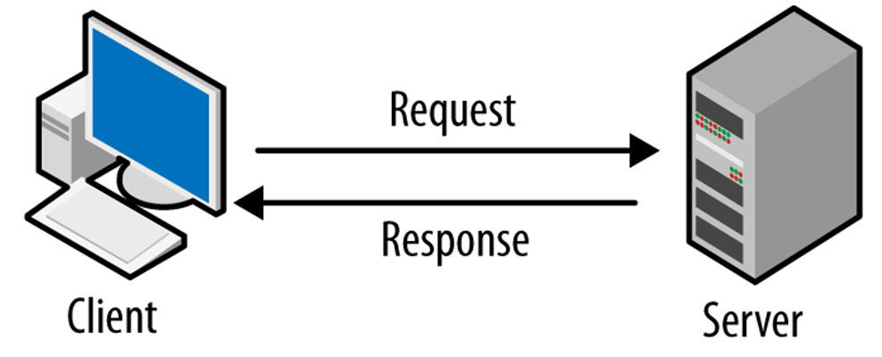
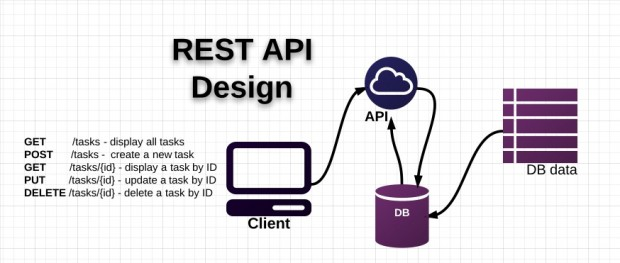

# Buổi 4: Tổng quan về Networking và RESTful API trong Android

## I. Tổng quan về Networking

### 1. Cấu trúc Client-Server

#### 1.1. Định nghĩa

**Client - server** là mô hình mạng máy tính gồm có 2 thành phần chính đó là **máy khách** (client) và **máy chủ** (server). 
- **Server** chính là nơi giúp lưu trữ tài nguyên cũng như cài đặt các chương trình dịch vụ theo đúng như yêu cầu của client. 
- **Client** bao gồm máy tính cũng như các loại thiết bị điện tử nói chung sẽ tiến hành gửi yêu cầu đến server.



#### 1.2. Đặc điểm

Mô hình mạng **Client - Server** sẽ cho phép mạng **tập trung** các ứng dụng có cùng chức năng tại một hoặc nhiều dịch vụ file chuyên dụng. Chúng sẽ trở thành trung tâm của hệ thống. Hệ điều hành của mô hình Client server sẽ cho phép người dùng **chia sẻ đồng thời** cùng một loại tài nguyên trên nhiều máy khác nhau.

**Ưu điểm:**
- Khả năng kiểm soát tập trung (Centralization) - mọi sự cố trong mạng đều sẽ được giải quyết ở cùng một nơi thống nhất, cập nhật cơ sở tài nguyên, dữ liệu dễ dàng
- Tất cả các dữ liệu đều sẽ được bảo vệ một cách tối đa
- Khả năng mở rộng cao
- Khả năng truy cập dễ dàng

**Nhược điểm:**
- Tắc nghẽn lưu lượng
- Tính ổn định phụ thuộc vào 1 server
- Chi phí cao

### 2. Giao thức HTTP/HTTPS
**HTTP** (Hypertext Transfer Protocol) là giao thức truyền tải siêu văn bản. Đây là giao thức tiêu chuẩn cho **World Wide Web**(www) để truyền tải dữ liệu dưới dạng văn bản, âm thanh, hình ảnh, video từ Web Server tới trình duyệt web của người dùng (client) và ngược lại.

**HTTPS** (Hypertext Transfer Protocol Secure) là giao thức truyền tải siêu văn bản **an toàn**. Thực chất, đây chính là giao thức HTTP nhưng tích hợp thêm Chứng chỉ bảo mật **SSL/TLS** nhằm mã hóa các thông điệp giao tiếp để tăng tính bảo mật.

### 3. IP, Port, URL, và DNS

#### 3.1. IP
**IP** (Internet Protocol address) là “địa chỉ” của một thiết bị trên mạng để các thiết bị khác biết gửi dữ liệu tới đâu.

- IPv4: dạng A.B.C.D (ví dụ 192.168.1.10)
- IPv6: dài hơn (ví dụ 2001:db8::1), dùng để giải quyết vấn đề thiếu IPv4.

Trong Android khi gọi API, ta thường không cần tự nhập IP. Ta sẽ gọi qua domain/URL, hệ thống sẽ tự DNS ra IP.

#### 3.2 Port
**Port** là “cổng” trên một máy (cùng một IP) dùng để phân biệt các dịch vụ/ứng dụng mạng khác nhau. Nó sẽ phân tích và quyết định việc dữ liệu nào được phép ra hoặc vào thiết bị. 

Mỗi port mạng có vai trò và phạm vi sử dụng riêng, được thiết kế để phù hợp với từng dịch vụ hoặc ứng dụng

**Ví dụ:**
- `80` - HTTP
- `443` - HTTPS
- `22` - SSH

Khi ta gọi API:
- `https://api.example.com` thường ngầm hiểu port **443**
- `http://api.example.com` thường ngầm hiểu port **80**

#### 3.3. URL
**URL** (Uniform Resource Locator) là “địa chỉ đầy đủ” để truy cập một tài nguyên trên Internet (API endpoint, trang web, file...).

Trong Android call API, chúng ta chủ yếu làm việc với base URL + endpoint path

**Ví dụ:** `https://api.example.com:443/v1/users?id=10`

**Các phần chính:**
- **scheme**: https (quy định giao thức + bảo mật TLS)
- **host**: api.example.com (tên miền)
- **port**: 443
- **path**: /v1/users
- **query**: ?id=10

#### 3.4. DNS

**DNS** (Domain Name System) là Hệ thống phân giải tên miền: đổi tên miền (domain) như `https://github.com/` thành địa chỉ IP (ví dụ `20.205.243.166`) để ứng dụng kết nối Internet. Hệ thống này giúp người dùng không cần ghi nhớ dãy số IP phức tạp, tăng tốc độ truy cập và đảm bảo kết nối mạng chính xác.

**Nguyên lý hoạt động**: Khi ta nhập một URL, trình duyệt gửi yêu cầu đến máy chủ DNS (DNS Server). Hệ thống này sẽ truy vấn các cấp khác nhau (như Root, TLD, Authoritative) để trả về địa chỉ IP chính xác.

Nếu DNS gặp sự cố, ta sẽ không thể truy cập các trang web bằng tên miền mặc dù mạng internet vẫn hoạt động.

### 4. URI vs URL
**URI** (Uniform Resource Identifier) và **URL** (Uniform Resource Locator) đều là cách định danh tài nguyên, nhưng URI mang phạm vi **rộng hơn**, bao gồm cả tên và vị trí, trong khi URL là tập hợp con của URI chuyên định vị trí cụ thể (địa chỉ) của tài nguyên trên **Internet**. Tất cả URL đều là URI, nhưng không phải tất cả URI đều là URL.

| URL                                                                                                  | URI                                                                                                                     |
| ---------------------------------------------------------------------------------------------------- | ----------------------------------------------------------------------------------------------------------------------- |
| URL là viết tắt của **Uniform Resource Locator**.                                                    | URI là viết tắt của **Uniform Resource Identity**.                                                                      |
| URL là một tập hợp con của URI chỉ định nơi tài nguyên tồn tại và cơ chế để truy xuất tài nguyên đó. | URI là một tập hợp siêu URL xác định tài nguyên bằng URL hoặc URN (Tên tài nguyên thống nhất) hoặc cả hai.              |
| Mục đích chính là lấy vị trí hoặc địa chỉ của tài nguyên.                                            | Mục đích chính của URI là tìm một tài nguyên và phân biệt nó với các tài nguyên khác bằng cách sử dụng tên hoặc vị trí. |
| URL chỉ được sử dụng để định vị các trang web.                                                       | Được sử dụng trong HTML, XML và các tệp khác XSLT (Extensible Stylesheet Language Transformations) và hơn thế nữa.      |
| Lược đồ phải là một giao thức như HTTP, FTP, HTTPS, v.v.                                             | Trong URI, lược đồ có thể là bất kỳ thứ gì như giao thức, đặc tả, tên, v.v.                                             |
| Thông tin giao thức được cung cấp trong URL.                                                         | Không có thông tin giao thức được cung cấp trong URI.                                                                   |
| Ví dụ về URL: `https://google.com`                                                                   | Ví dụ về URI: `urn: isbn: 0-486-27557-4`                                                                                |
| Nó chứa các thành phần như giao thức, miền, đường dẫn, hash, chuỗi truy vấn, v.v.                    | Nó chứa các thành phần như lược đồ, quyền hạn, đường dẫn, truy vấn, thành phần phân mảnh, v.v.                          |

## II. RESTful API

### 1. API là gì?

**API** (Application Programming Interface) là gì?
**API** là **tập các “quy tắc” và “điểm truy cập” (endpoints / functions / contracts)** cho phép **một phần mềm giao tiếp với phần mềm khác** một cách chuẩn hóa.

Trong **Android call APIs**, “API” gần như luôn được hiểu là **Web API** (đặc biệt là **HTTP API/REST API** hoặc **GraphQL API**) mà ứng dụng Android gọi qua Internet/LAN để:
- lấy dữ liệu (danh sách sản phẩm, bài viết, người dùng…),
- gửi dữ liệu (đăng nhập, tạo đơn hàng…),
- cập nhật/xóa dữ liệu,
- đồng bộ trạng thái (chat, notifications…).

**API** là “cầu nối” giữa client và server. Lý do chúng ra dùng API như:
- **Dữ liệu tập trung** ở server (nhiều thiết bị dùng chung).
- **Bảo mật**: logic nhạy cảm (tính giá, thanh toán, phân quyền) chạy ở server.
- **Cập nhật dễ**: thay đổi logic phía server mà không bắt buộc người dùng cập nhật app (miễn giữ hợp đồng API ổn định).
- **Tích hợp**: app có thể gọi dịch vụ bên thứ ba (maps, payment, auth…).

### 2. RESTful

#### 2.1. RESTful API là gì?

**REST** (Representational State Transfer) là một **phong cách kiến trúc** (architectural style), một tiêu chuẩn được sử dụng để thiết kế hệ thống web service.  

**RESTful API** là một tiêu chuẩn dùng trong việc thiết kế các **API** cho các ứng dụng web để **quản lý các resource**. RESTful là một trong những kiểu thiết kế API được sử dụng phổ biến ngày nay để cho các ứng dụng (web, mobile...)

**Chức năng** quan trọng nhất của **REST** là quy định cách sử dụng các HTTP method (như GET, POST, PUT, DELETE…) và cách định dạng các **URL** cho ứng dụng web để quản các resource. RESTful không quy định logic code ứng dụng và không giới hạn bởi ngôn ngữ lập trình ứng dụng, bất kỳ ngôn ngữ hoặc framework nào cũng có thể sử dụng để thiết kế một RESTful API.



#### 2.2. Nguyên tắc RESTful API

REST có 5 “constraints”. Một API càng đáp ứng các constraint này thì càng “RESTful”.

##### 1. Client–Server (tách client và server)
- **Client** (Android app) và **Server** (backend) tách rời.
- Client chỉ cần biết **API contract** (endpoint, request/response), không cần biết server implement thế nào.

##### 2. Stateless (không trạng thái giữa các request)
Server và client sẽ không lưu trạng thái của nhau, mỗi request phải chứa **đủ thông tin**, tách biệt với nhau để server xử lý. Server không nên dựa vào “trạng thái phiên” lưu riêng giữa các request (theo tinh thần REST).

##### 3. Cacheability (có khả năng cache)

**Các response** có thể được lấy ra từ cache của server giúp giảm thiểu thời gian xử lý, các request phải đảm bảo tính duy nhất để response không bị nhầm lẫn với các request khác.

##### 4. Layered system (phân lớp hệ thống)

Hệ thống được chia làm nhiều lớp, việc giao tiếp của 1 lớp chỉ được tiến hành với lớp ở trên và lớp ở dưới của nó, khả năng cân bằng tải (load balancing) và cache dữ liệu trong hệ thống cũng sẽ được cải thiện.

Client không cần biết request đi qua CDN/proxy/API gateway/load balancer.

##### 5. Uniform interface (các interface thống nhất)

Đây là ràng buộc quan trọng nhất của hệ thống REST. Để đảm bảo ràng buộc này, hệ thống tập trung vào việc xử lý các tài nguyên (resource). Mỗi một resource sẽ được xác định (định danh) bằng một URI (Uniform Resource Identifier) riêng biệt.

Uniform Interface thường được hiểu qua 4 ý:
- **Resource Identification** (định danh tài nguyên bằng URI) URI đại diện cho **resource** (danh từ): `/users`, `/users/42`, `/orders/99/items`. Tránh “RPC style” dùng động từ: `/getUser`, `/createOrder`
- **Manipulation of Resources through Representations**: Client thao tác với resource bằng cách gửi/nhận **representation** (thường là  JSON)
- **Self-descriptive Messages** (message tự mô tả)
Request/response nên tự mô tả bằng:
  - `Content-Type: application/json`: header cho biết nội dung body mà client (app Android) đang gửi lên server có định dạng gì
  - `Accept: application/json`: header cho biết app mong muốn server trả response theo định dạng nào
  - status code đúng nghĩa: [tham khảo](https://developer.mozilla.org/en-US/docs/Web/HTTP/Reference/Status#informational_responses)
  - schema/format nhất quán: API luôn trả dữ liệu theo một cấu trúc JSON ổn định và có quy ước thống nhất giữa các endpoint và giữa các lần gọi (ví dụ: field đặt tên thống nhất snake_case hoặc camelCase, kiểu dữ liệu và format ngày giờ nhất quán, response thành công và response lỗi đều theo một “khung” cố định)

##### 6. Code-on-demand (Tuỳ chọn, ít dùng với Android)
Server có thể gửi code để client chạy (thường JS trong web).

### 3. Các phương thức HTTP trong RESTful API

Trong RESTful API, **HTTP method** mô tả *hành động* ta muốn thực hiện lên **resource** được định danh bởi **URI**.

**Thuật ngữ:**
- **Safe Methods**: Method được coi là **safe** nếu nó là “read-only”: client không yêu cầu và không mong đợi có thay đổi state trên server. Theo HTTP spec, các method thường được coi là safe:
  - `GET`, `HEAD`, `OPTIONS`, `TRACE`

- **Idempotent**: thực hiện 1 lần hay nhiều lần vẫn cho **kết quả cuối cùng tương đương**. Theo HTTP spec, các method idempotent:
  - `PUT`, `DELETE`, và các safe methods (`GET`, `HEAD`, `OPTIONS`, `TRACE`)


#### 1) GET — Lấy dữ liệu (Read)
Dùng **GET** để **lấy (retrieve)** thông tin/biểu diễn (representation) của resource — và **không** được làm thay đổi resource theo bất kỳ cách nào.  
Vì GET không làm thay đổi trạng thái resource trên server, nên GET được coi là **safe method**.

Ngoài ra, các API dùng GET nên có tính **idempotent**: gọi nhiều lần cùng một request GET phải cho kết quả giống nhau, **cho đến khi** có API khác (ví dụ POST hoặc PUT) làm thay đổi trạng thái resource trên server.

Nếu Request-URI trỏ tới một tiến trình tạo dữ liệu (data-producing process) thì response phải trả về **dữ liệu được tạo ra** (produced data), chứ không trả về “mã nguồn” hay nội dung định nghĩa của tiến trình đó (trừ khi nội dung đó chính là output của tiến trình).

**GET — Response codes:**

- Nếu resource **tồn tại** trên server: trả `200 OK` + response body (thường là XML hoặc JSON).
- Nếu resource **không tồn tại**: trả `404 Not Found`.
- Nếu request GET **không hợp lệ / sai định dạng**: trả `400 Bad Request`.

**Ví dụ URI**
- `HTTP GET http://www.appdomain.com/users`
- `HTTP GET http://www.appdomain.com/users?size=20&page=5`
- `HTTP GET http://www.appdomain.com/users/123`
- `HTTP GET http://www.appdomain.com/users/123/address`

#### 2) POST — Tạo mới

Dùng **POST** để tạo **resource con (subordinate resources)**, ví dụ:
- file là resource con của thư mục chứa nó,
- một dòng (row) là resource con của một bảng (table).

Response của POST **không cache được**, trừ khi response có các header phù hợp như `Cache-Control` hoặc `Expires`.

POST **không safe** và **không idempotent**: gọi hai POST giống hệt nhau có thể tạo ra **hai resource khác nhau** chứa cùng thông tin (khác nhau ở ID).

**POST — Response codes**
- Nếu server tạo resource thành công: response **nên** là `201 Created`, kèm:
  - entity/body mô tả trạng thái request và trỏ tới resource mới,
  - và header `Location` trỏ tới URI của resource mới.
- Nhiều trường hợp hành động POST không tạo ra resource có thể định danh bằng URI. Khi đó:
  - `200 OK` hoặc `204 No Content` là phù hợp.

**Ví dụ URI**
- `HTTP POST http://www.appdomain.com/users`
- `HTTP POST http://www.appdomain.com/users/123/accounts`

#### 3) PUT — Thay thế toàn bộ resource (Replace)

**PUT** chủ yếu dùng để **cập nhật** một resource đã tồn tại.  
Nếu resource chưa tồn tại, API có thể quyết định **tạo mới** hoặc **không tạo** (tùy thiết kế).

**PUT — Response codes**
- Nếu PUT tạo ra resource mới: server **phải** báo bằng `201 Created`.
- Nếu PUT sửa resource đã tồn tại: **nên** trả `200 OK` hoặc `204 No Content`.

Ví dụ URI
- `HTTP PUT http://www.appdomain.com/users/123`
- `HTTP PUT http://www.appdomain.com/users/123/accounts/456`

**Phân biệt POST vs PUT** có thể thấy ở URI:
- POST thường gọi trên **collection** (ví dụ `/users`)
- PUT thường gọi trên **single resource** (ví dụ `/users/123`)

#### 4) PATCH — Cập nhật một phần (Partial update)
**PATCH** dùng để **cập nhật một phần (partial update)** trên resource.

**PUT** cũng có thể “sửa” resource, nhưng để chính xác hơn:
- PATCH là lựa chọn đúng khi muốn cập nhật một phần
- PUT nên dùng khi ta **thay thế toàn bộ (replace)** resource

Ví dụ payload PATCH (minh hoạ)
Giả sử:
- `HTTP GET /users/1` trả về:
  ```json
  { "id": 1, "username": "admin", "email": "email@example.org" }
  ```
Muốn cập nhật email bằng PATCH theo dạng “JSON Patch” (delta/diff):
- `HTTP PATCH /users/1`
  ```json
  [
    { "op": "replace", "path": "/email", "value": "new.email@example.org" }
  ]
  ```

#### 5) DELETE — Xoá resource
**DELETE** dùng để **xoá resource** được định danh bởi Request-URI.

**DELETE** là **idempotent**: nếu bạn DELETE một resource thì nó bị xoá khỏi collection.

Response của DELETE **không cache được**.

**DELETE — Response codes**
- `200 OK` nếu response có body mô tả trạng thái.
- `202 Accepted` nếu hành động xoá đã được xếp hàng (queued) để xử lý sau.
- `204 No Content` nếu đã xoá xong và không trả body.
- Gọi DELETE lần 2 lên resource đã xoá: có thể trả `404 Not Found` vì resource không còn.

**Ví dụ URI**
- `HTTP DELETE http://www.appdomain.com/users/123`
- `HTTP DELETE http://www.appdomain.com/users/123/accounts/456`

#### 6) HEAD — Lấy headers (không lấy body)
**Mục đích:** giống GET nhưng server chỉ trả **headers** (không có response body).  
Dùng để:
- kiểm tra resource có tồn tại không,
- lấy metadata (`Content-Length`, `Last-Modified`, `ETag`),
- hỗ trợ caching/CDN.

Ví dụ:
- `HEAD /files/abc`

#### 7) OPTIONS — Hỏi server hỗ trợ gì (capabilities / CORS)
**Mục đích:** server trả về các method/headers được phép cho resource, thường liên quan:
- CORS preflight (trên web),
- mô tả allowed methods.

Ví dụ:
- `OPTIONS /users`

#### 8) CONNECT / TRACE
- `CONNECT`: dùng cho proxy tunnel (thường cho HTTPS qua proxy).
- `TRACE`: debug vòng lặp request; thường bị disable vì security.

Trong REST API cho mobile, gần như không dùng.

### 4. Cấu trúc một API endpoint

Khi “call API” trong Android, ta thường làm việc với một **endpoint URL hoàn chỉnh**. URL này thường được ghép từ:

- **Base URL** (gốc)
- **Endpoint / Path** (đường dẫn endpoint)
- **Path parameters** (biến nằm trong path)
- **Query parameters** (tham số truy vấn sau dấu `?`)

#### 1) Base URL là gì?
**Base URL** là phần “gốc” chung cho tất cả API trong một hệ thống, thường gồm:
- scheme: `https://`
- host: `api.example.com`
- (tuỳ) port: `:443` hoặc `:8080`
- (tuỳ) base path: `/api/`

**Ví dụ**
- `https://api.example.com/`
- `https://api.example.com/api/`
- `http://10.0.2.2:8080/` (dev local trên Android Emulator)

#### 2) Endpoint (Path) là gì?
**Endpoint** (thực tế hay gọi là “path”) là phần sau base URL chỉ ra resource/hành động REST.

**Ví dụ**
- `/v1/users`
- `/v1/users/42`
- `/v1/orders`

Nếu Base URL là:
- `https://api.example.com/`

thì endpoint:
- `v1/users`

tạo thành URL đầy đủ:
- `https://api.example.com/v1/users`

#### 3) Path Parameters là gì?
**Path parameters** là các biến nằm **trong đường dẫn** (path), thường dùng để định danh 1 resource cụ thể. Dùng path param khi tham số là “một phần của định danh resource”: id, slug,...

**Ví dụ**
- `GET /v1/users/{id}`
- `GET /v1/users/42` (id=42)

- `GET /v1/tickets/{ticketId}/messages/{messageId}`
- `GET /v1/tickets/12/messages/5` (ticketId=12, messageId=5)

#### 4) Query Parameters là gì?
**Query parameters** là các tham số sau dấu `?`, dạng `key=value` và ngăn cách nhau bởi `&`.
Chúng thường dùng để:
- filter (lọc)
- sort (sắp xếp)
- pagination (phân trang)
- search (tìm kiếm)
- chọn fields (fields selection)

**Ví dụ**
- `GET /v1/users?page=2&per_page=20`
- `GET /v1/tickets?state=open&sort=-priority`
- `GET /v1/products?q=iphone&min_price=100`

**Khi nào dùng query param?**
- Khi tham số là “tuỳ chọn”, thay đổi cách trả kết quả nhưng không thay đổi định danh resource:
  - page/per_page
  - sort
  - filter
  - q search

### 5. Request

Khi Android app “call API”, app đang gửi một **HTTP request** đến server. Một request (đơn giản hoá) gồm 3 phần:

1) **Method** (HTTP verb)  
2) **Headers** (siêu dữ liệu/metadata đi kèm request)  
3) **Body** (dữ liệu gửi lên server — thường là JSON hoặc multipart)

#### 1) HTTP Method

**Method** cho server biết bạn muốn làm gì với resource (được định danh bởi URL/URI), ví dụ:
- `GET` lấy dữ liệu
- `POST` tạo mới / thực hiện hành động
- `PUT` thay thế toàn bộ
- `PATCH` cập nhật một phần
- `DELETE` xoá

**Ví dụ**
- `GET /v1/users/42` → lấy user 42
- `POST /v1/auth/login` → thực hiện login
- `PATCH /v1/users/42` → sửa một vài field của user

#### 2) Headers (HTTP Headers)

**Headers** là các cặp `key: value` mô tả thông tin bổ sung cho request. Chúng không phải “dữ liệu chính” như body, nhưng quyết định cách server hiểu request.

**Những header phổ biến khi call API từ Android:**
- **Authorization:** Dùng để xác thực: `Authorization: Bearer <access_token>`
-  **Content-Type:** Mô tả định dạng của request body: `Content-Type: application/json` (gửi JSON)
-  **Accept:** Mô tả định dạng response mà client mong muốn: `Accept: application/json`

#### 3) Request Body

**Body** là phần dữ liệu mà client gửi lên server (thường gặp trong `POST`, `PUT`, `PATCH`).  
GET/DELETE thường không cần body (theo thông lệ).

##### 3.1 JSON body (phổ biến nhất)
Ví dụ login:
Request:
- `POST /v1/auth/login`
- Body:
```json
{ "email": "a@b.com", "password": "123456" }
```

##### 3.2 Multipart body (upload file)
Ví dụ upload avatar:
- `POST /v1/users/42/avatar`
- Body: multipart gồm file + các field phụ

Trong Android thường:
- có `Uri` (content://...) -> đọc bytes/stream
- tạo `MultipartBody.Part` để gửi

### 6. Response

Khi Android app gọi API, server trả về một **HTTP response**
1) **Status Code** (mã trạng thái)  
2) **Body** (nội dung phản hồi — thường là JSON)

#### 1) Status Code (HTTP Status Code)

**Status code** là con số (3 chữ số) cho biết request **thành công hay thất bại**, và thất bại theo kiểu gì.

**Nhóm status code**
- **2xx**: thành công 
  -  **200 OK**: thành công, thường có body trả về dữ liệu
  - **201 Created**: tạo mới thành công (thường sau POST)
  - **204 No Content**: thành công nhưng không có body (hay gặp khi DELETE hoặc update)
- **3xx**: redirect / cache negotiation
  - **304 Not Modified**: dùng cache, server báo “dữ liệu không đổi”
- **4xx**: lỗi phía client (request sai, thiếu auth, không đủ quyền…)  
  - **400 Bad Request**: request sai format/thiếu field/param không hợp lệ
  - **401 Unauthorized**: thiếu token hoặc token không hợp lý/hết hạn
  - **403 Forbidden**: có token nhưng không đủ quyền
  - **404 Not Found**: không có resource (id không tồn tại / endpoint sai)
  - **409 Conflict**: xung đột dữ liệu (ví dụ trùng email)
  - **415 Unsupported Media Type**: sai `Content-Type` (ví dụ server cần JSON nhưng bạn gửi form)
  - **422 Unprocessable Entity**: validate fail (nhiều hệ thống dùng để báo lỗi input chi tiết)
  - **429 Too Many Requests**: bị rate limit
- **5xx**: lỗi phía server/hạ tầng
  - **500 Internal Server Error**: lỗi trong server
  - **502 Bad Gateway**: gateway/proxy nhận phản hồi lỗi từ upstream
  - **503 Service Unavailable**: server tạm unavailable/đang quá tải/bảo trì
  - **504 Gateway Timeout**: gateway timeout khi gọi upstream

#### 2) Response Body

**Response body** là nội dung server trả về. Với REST API hiện đại, body thường là **JSON**.

Body có thể là:
- **Dữ liệu thành công** (success payload)
- **Thông tin lỗi** (error payload)
- Hoặc **không có body** (204)

**Ví dụ success body**
`GET /v1/users/42` -> `200 OK`
```json
{
  "id": 42,
  "name": "An",
  "email": "an@example.com"
}
```

`POST /v1/orders` -> `201 Created`
```json
{
  "id": 999,
  "status": "created",
  "total": 120000
}
```

**Ví dụ error body**
`POST /v1/auth/login` -> `401 Unauthorized`
```json
{
  "error": {
    "code": "INVALID_CREDENTIALS",
    "message": "Email or password is incorrect"
  }
}
```

`POST /v1/users` -> `422 Unprocessable Entity`
```json
{
  "error": {
    "code": "VALIDATION_ERROR",
    "message": "Invalid fields",
    "fields": {
      "email": "invalid format",
      "password": "too short"
    }
  }
}
```

### 7. JSON và cách nó được sử dụng trong RESTful API (góc nhìn Android Kotlin)

#### 1) JSON là gì?
**JSON (JavaScript Object Notation)** là định dạng dữ liệu dạng text, nhẹ, dễ đọc, dễ parse, dùng rộng rãi để trao đổi dữ liệu giữa client–server.

JSON có 6 kiểu dữ liệu cơ bản:
- **object**: `{ "key": "value" }`
- **array**: `[1, 2, 3]`
- **string**: `"hello"`
- **number**: `123`, `3.14`
- **boolean**: `true/false`
- **null**: `null`

#### 2) JSON dùng để làm gì trong RESTful API?
Trong RESTful API, JSON thường là **representation** (biểu diễn) của resource.

Ví dụ resource `User` có thể được biểu diễn bằng JSON:
```json
{
  "id": 42,
  "name": "An",
  "email": "an@example.com"
}
```

Trong call API từ Android, JSON xuất hiện ở 2 nơi chính:

##### 2.1 Request JSON (client gửi lên)
- Dùng trong `POST`, `PUT`, `PATCH` (thường)
- Header liên quan:
  - `Content-Type: application/json`

Ví dụ login request:
```json
{ "email": "a@b.com", "password": "123456" }
```

##### 2.2 Response JSON (server trả về)
- Dùng cho response của `GET/POST/PUT/PATCH` (thường)
- Header liên quan:
  - `Content-Type: application/json`
- Client có thể gửi:
  - `Accept: application/json`

Ví dụ response list:
```json
{
  "data": [
    { "id": 1, "name": "A" },
    { "id": 2, "name": "B" }
  ],
  "meta": { "page": 1, "per_page": 20, "total": 200 }
}
```

#### 3) JSON và “schema/format nhất quán”
Đối với mobile, điều quan trọng không chỉ là “có JSON”, mà là JSON phải **nhất quán**:
- tên field thống nhất (snake_case hoặc camelCase)
- kiểu dữ liệu ổn định (đừng lúc string lúc number)
- format ngày giờ thống nhất (thường ISO-8601)
- lỗi cũng có schema chung

Ví dụ error schema:
```json
{
  "error": {
    "code": "VALIDATION_ERROR",
    "message": "Invalid fields",
    "fields": { "email": "invalid format" }
  }
}
```

#### 4) Mapping JSON với Kotlin data class (Serialization/Deserialization)

##### 4.1 Deserialize: JSON → object Kotlin
Server trả JSON, app parse thành object.

Ví dụ JSON:
```json
{ "id": 42, "name": "An" }
```

Kotlin:
```kotlin
data class User(
    val id: Long,
    val name: String
)
```

##### 4.2 Serialize: object Kotlin -> JSON
App tạo request object, library chuyển thành JSON để gửi.

Kotlin:
```kotlin
data class CreatePostReq(
    val title: String,
    val content: String
)
```

Sẽ serialize thành:
```json
{ "title": "Hello", "content": "..." }
```

##### 4.3 Các thư viện JSON phổ biến trên Android
- **Moshi**
- **Gson**
- **kotlinx.serialization**