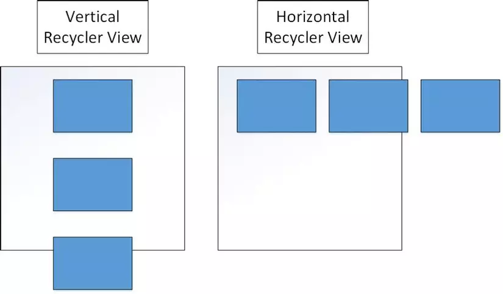
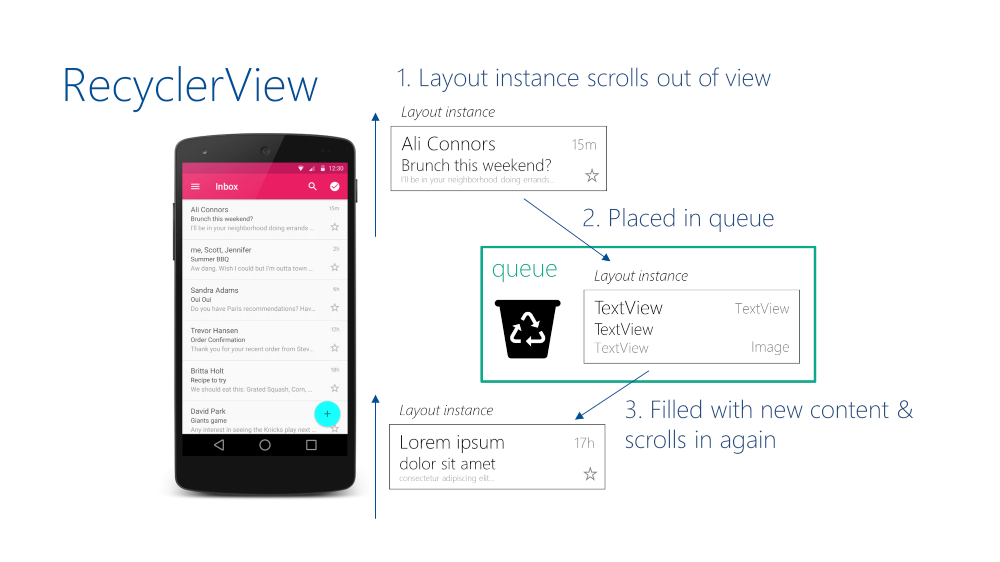
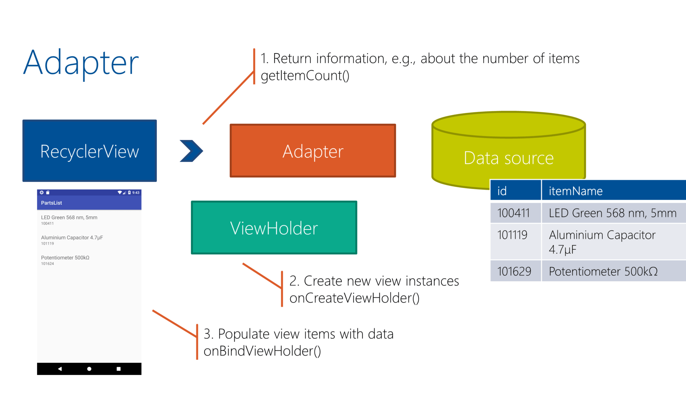

Recycler View là gì
Ưu điểm của việc sử dụng RecyclerView
Tính tái sử dụng của RecyclerView
Adapter và ListAdapter
RecyclerView Multiple View Type

# Recycler View
## 1. Recycler View là gì?
`RecyclerView` là một thành phần UI trong ứng dụng dùng để **cuộn** (roll) các view nằm trong nó. Nó là phiên bản nâng cấp của `ListView` (hiển thị các thành phần dạng danh sách) và `GradView` (hiển thị các thành phần dạng ô). Trong `RecyclerView`, khi view được cuộn ra ngoài màn hình hoặc được ẩn khỏi người dùng thì nó không bị kill mà được tái sử dụng cho view mới.

Ưu điểm:
- Hỗ trợ thiết kế nhiều loại layout khác nhau tùy vào nhu cầu người dùng (danh sách ngang/dọc, lưới, layout tùy chỉnh...)
- Hiệu năng cao khi được thiết kế tối ưu cho danh sách dữ liệu lớn, giảm hiện tượng lag/giật khi cuộn. Khắc phục mọi nhược điểm của ListView và GridView, từ hiệu năng, khả năng mở rộng, đến tùy biến giao diện.

- Dễ dàng thêm animation khi thêm, xóa, di chuyển item. Các thao tác drag & drop, swipe to delete



#### Tạo `RecyclerView` trong layout:
```xml
<androidx.recyclerview.widget.RecyclerView
    android:id="@+id/recyclerView"
    android:layout_width="match_parent"
    android:layout_height="match_parent"/>
```

#### Layout Manager
`RecyclerView.LayoutManager` :  là một lớp trừu tượng xác định các item bên trong RecyclerView được bố trí ở vị trí nào trên màn hình. Khi sử dụng RecyclerView ta cần cung cấp một **Layout Manager** để xác định cách sắp xếp và hiển thị dữ liệu.

Có các loại Layout Manager chính:
| Loại | Khi nào dùng | Tùy chọn chính |
| - | - | - |
| `LinearLayoutManager`| Danh sách dọc hoặc ngang| `orientation`, `reverseLayout`, `stackFromEnd`| 
| `GridLayoutManager`| Lưới cố định số cột/hàng| `spanCount`, `orientation`, `SpanSizeLookup`|
| `StaggeredGridLayoutManager` | Lưới “so le” (item cao thấp khác nhau) | `spanCount`, `orientation`, `gapStrategy`, `setFullSpan()` |

Ngoài ra, có thể tự tạo `Custom Layout Manager` bằng cách kế thừa class `RecyclerView.LayoutManager`

#### ViewHolder
`ViewHolder` là một class (thường là inner class trong `Adapter`).

Khi `RecyclerView` cần hiển thị một item, nó dùng `ViewHolder` để giữ các bind đến các View (TextView, ImageView, ...) giúp không phải tìm lại bằng findViewById

Ví dụ ViewHolder được dùng trong Adapter:
```kt
class CategoryAdapter (private var categories: List<Category>): RecyclerView.Adapter<CategoryAdapter.CategoryViewHolder>() {
    inner class CategoryViewHolder(val binding: CategoriesItemBinding): RecyclerView.ViewHolder(binding.root)

    override fun onCreateViewHolder(
        parent: ViewGroup,
        viewType: Int
    ): CategoryViewHolder {
        val binding = CategoriesItemBinding.inflate(LayoutInflater.from(parent.context), parent, false)
        return CategoryViewHolder(binding)
    }

    override fun onBindViewHolder(
        holder: CategoryViewHolder,
        position: Int
    ) {
        val category = categories[position]
        with(holder.binding) {
            categoriesName.text = category.categoryName
            categoriesNumber.text = category.categoryNumber
            Glide
                .with(holder.binding.categoriesImage.context)
                .load(category.imageUrl)
                .into(holder.binding.categoriesImage)
        }
    }

    override fun getItemCount(): Int = categories.size

    @SuppressLint("NotifyDataSetChanged")
    fun updateData(newData: List<Category>) {
        categories = newData
        notifyDataSetChanged()
    }
}
```

#### ItemAnimator
- `RecyclerView.ItemAnimator` là một lớp dùng để thêm hiệu ứng khi thay đổi các phần tử trong `RecyclerView`. Khi thêm, xóa hoặc cập nhật các phần tử trong `RecyclerView`, `ItemAnimator` sẽ xử lý các hiệu ứng chuyển động của các phần tử này, giúp tạo ra các hoạt hình mượt mà và sống động.
- `DefaultItemAnimator`: là `ItemAnimator` mặc định được sử dụng khi không cung cấp bất kỳ `ItemAnimator` nào. Nó cung cấp các hiệu ứng mặc định khi thêm, xóa và cập nhật các phần tử.

#### Tính tái sử dụng của `RecyclerView`:
- **Cơ chế hoạt động:** Các view trong RecyclerView sẽ được cuộn trong một thành phần màn hình nhìn thấy được. Khi các view con được cuộn ra khỏi màn hình thì nó không bị hủy luôn mà được đưa vào một "view pool" để tái sử dụng. Các view chuẩn bị được hiển thị sẽ được lấy từ các view cũ từ pool và chỉ thay đổi dữ liệu - không tạo layout mới.



- Một khi **RecyclerView** được kết nối với **Adapter** , **Adapter** sẽ tạo ra đối tượng của các hàng (**ViewHolder object**) cho đến khi lấp đầy kích thước của RecyclerView và lưu trong **HeapMemory**

- Mỗi khi một hàng mới được chèn vào màn hình thì đối tượng **ViewHolder** được lưu trong bộ nhớ sẽ được mang ra để tái sử dụng và gán dữ liệu . Nếu không gán lại dữ liệu cho **ViewHolder object** thì sẽ hiện thị dữ liệu được gán trước đó

## 2. Adapter và ListAdapter
### 2.1. Adapter
**Adapter** là một lớp *trung gian* dùng để kết nối dữ liệu với RecyclerView
- Chịu trách nhiệm tạo `ViewHolder` cho từng phần tử trong danh sách và bind dữ liệu vào `ViewHolder` đó
- Đưa dữ liệu vào các `ViewHolder` để hiển thị lên màn hình.

Trong adapter thường có 3 phương thức bắt buộc override:
|Phương thức|Công dụng|
|-|-|
|`getItemCount()`|Trả về số lượng phần tử trong danh sách (độ dài list)|
|`onCreateViewHolder()`|Tạo mới `ViewHolder`. Inflate layout item (file xml) và gắn vào `ViewHolder`|
|`onBindViewHolder()`|Lấy dữ liệu và gắn vào `ViewHolder`|

**Luồng hoạt động của Adapter:**



**Ví dụ:**
```kt
class MyAdapter(private val dataList: List<String>) :
    RecyclerView.Adapter<MyAdapter.MyViewHolder>() {

    // 1. Định nghĩa ViewHolder
    class MyViewHolder(itemView: View) : RecyclerView.ViewHolder(itemView) {
        val textView: TextView = itemView.findViewById(R.id.textView)
    }

    // 2. Tạo ViewHolder
    override fun onCreateViewHolder(parent: ViewGroup, viewType: Int): MyViewHolder {
        val view = LayoutInflater.from(parent.context)
            .inflate(R.layout.item_layout, parent, false)
        return MyViewHolder(view)
    }

    // 3. Gắn dữ liệu vào ViewHolder
    override fun onBindViewHolder(holder: MyViewHolder, position: Int) {
        holder.textView.text = dataList[position]
    }

    // 4. Số item
    override fun getItemCount(): Int = dataList.size
}
```

### 2.2. ListAdapter
**ListAdapter** là một lớp mở rộng từ Adapter, được Google cung cấp để làm việc với các danh sách có thể thay đổi (ví dụ khi thêm, xóa, sửa dữ liệu).  

**ListAdapter** sử dụng một công cụ gọi là **DiffUtil** để tự động so sánh danh sách cũ và mới, từ đó chỉ cập nhật những phần tử thực sự thay đổi lên RecyclerView. Điều này giúp hiệu năng tốt hơn rất nhiều so với việc gọi `notifyDataSetChanged()` (làm mới toàn bộ danh sách).


**Ưu điểm:**
- Tự động tính toán phần tử nào cần cập nhật, xóa, thêm, di chuyển.
- Hiệu năng cao cho danh sách động.
- Khi dữ liệu thay đổi, chỉ cần submitList mới vào ListAdapter.
- Phù hợp cho các danh sách dữ liệu động (chat, comment, ...)
**Ví dụ về cách sử dụng:**
**Ví dụ ListAdapter:**
```kotlin
// 1. Tạo DiffUtil cho kiểu dữ liệu của bạn
class UserDiffCallback : DiffUtil.ItemCallback<User>() {
    override fun areItemsTheSame(oldItem: User, newItem: User): Boolean {
        // So sánh bằng id (duy nhất)
        return oldItem.id == newItem.id
    }
    override fun areContentsTheSame(oldItem: User, newItem: User): Boolean {
        // So sánh nội dung thực tế, ví dụ tên, avatar, ...
        return oldItem == newItem
    }
}

// 2. Tạo ListAdapter
class UserListAdapter : ListAdapter<User, UserListAdapter.UserViewHolder>(UserDiffCallback()) {

    inner class UserViewHolder(itemView: View) : RecyclerView.ViewHolder(itemView) {
        val tvName: TextView = itemView.findViewById(R.id.tvName)
        val imgAvatar: ImageView = itemView.findViewById(R.id.imgAvatar)
    }

    override fun onCreateViewHolder(parent: ViewGroup, viewType: Int): UserViewHolder {
        val view = LayoutInflater.from(parent.context).inflate(R.layout.item_user, parent, false)
        return UserViewHolder(view)
    }

    override fun onBindViewHolder(holder: UserViewHolder, position: Int) {
        val user = getItem(position)
        holder.tvName.text = user.name
        // Glide.with(holder.imgAvatar).load(user.avatarUrl).into(holder.imgAvatar)
    }
}

// 3. Khi có dữ liệu mới
userListAdapter.submitList(newUserList)
```

## 3. RecyclerView Multiple View Type

**RecyclerView** có thể hiển thị nhiều loại item khác nhau trong cùng một RecyclerView.

**Cách làm:**
1. Override hàm `getItemViewType(position: Int)` để phân biệt loại item ở từng vị trí.
2. Trong `onCreateViewHolder`, inflate layout tương ứng theo viewType.
3. Trong `onBindViewHolder`, bind dữ liệu phù hợp với loại item.
