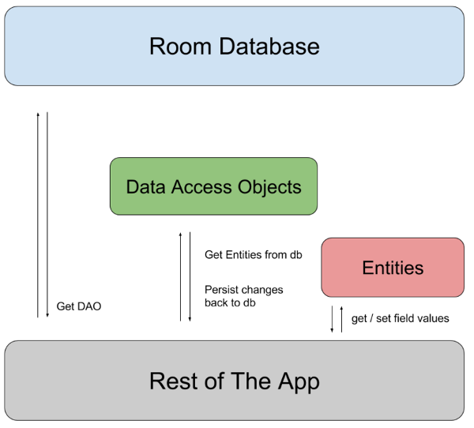

So sánh SQLite và MySQL.
Room database là gì? Cách tạo Room Database trong Android
DAO và Entity là gì? Cách sử dụng chúng?
Relationship trong Room và cách sử dụng?
SharedPreferences

# Room Data Base
## 1. So sánh SQLite và MySQL
### 1.1 SQLite
**SQLite** là một hệ quản trị cơ sở dữ liệu quan hệ (RDBMS) nhẹ, được tích hợp trực tiếp vào ứng dụng mà không cần cài đặt máy chủ riêng biệt. SQLite sử dụng file để lưu trữ toàn bộ cơ sở dữ liệu, giúp việc triển khai và sử dụng trở nên đơn giản, nhanh chóng.

- **Không máy chủ (Serverless):** SQLite hoạt động hoàn toàn mà không cần hệ thống quản lý máy chủ
- **Nhẹ, nhỏ gọn:** Thư viện SQLite có kích thước nhỏ (chỉ vài trăm KB), không yêu cầu cài đặt phức tạp.
- **Lưu trữ dữ liệu trong một file:** Tất cả dữ liệu đều được lưu trong một file duy nhất (`.sqlite` hoặc `.db`)
- **Mã nguồn mở:** SQLite được phát hành dưới dạng mã nguồn mở
- **Tương thích ACID:** Đảm bảo tính nhất quán, toàn vẹn dữ liệu theo tiêu chuẩn ACID.

**Ứng dụng:**
- Lưu trữ dữ liệu offline cho các ứng dụng nhỏ
- Dùng làm kho dữ liệu tạm, lưu cấu hình ứng dụng
- Phù hợp cho việc học SQL hoặc test nhanh ứng dụng

**Ưu điểm:**
- **Dễ dàng triển khai:** Không cần cấu hình máy chủ, chỉ cần thêm thư viện và chỉ định đường dẫn file cơ sở dữ liệu.
- **Hiệu năng tốt với dữ liệu nhỏ:** Xử lý nhanh với các ứng dụng có dữ liệu vừa và nhỏ.
- **Di chuyển dễ dàng:** Chỉ cần copy file dữ liệu là có thể di chuyển toàn bộ cơ sở dữ liệu.

**Nhược điểm:**
- **Khả năng mở rộng hạn chế:** Không phù hợp cho hệ thống lớn, có nhiều kết nối đồng thời.
- **Bảo mật đơn giản:** Không có hệ thống phân quyền người dùng nâng cao như các RDBMS lớn.
- **Chưa hỗ trợ đầy đủ các tính năng nâng cao:** Một số tính năng phức tạp về giao dịch hoặc khóa chưa được hỗ trợ tốt.

### 1.2 Nhắc lại về MySQL
**MySQL** là một hệ thống quản trị cơ sở dữ liệu quan hệ mã nguồn mở

**Đặc điểm nổi bật:**
- Sử dụng mô hình client-sever
- Hỗ trợ đa người dùng, nhiều kết nối đồng thời.
- Tối ưu cho việc truy vấn và xử lý dữ liệu lớn.
- Bảo mật tốt, khả năng mở rộng cao.
- Đảm bảo tính ACID

**Ứng dụng:**
- Hầu hết các website, ứng dụng lớn
- Các dịch vụ cung cấp cho nhiều người dùng
- Quản lí database lớn, phức tạp

**Bảng so sánh SQLite vs MySQL**
| Tiêu chí         | SQLite                                | MySQL                               |
| ---------------- | ------------------------------------- | ----------------------------------- |
| Kiến trúc        | Nhúng, không cần server               | Client-server, cần server           |
| Lưu trữ          | 1 file duy nhất trên ổ đĩa            | Nhiều file, lưu trữ trên server     |
| Hiệu năng        | Nhanh với dữ liệu nhỏ, ít kết nối     | Tốt với dữ liệu lớn, nhiều kết nối  |
| Quản lý          | người dùng	Không hỗ trợtrợ            | Hỗ trợ phân quyền, nhiều user       |
| Khả năng mở rộng | Hạn chế, phù hợp ứng dụng nhỏ         | Cao, phù hợp ứng dụng lớn           |
| Cài đặt          | Đơn giản, chỉ cần file thư viện       | Phức tạp hơn, cần cài server        |
| Bảo mật          | Đơn giản                              | Tốt hơn, nhiều tính năng nâng cao   |
| Sử dụng phổ biến | Ứng dụng di động, nhúng, phần mềm nhỏ | Website, hệ thống lớn, doanh nghiệp |

## 2. Room Database

**Room** là một thư viện của **Jetpack Android** làm việc với database dựa trên `SQLite`. Cho phép ta dễ dàng thao tác các truy vấn `SQLite` trong **Android**.

Bản chất **Room Database** là **abstract layer** gồm cơ sở dữ liệu chuẩn `SQLite` được Android thông qua. Với 3 thành phần chính là:

- **Room Database (Lớp Database)**: lưu giữ cơ sở dữ liệu và đóng vai trò định nghĩa cơ sở dữ liệu và hoạt động như điểm truy cập chính để kết nối với dữ liệu.
- **Entities**: chính là các bảng trong cơ sở dữ liệu.
- **Data Access Objects (DAO)**: cung cấp các phương thức mà ứng dụng dùng để truy vấn, cập nhật, chèn và xoá dữ liệu trong cơ sở dữ liệu.
  - Được khai báo bằng interface hoặc abstract class, với các method có annotation như:

    - `@Insert` → Thêm dữ liệu

    - `@Update` → Cập nhật dữ liệu

    - `@Delete` → Xóa dữ liệu

    - `@Query` → Truy vấn dữ liệu bằng SQL



Ứng dụng gọi đến Room Database để lấy DAO -> DAO được dùng để thực thi các truy vấn SQL -> DAO trả về hoặc cập nhật Entities (bảng dữ liệu) -> Ứng dụng sử dụng Entities để hiển thị hoặc xử lý logic.
### Cài đặt gradle
#### Bước 1:
Thêm các dòng sau vào `dependencies` trong `buid.gradle` của app:

```kts
plugins {
    id("kotlin-kapt)
}

dependencies {
    val roomVersion = "2.7.2"

    implementation("androidx.room:room-runtime:$roomVersion")
    kapt("androidx.room:room-compiler:$roomVersion")
}
```
- Cài đặt lựa chọn:

```kts
// optional - Kotlin Extensions and Coroutines support for Room
    implementation("androidx.room:room-ktx:$room_version")

    // optional - RxJava2 support for Room
    implementation("androidx.room:room-rxjava2:$room_version")

    // optional - RxJava3 support for Room
    implementation("androidx.room:room-rxjava3:$room_version")

    // optional - Guava support for Room, including Optional and ListenableFuture
    implementation("androidx.room:room-guava:$room_version")

    // optional - Test helpers
    testImplementation("androidx.room:room-testing:$room_version")

    // optional - Paging 3 Integration
    implementation("androidx.room:room-paging:$room_version")
```

### Tạo class Database
Ta muốn tạo ra một class **AppDatabase** để lưu trữ cơ sở dữ liệu cho dứng dụng của mình.

AppDatabase sẽ định nghĩa cấu hình database và đóng vai trò là điểm truy cập chính của ứng dụng vào dữ liệu được lưu trữ.

Trong đó:
- AppDatabase được chú thích `@Database` bao gồm một mảng entities liệt kê tất cả các data entity được liên kết với cơ sở dữ liệu.
- Phải là một abstract class kế thừa **RoomDatabase**.
- Đối với mỗi lớp **DAO** được liên kết với cơ sở dữ liệu, trong AppDatabase phải định nghĩa một phương thức trừu tượng không có đối số và trả về một thể hiện của lớp **DAO**. Room sẽ tự động sinh code cho phương thức này để bạn thao tác với bảng User thông qua UserDao.

```kt
@Database(entities = [User::class, Product::class], version = 1)
abstract class AppDatabase : RoomDatabase() {
    abstract fun userDao(): UserDao
}
```
- version: Số phiên bản của database. Nếu ta thay đổi cấu trúc bảng, cần tăng version để Room biết và thực hiện migration.

Sau đó ta có thể tạo một object cho Appdatabase:

```kt
import androidx.room.Room

val db = Room.databaseBuilder(
    context,                 // Tham số 1: Context
    AppDatabase::class.java, // Tham số 2: Class Database
    "app_database"           // Tham số 3: Tên file database (String)
).build()
```
## 3. Data Entity và Data Access object
### 3.1 Data Entity
#### Định nghĩa:
Là các lớp thể hiện các bảng trong database. Mỗi 1 field trong bảng sẽ được thể hiện là 1 thuộc tính trong Data Entity.

Mỗi entity sẽ được đánh dấu bằng annotation `@Entity`.

Thông thường Room sẽ dùng tên class đặt cho tên bảng mà class entity đó thể hiện.

```kt
data class User ( //thể hiện cho bảng có tên "user"
    @PrimaryKey val id: Int,
    @ColumnInfo(name = "first_name") val firstName: String?,
    @ColumnInfo(name = "last_name") val lastName: String?
)
```

Nếu ta muốn đổi tên của bảng thì sẽ đặt lại giá trị cho `tableName`

```kt
@Entity(tableName = "users") //đặt tên cho bảng mà class User thể hiện là "users"
data class User (
    @PrimaryKey val id: Int,
    @ColumnInfo(name = "first_name") val firstName: String?,
    @ColumnInfo(name = "last_name") val lastName: String
)
```

#### Các thành phần:

##### 1. Primary key
```kt
@PrimaryKey val id: Int
```

##### 2. Composite primary key
```kt
@Entity(primaryKeys = ["firstName", "lastName"])
data class User(
    val firstName: String?,
    val lastName: String?
)
```

##### 3. Ignore fields
Theo mặc định, Room tạo một cột cho mỗi field được xác định trong entity. Nếu một entity có các trường không muốn lưu lại, ta có thể chú thích chúng bằng `@Ignore`

```kt
@Entity
data class User(
    @PrimaryKey val id: Int,
    val firstName: String?,
    val lastName: String?,
    @Ignore val picture: Bitmap?
)
```

Đôi khi class entity kế thừa từ class cha ta sẽ muốn dùng `ignoredColumns` để bỏ qua một cột

```kt
open class User {
    var picture: Bitmap? = null
}

@Entity(ignoredColumns = ["picture"])
data class RemoteUser(
    @PrimaryKey val id: Int,
    val hasVpn: Boolean
) : User()
```
### 3.2 Data Access object
**DAO** (Data Access Object) là một interface/abstract class trong Room Database, dùng để xác định các phương thức truy cập và thao tác dữ liệu với các bảng trong cơ sở dữ liệu. DAO cung cấp các phương thức như thêm, sửa, xóa, truy vấn dữ liệu một cách an toàn và hiệu quả.

**DAO** thường được khai báo bằng `interface` hoặc `abstract class`, sử dụng các annotation của Room:

- `@Dao`: Đánh dấu ở đầu của interface/abstract class DAO.
- `@Insert`, `@Update`, `@Delete`: Các thao tác thêm, sửa, xóa. (Các phương thức tiện lợi)
- `@Query`: Truy vấn dữ liệu SQL.

```kt
@Dao
interface UserDao {
    @Query("SELECT * FROM user")
    fun getAll(): List<User>

    @Query("SELECT * FROM user WHERE uid IN (:userIds)")
    fun loadAllByIds(userIds: IntArray): List<User>

    @Query("SELECT * FROM user WHERE first_name LIKE :first AND " +
           "last_name LIKE :last LIMIT 1")
    fun findByName(first: String, last: String): User

    @Insert
    fun insertAll(vararg users: User)

    @Delete
    fun delete(user: User)
}
```

#### Convinient methods
##### 1. @Insert
Annotation `@Insert` cho phép bạn định nghĩa phương thức để thêm một hoặc nhiều đối tượng vào bảng dữ liệu.

- Mỗi tham số của phương thức `@Insert` phải là một instance của class Entity hoặc một collection các Entity.
- Nếu phương thức nhận một tham số duy nhất, có thể trả về kiểu `Long` là rowId của dòng vừa thêm.
- Nếu tham số là mảng/collection, có thể trả về mảng/collection các giá trị rowId.

```kotlin
@Dao
interface UserDao {
    @Insert(onConflict = OnConflictStrategy.REPLACE)
    fun insertUsers(vararg users: User)

    @Insert
    fun insertBothUsers(user1: User, user2: User)

    @Insert
    fun insertUsersAndFriends(user: User, friends: List<User>)
}
```
##### 2. @Update
Annotation `@Update` cho phép định nghĩa phương thức cập nhật dòng dữ liệu trong bảng.

- Đối tượng truyền vào phải có `primary key` để xác định bản ghi cần sửa.

- Nếu không có `primary key` hoặc không trùng với bản ghi trong database, câu lệnh sẽ không cập nhật gì

- Phương thức `@Update` có thể trả về kiểu `Int` là số dòng được cập nhật thành công.

```kt
@Dao
interface UserDao {
    @Update
    fun updateUser(user: User)

    @Update
    fun updateUsers(users: List<User>)
}
```

##### 3. @Delete
Annotation `@Delete` cho phép định nghĩa phương thức xóa dòng dữ liệu khỏi bảng.

- Room sử dụng `primary key` để xác định dòng cần xóa.
- Nếu không có dòng trùng `primary key`, Room sẽ không thay đổi gì.
- Phương thức `@Delete` có thể trả về kiểu `Int` là số dòng được xóa thành công.

```kotlin
@Dao
interface UserDao {
    @Delete
    fun deleteUsers(vararg users: User)
}
```

#### Query methods
Annotation `@Query` cho phép viết câu lệnh SQL và định nghĩa các phương thức truy vấn dữ liệu hoặc thao tác phức tạp.
- Room kiểm tra cú pháp SQL ở thời điểm biên dịch, giúp phát hiện lỗi sớm.

```kotlin
@Query("SELECT * FROM user")
fun loadAllUsers(): Array<User>
```

##### 1. Trả về một phần cột của bảng
```kotlin
data class NameTuple(
    @ColumnInfo(name = "first_name") val firstName: String?,
    @ColumnInfo(name = "last_name") val lastName: String?
)

@Query("SELECT first_name, last_name FROM user")
fun loadFullName(): List<NameTuple>
```

##### 2. Truyền tham số vào truy vấn

Ta có thể truyền tham số đơn giản để lọc kết quả.
```kotlin
@Query("SELECT * FROM user WHERE age > :minAge")
fun loadAllUsersOlderThan(minAge: Int): Array<User>

@Query("SELECT * FROM user WHERE age BETWEEN :minAge AND :maxAge")
fun loadAllUsersBetweenAges(minAge: Int, maxAge: Int): Array<User>

@Query("SELECT * FROM user WHERE first_name LIKE :search OR last_name LIKE :search")
fun findUserWithName(search: String): List<User>
```

Truyền tham số collection vào truy vấn:

```kotlin
@Query("SELECT * FROM user WHERE region IN (:regions)")
fun loadUsersFromRegions(regions: List<String>): List<User>
```
##### 3. Truy vấn nhiều bảng (JOIN)
Có thể dùng JOIN để lấy dữ liệu từ nhiều bảng.
```kotlin
@Query(
    "SELECT * FROM book " +
    "INNER JOIN loan ON loan.book_id = book.id " +
    "INNER JOIN user ON user.id = loan.user_id " +
    "WHERE user.name LIKE :userName"
)
fun findBooksBorrowedByNameSync(userName: String): List<Book>
```

Trả về đối tượng tùy chỉnh với JOIN:

```kotlin
interface UserBookDao {
    @Query(
        "SELECT user.name AS userName, book.name AS bookName " +
        "FROM user, book " +
        "WHERE user.id = book.user_id"
    )
    fun loadUserAndBookNames(): LiveData<List<UserBook>>

    data class UserBook(val userName: String?, val bookName: String?)
}
```
Dùng GROUP BY để lọc kết quả:

```kotlin
@Query(
    "SELECT * FROM user JOIN book ON user.id = book.user_id GROUP BY user.name WHERE COUNT(book.id) >= 3"
)
fun loadUserAndBookNames(): Map<User, List<Book>>
```

## 4. Relationship
### 4.1. Mối quan hệ trong Room là gì?

Mối quan hệ (relationship) trong Room là cách mô hình hóa sự liên kết giữa các bảng (entity) trong cơ sở dữ liệu, tương tự như trong các hệ quản trị cơ sở dữ liệu quan hệ (RDBMS). Room hỗ trợ các loại quan hệ sau:

- **One-to-One (1-1):** Một bản ghi ở bảng A liên kết duy nhất với một bản ghi ở bảng B.
- **One-to-Many (1-nhiều):** Một bản ghi ở bảng A liên kết với nhiều bản ghi ở bảng B.
- **Many-to-Many (n-nhiều):** Nhiều bản ghi ở bảng A liên kết với nhiều bản ghi ở bảng B thông qua bảng trung gian.

### 4.2. Cách thiết lập mối quan hệ trong Room

Room không tự động nhận diện mối quan hệ như các ORM phức tạp, nhưng có thể thực hiện qua các bước:

- Thêm foreign key vào entity.
- Sử dụng các annotation như `@Embedded` và `@Relation` trong data class để ánh xạ mối quan hệ.

#### One to One & One to Many
Để xác định mối quan hệ một với một hoặc một với nhiều, trước tiên, tạo một lớp cho mỗi thực thể. Một trong các thực thể phải bao gồm một biến là tham chiếu đến khoá chính của thực thể kia.

```kt
@Entity
data class Student(
    @PrimaryKey val StuId: String,
    val name: String,
    val age: Int
)

@Entity
data class Course(
    @PrimaryKey val CourseId: String,
    val StudentStudyId: Long
)
```

Để truy vấn danh sách quan hệ tương ứng, ta cần tạo một class relationship

- Đối với One to One:
  ```kt
    data class StudentAndCourse(
        @Embedded val student: Student,
        @Relation(
            parentColumn = "StuId",
            entityColumn = "StudentStudyId"
        )
        val course: Course
    )
  ```
- Đối với One to Many:
  ```kt
    data class StudentAndCourses(
        @Embedded val student: Student,
        @Relation(
            parentColumn = "StuId",
            entityColumn = "StudentStudyId"
        )
        val courses: List<Course>
    )
  ```
Cuối cùng, một phương thức được thêm vào lớp DAO sẽ trả về tất cả các bản sao của lớp dữ liệu mà ghép nối thực thể mẹ và thực thể con. Phương thức này đòi hỏi Room chạy hai truy vấn. Do đó, bạn nên thêm chú thích `@Transaction` vào phương thức này. Điều này đảm bảo rằng toàn bộ thao tác sẽ chạy tuân thủ tính atomically.

```kt
@Transaction
@Query("SELECT * FROM Student")
fun getStudentsAndCourses(): List<StudentAndCourse>
```
```kt
@Transaction
@Query("SELECT * FROM Student")
fun getStudentsAndCourses(): List<StudentAndCourses>
```

#### Many to Many
Để xác định mối quan hệ nhiều với nhiều, trước tiên, hãy tạo một lớp cho mỗi thực thể. Mối quan hệ nhiều với nhiều khác hẳn với các loại quan hệ khác bởi vì thường không có tham chiếu đến thực thể mẹ trong thực thể con. Thay vào đó, hãy tạo một lớp thứ ba để đại diện cho một relationship entity

```kt
@Entity
data class Playlist(
    @PrimaryKey val playlistId: Long,
    val playlistName: String
)

@Entity
data class Song(
    @PrimaryKey val songId: Long,
    val songName: String,
    val artist: String
)

@Entity(primaryKeys = ["playlistId", "songId"])
data class PlaylistSongCrossRef(
    val playlistId: Long,
    val songId: Long
)
```

- Nếu muốn truy vấn **playlist** và nhận được danh sách **song** tương ứng thì tạo một lớp dữ liệu mới chứa một đối tượng `Playlist` duy nhất và một List tất cả các đối tượng `Song` tương ứng với PlayList trên.

- Nếu muốn truy vấn **song** và nhận được danh sách các **playlist** tương ứng thì ta làm ngược lại

```kt
data class PlaylistWithSongs(
    @Embedded val playlist: Playlist,
    @Relation(
         parentColumn = "playlistId",
         entityColumn = "songId",
         associateBy = Junction(PlaylistSongCrossRef::class)
    )
    val songs: List<Song>
)

data class SongWithPlaylists(
    @Embedded val song: Song,
    @Relation(
         parentColumn = "songId",
         entityColumn = "playlistId",
         associateBy = Junction(PlaylistSongCrossRef::class)
    )
    val playlists: List<Playlist>
)
```

Cuối cùng, thêm một phương thức vào lớp DAO để cung cấp chức năng truy vấn mà ứng dụng của bạn cần.

- `getPlaylistsWithSongs`: phương thức này sẽ truy vấn cơ sở dữ liệu và trả về tất cả các đối tượng PlaylistWithSongs kết quả.
- `getSongsWithPlaylists`: phương thức này sẽ truy vấn cơ sở dữ liệu và trả về tất cả các đối tượng SongWithPlaylists kết quả.

## 5. SharedPreferences
**SharedPreference** là một lớp cho phép lưu trữ và nhận dữ liệu kiểu `key-value` vào file XML riêng biệt và thường được sử dụng để lưu các thông tin cấu hình, trạng thái đăng nhập, hoặc các giá trị nhỏ mà không cần sử dụng database.

- Lưu trữ dữ liệu dạng `key-value`.
- Dữ liệu được lưu dưới dạng `XML` trên thiết bị.
- Chỉ phù hợp với dữ liệu nhỏ, không lưu trữ được các kiểu dữ liệu phức tạp.
- Có thể truy cập ở chế độ `private` hoặc `shared` giữa các component của app.

### 5.1 Khởi tạo SharedPreferences
*Có hai cách phổ biến để khởi tạo SharedPreferences:*

#### a. Qua Context

```kotlin
val sharedPref = context.getSharedPreferences("MyPrefs", Context.MODE_PRIVATE)
```
- `"MyPrefs"` là tên file lưu trữ, bạn có thể đặt tùy ý.
- `Context.MODE_PRIVATE`: Chỉ ứng dụng hiện tại truy cập được SharedPreferences này.

#### b.  Qua PreferenceManager (dùng cho Preference mặc định)
```kotlin
val sharedPref = PreferenceManager.getDefaultSharedPreferences(context)
```

- Dùng cho trường hợp sử dụng file SharedPreferences mặc định của hệ thống.

### 5.2  Ghi dữ liệu vào SharedPreferences

Để ghi dữ liệu, bạn cần sử dụng `SharedPreferences.Editor`:

```kotlin
val editor = sharedPref.edit()
editor.putString("username", "Pandoruu")
editor.putInt("age", 25)
editor.putBoolean("isPremium", true)
editor.putFloat("score", 9.5f)
editor.putLong("timestamp", System.currentTimeMillis())
editor.putStringSet("tags", setOf("android", "kotlin"))
editor.apply() // hoặc editor.commit()
```

- `apply()`: Thay đổi ngay đối tượng SharedPreferences trong bộ nhớ nhưng ghi nội dung cập nhật vào ổ đĩa một cách không đồng bộ (nên dùng)
- `commit()`: Ghi dữ liệu vào ổ đĩa 1 cách đồng bộ. Sẽ tạm dừng hiển thị giao diện cho đến khi lưu xong (nên hạn chế dùng).


Khi muốn cập nhật dữ liệu chỉ cần sử dụng lại `put` với key cũ và giá trị mới, ví dụ:

```kotlin
editor.putInt("age", 30).apply()
```

### 5.3 Đọc dữ liệu từ SharedPreferences

Bạn có thể đọc dữ liệu với phương thức tương ứng, truyền vào key và giá trị mặc định nếu key không tồn tại:

```kotlin
val username = sharedPref.getString("username", "defaultUser")
val age = sharedPref.getInt("age", 0)
val isPremium = sharedPref.getBoolean("isPremium", false)
val score = sharedPref.getFloat("score", 0.0f)
val timestamp = sharedPref.getLong("timestamp", 0L)
val tags = sharedPref.getStringSet("tags", emptySet())
```

Nếu key chưa được lưu, giá trị trả về là giá trị mặc định truyền vào.

### 5.4 Xóa dữ liệu

#### a. Xóa một key

```kotlin
val editor = sharedPref.edit()
editor.remove("username")
editor.apply()
```

#### b. Xóa toàn bộ dữ liệu

```kotlin
val editor = sharedPref.edit()
editor.clear()
editor.apply()
```

### 5.5 Sử dụng listener với SharedPreferences

Ta có thể đăng ký lắng nghe sự thay đổi dữ liệu bằng `OnSharedPreferenceChangeListener`:

```kotlin
val listener = SharedPreferences.OnSharedPreferenceChangeListener { sharedPrefs, key ->
    val value = sharedPrefs.all[key]
    // Xử lý khi giá trị key thay đổi
}

sharedPref.registerOnSharedPreferenceChangeListener(listener)
```

Khi không cần dùng sẽ hủy đăng ký:

```kotlin
sharedPref.unregisterOnSharedPreferenceChangeListener(listener)
```
